# Supported shapes of parametric cross-section


 Examples below are presented for "**LCS of cross-section**" set as **ZYX** in the sheet [Project and model specification](../getting-started/project-and-model-specifications/#project). For the other types, adjust the axis of the coordinate system of cross-section to the defined value of "**LCS of cross-section**" .


| Pattern | Shape | Parameters \[mm\] |
| :---: | :--- | :--- |
| 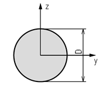 | Circle | D |
| 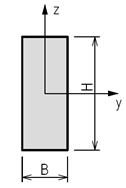 | Rectangle | H; B |
| 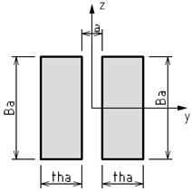 | Double rectangle | tha; Ba; a |
| 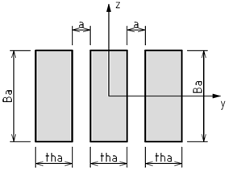 | Triple rectangle | tha; Ba; a |
| 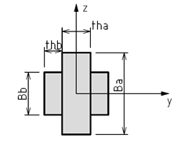 | Rectangle with plates | tha; Ba; thb; Bb |
| 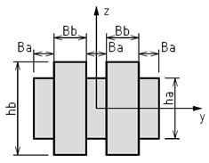 | Double rectangle with plates | Ba; ha; Bb; hb |
| 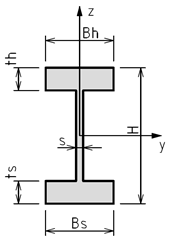 | I Section | H; Bh; Bs; ts; th; s |
| 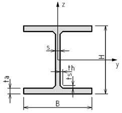 | I Section with haunch | H; B; ta; s; ts; th |
| 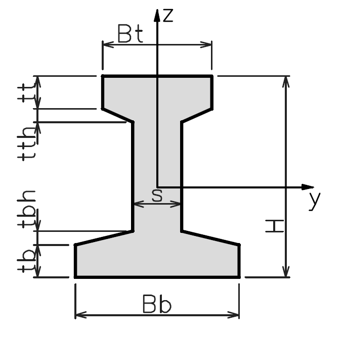 | I Section with haunch Asymmetric | H; Bt; tt; tth; Bb; tb; tbh; s |
| 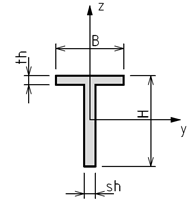 | T Section | H; B; th; sh |
| 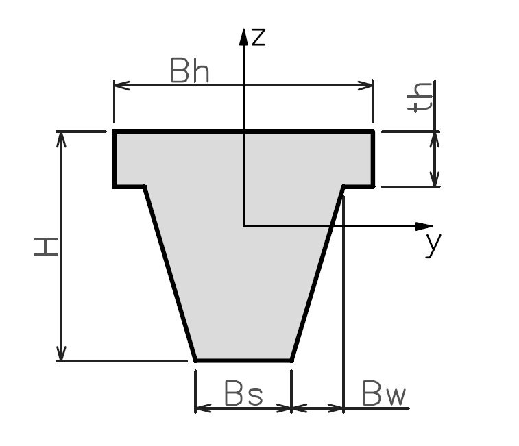 | T Section with haunch | H; Bh; Bs; Bw; th |
| 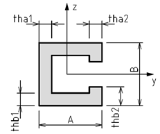 | C Section | A; tha1; tha2; B; thb1; thb2 |
| 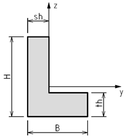 | L Section | H; B; th; sh |
| 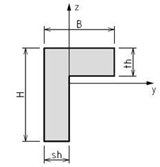 | L Section opposite | H; B; th; sh |
| 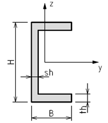 | U Section | H; B; th; sh |
| 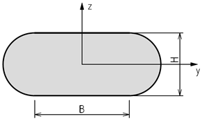 | Oval | H; B |
| 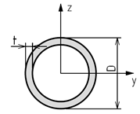 | Pipe | D; t |
| 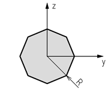 | Polygon | R; n |
| 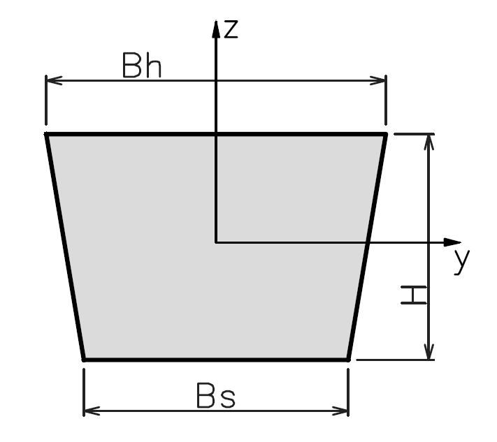 | Trapezoid | H; Bh; Bs |
| 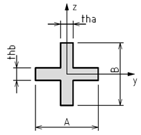 | X Section | A; tha; B; thb |
| 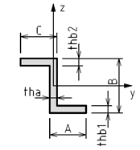 | Z Section | A; tha; B; thb1; thb2; C |
| 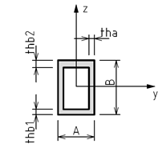 | Box | A; tha; B; thb1; thb2 |
| 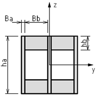 | Double box | Ba; ha; Bb; hb |
| 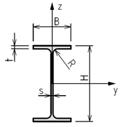 | I rolled | H; B; t; s; R |
| 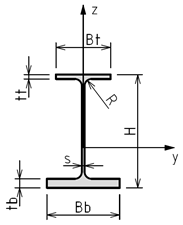 | I rolled asymmetric | H; s; Bt; Bb; tt; tb; R |
| 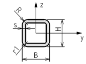 | Tube | H; B; s; R; r1 |
| 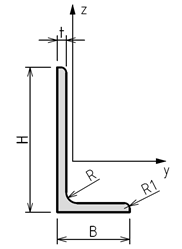 | Angle | H; B; t; R; R1 |
| 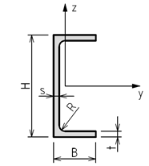 | Channel | H; B; t; s; R |
| 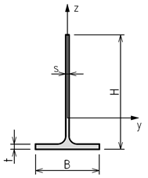 | T tee | H; B; t; s; R |
| 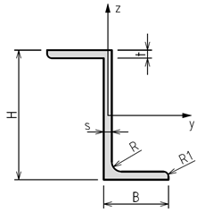 | Z zee | H; B; t; s; R; R1 |
| 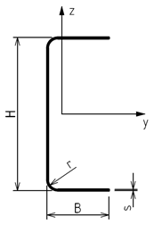 | Cold formed Channel | H; B; s; r |
| 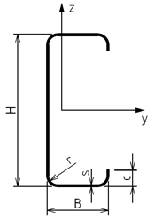 | Cold formed Channel with lips | H; B; s; r; c |
| 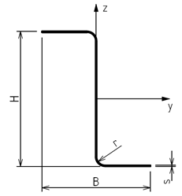 | Cold formed Zee | H; B; s; r |

