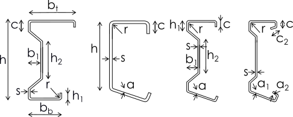

# Formcodes

Formcode is defining the shape of cross-section and how it is oriented according to used LCS. Due to defining the formcode for CSS, exchange of SAF files between applications that are differently handling LCS is possible.


Formcode of manufactured cross-section, together with the attribute "**LCS of cross-section**" from the sheet [Project and model specification](../getting-started/project-and-model-specifications/#project) is defining the exact orientation of cross-section in the model.

Formocode set to "**0**" means that receiving application won't do any action ensuring the proper positioning of CSS.


| Formcode number | Name | Description | Examples of corresponding profiles | Corresponding Description ID of the profile |
| :---: | :---: | :---: | :---: | :--- |
| 0 | - | Provisional formcode | - | not available |
| 1 | I-section | Profiles symmetrical around the vertical and horizontal axes \(typically I-Sections\) |  | 1, 2, 3, 4, 5, 11, 12, 13, 29, 33, 34, 35, 36, 37, 38, 39, 40, 55, 63, 64, 68, 69, 71, 72, 91, 96, 102, 105, 106, 109, 110 |
| 2 | Rectangular Hollow Section | Rectangular Hollow Section |  | 25, 27, 49, 50, 74, 75, 82, 83, 84, 85, 86, 87, 93, 94 |
| 3 | Circular Hollow Section | Circular Hollow Section |  | 20, 21, 51, 52, 53, 54,88, 89, 90, 95, 103 |
| 4 | L-section | Equal and unequal L-sections |  | 8, 9, 10, 16, 45, 46, 65, 73, 98, 99 |
| 5 | Channel Section | Profiles symmetrical around the horizontal axes Opening oriented to the right \(typically channels\) |  | 6, 7, 15, 18, 28, 41, 42, 43, 44, 57, 62, 66, 67, 70, 76, 97, 101, 107, 108, 111, 112, 113, 114, 115, 118 |
| 6 | T-section | Profiles symmetrical around vertical axes Flange at the bottom \(typically T-section\) |  | 23, 31, 47, 48, 77, 78, 80, 81, 92 |
| 7 | Full Rectangular Section | Full Rectangular Section |  | 14, 22, 30, 79 |
| 8 | Full Circular Section | Full Circular Section |  | 26 |
| 9 | T-section Up | Profiles symmetrical around vertical axes Flange at the top \(typically T-section\) |  | 23, 31, 47, 48, 77, 78, 80, 81, 92 |
| 10 | L-section III | Equal and unequal L-sections |  | 8, 9, 10, 16, 45, 46, 65, 73, 98, 99 |
| 11 | L-section I | Equal and unequal L-sections |  | 8, 9, 10, 16, 45, 46, 65, 73, 98, 99 |
| 12 | L-section IV | Equal and unequal L-sections |  | 8, 9, 10, 16, 45, 46, 65, 73, 98, 99 |
| 13 | Channel Section Left | Profiles symmetrical around the horizontal axes Opening oriented to the left \(typically channels\) |  | 6, 7, 15, 18, 28, 41, 42, 43, 44, 57, 62, 66, 67, 70, 76, 97, 101, 107, 108, 111, 112, 113, 114, 115, 118 |
| 14 | Asymmetric I-Section | I-sections symmetrical around vertical axis only \(typically asymmetric I-Section\) |  | 24 |
| 15 | Asymmetric I-Section Up | I-sections symmetrical around vertical axis only \(typically asymmetric I-Section\) |  | 24 |
| 16 | Z-section | Z-sections with equal or unequal flanges Top flange to the left |  | 19, 32, 56, 100 |
| 17 | Z-section Right | Z-sections with equal or unequal flanges Top flange to the right |  | 19, 32, 56, 100 |
| 18 | Omega Section | Omega sections Opening is oriented to the bottom |  | 17 |
| 19 | Omega Section Down | Omega sections Opening is oriented to the top |  | 17 |
| 20 | Sigma Section | Sigma sections Opening is oriented to the right Top flanges are unequal or inclined |  | 58, 104 |
| 21 | Sigma Section III | Sigma sections Opening is oriented to the left Top flanges are unequal or inclined |  | 58, 104 |
| 22 | Sigma Section IV | Sigma sections Opening is oriented to the left Bottom flanges are unequal or inclined |  | 58, 104 |
| 23 | Sigma Section I | Sigma sections Opening is oriented to the right Bottom flanges are unequal or inclined |  | 58, 104 |

