# Supported shapes of compound section


|Pattern|Shape|Parameters [mm]|
|--- |--- |--- |
| ```{image} ../.gitbook/assets/45_supportedcompound_double_i_section.png
:width: 200 px
``` |Double I section|a|
| 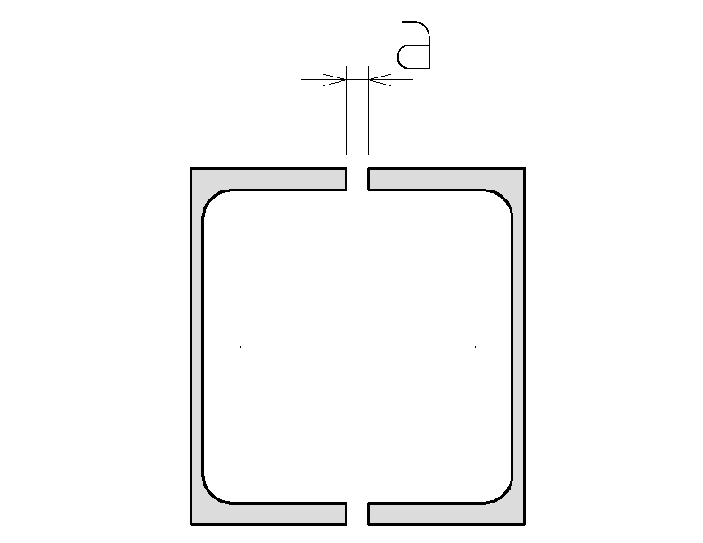 |Double Channel FtF        (face to face position)|a|
| 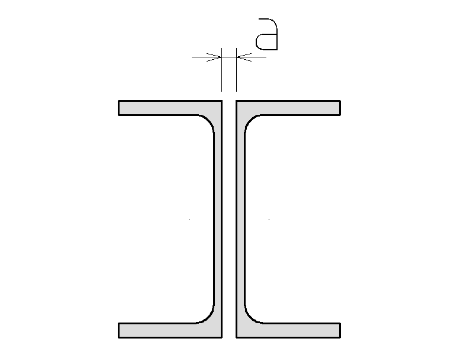 |Double Channel BtB        (back to back position)|a|
| 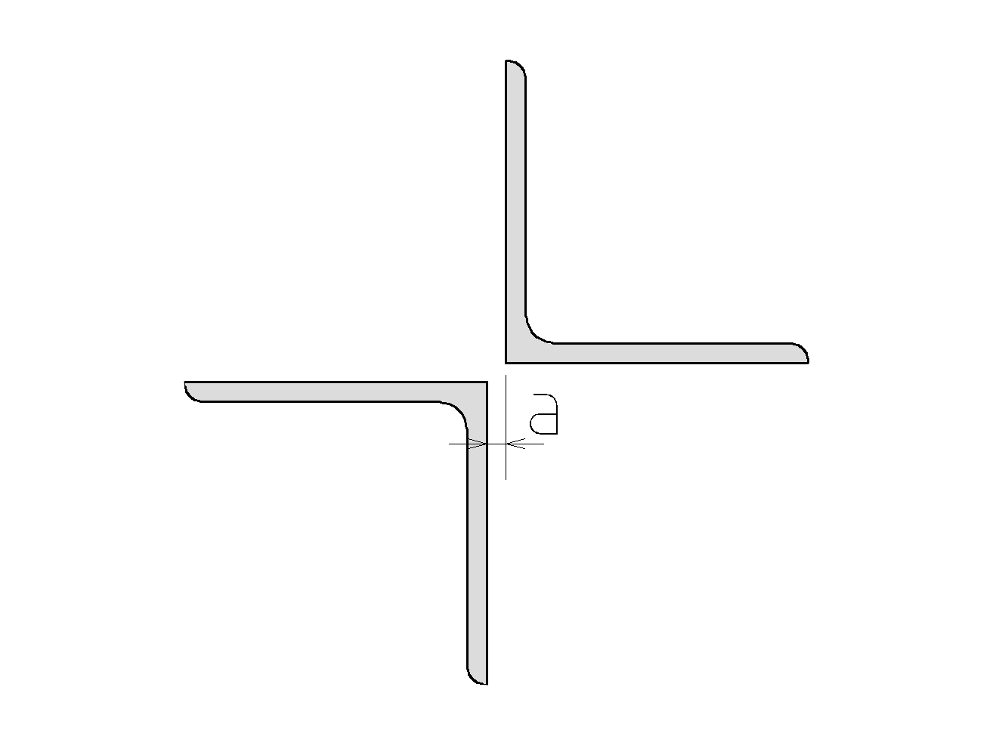 |Starred Angle        (diagonal position)|a|
| 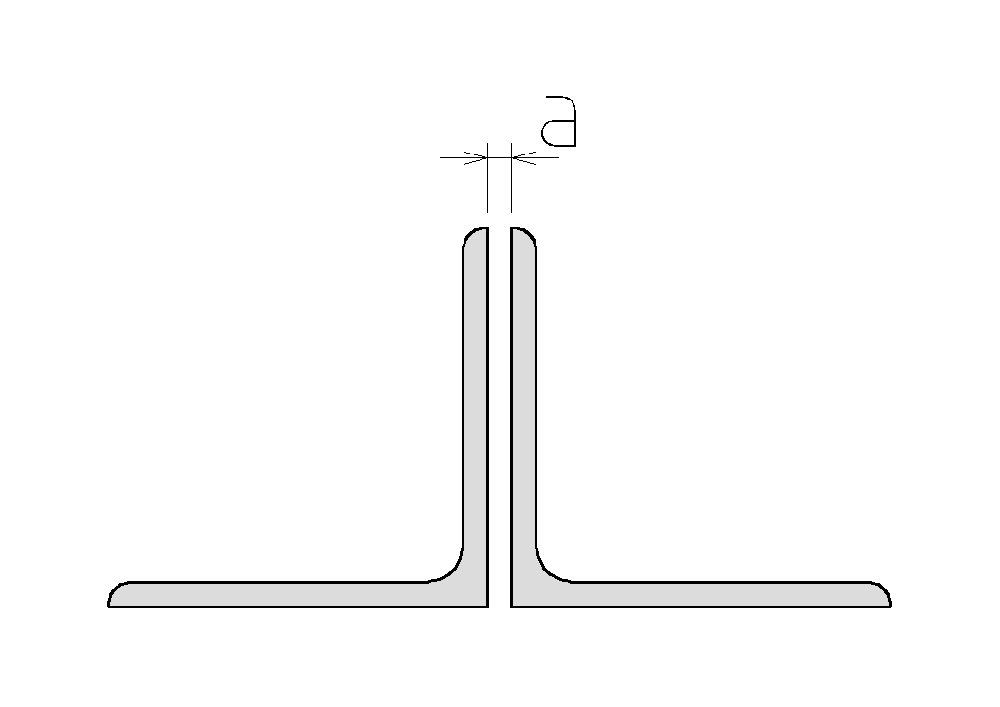 |Double Angle BtB        (back to back position)|a|
| 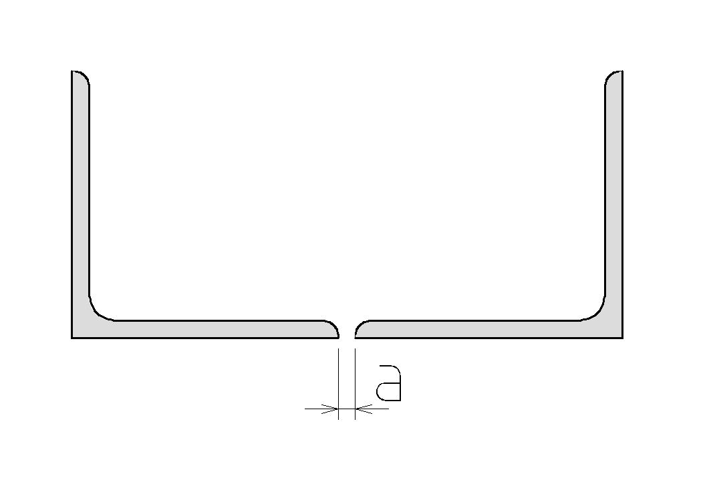 |Double Angle FtF        (face to face position)|a|
| 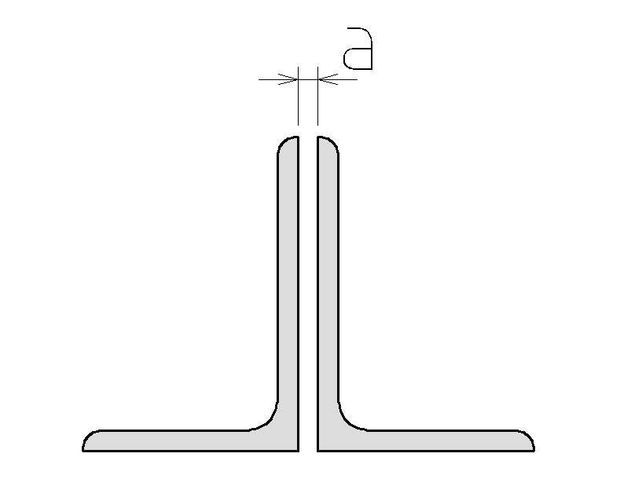 |Double Angle BtB LL        (long leg - back to back position)|a|
| 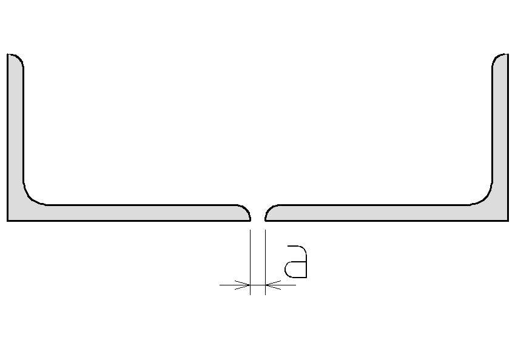 |Double Angle FtF LL        (long leg - face to face position)|a|
| 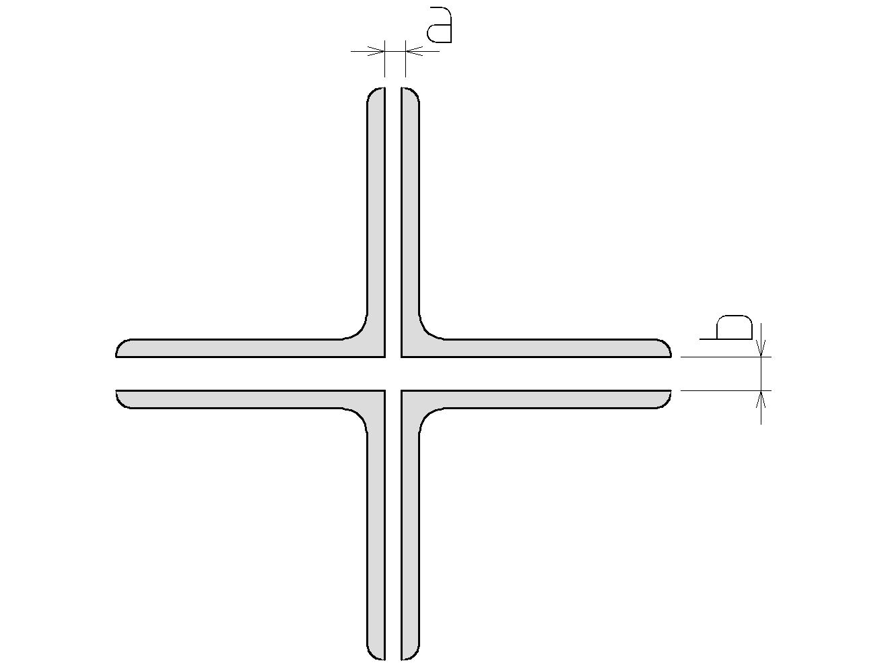 |Four Angle BtB        (back to back position)|a; b|
|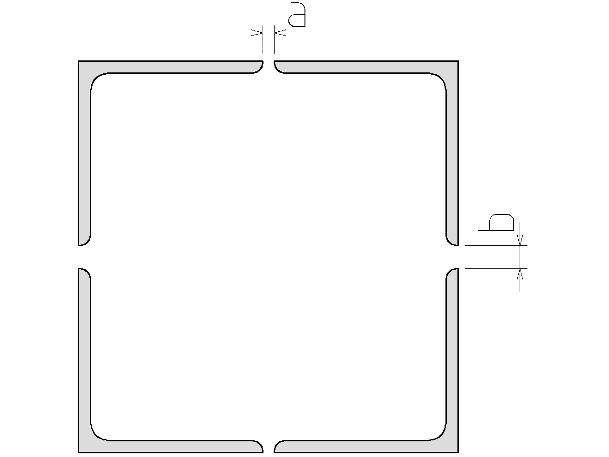 |Four Angle FtF        (face to face position)|a; b|
| 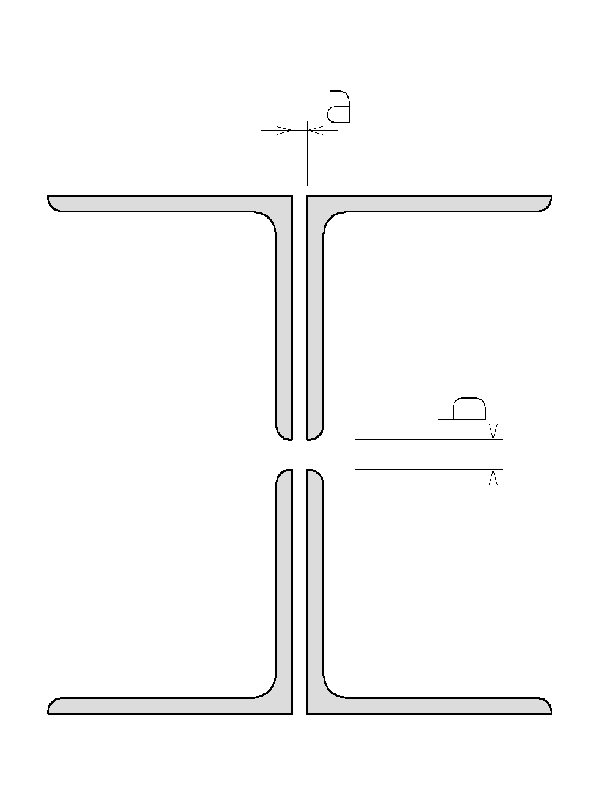 |Four Angle I|a; b|
| 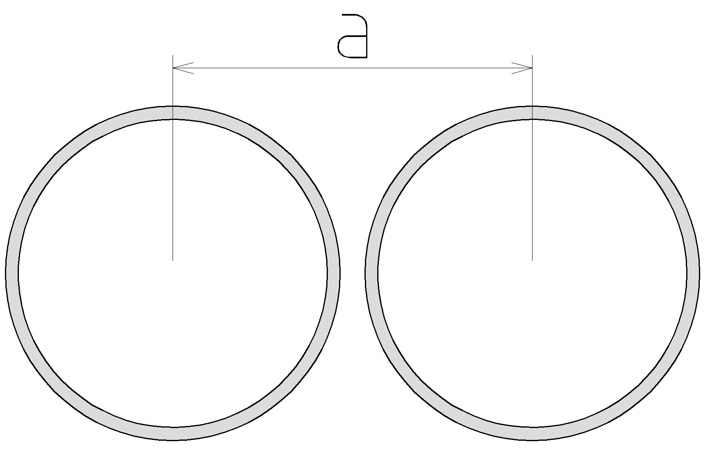 |Double pipe|a|
