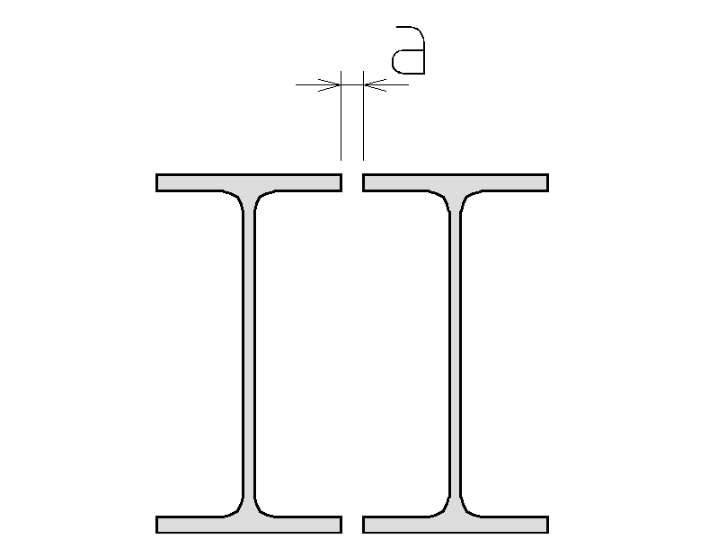

# Supported shapes of compound section

|Pattern|Shape|Parameters [mm]|
|--- |--- |--- |
|  |Double I section|a|
|  |Double Channel FtF        (face to face position)|a|
|  |Double Channel BtB        (back to back position)|a|
|  |Starred Angle        (diagonal position)|a|
|  |Double Angle BtB        (back to back position)|a|
|  |Double Angle FtF        (face to face position)|a|
|  |Double Angle BtB LL        (long leg - back to back position)|a|
|  |Double Angle FtF LL        (long leg - face to face position)|a|
|  |Four Angle BtB        (back to back position)|a; b|
|  |Four Angle FtF        (face to face position)|a; b|
|  |Four Angle I|a; b|
|  |Double pipe|a|
