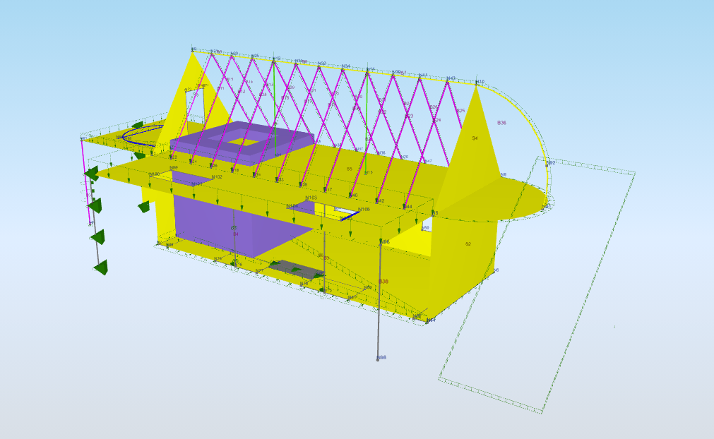

# SAF Examples

```{admonition} All in one place
For all versions of all examples go to [SAF examples page](https://examples.saf.guide/)
```

## HOUSE&#x20;

Example model of a house contains all the objects supported by SAF. It can help to implement the format into a software or can be the first model to try out in [free SAF viewer](https://autoconverter.structuraltoolkit.com/en-GB/saf-viewer).

Global coordinate system: Z vertical\
System of units: Metric units

For all the versions of the file go to [SAF examples page](https://examples.saf.guide/). Older versions contain only objects supported by the older versions of the documentation.



