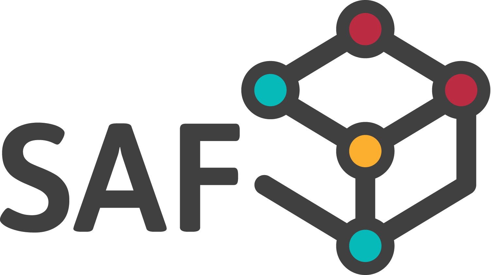

SAF Documentation
--------------------

Structural Analysis Format documentation

Current version: Version in progress

.. tip:: Visit `discussion <https://github.com/StructuralAnalysisFormat/StructuralAnalysisFormat-Doc/discussions>`_ to ask any questions or contribute to the development.

Table of contents:
**********************

.. toctree::
  :caption: Getting started
  :maxdepth: 1
  
  getting-started/what-is-saf
  getting-started/who-supports-saf
  getting-started/saf-versions
  getting-started/saf-examples
  getting-started/release-notes
  getting-started/introduction
  getting-started/geometry
  getting-started/best-practice-for-saf-implementation
  getting-started/project-and-model-specifications/README
  
.. toctree::
  :caption: Structural analysis elements
  :maxdepth: 1
  
  structural-analysis-elements/structuralmaterial
  structural-analysis-elements/structuralcrosssection
  structural-analysis-elements/compositeshapedef
  structural-analysis-elements/structuralpointconnection
  structural-analysis-elements/structuralcurveedge
  structural-analysis-elements/structuralcurvemember
  structural-analysis-elements/structuralcurvemembervarying
  structural-analysis-elements/structuralcurvememberrib
  structural-analysis-elements/structuralsurfacemember
  structural-analysis-elements/structuralsurfacememberopening
  structural-analysis-elements/structuralsurfacememberregion
  structural-analysis-elements/structuralstorey
  structural-analysis-elements/structuralproxyelement
  
.. toctree::
  :caption: Supports and hinges
  :maxdepth: 1
  
  supports-and-hinges/structuralpointsupport
  supports-and-hinges/structuralsurfaceconnection
  supports-and-hinges/structuralcurveconnection
  supports-and-hinges/structuraledgeconnection
  supports-and-hinges/relconnectsstructuralmember
  supports-and-hinges/relconnectssurfaceedge
  supports-and-hinges/relconnectsrigidcross
  supports-and-hinges/relconnectsrigidlink
  supports-and-hinges/relconnectsrigidmember
  supports-and-hinges/nonlinearfunction
  
.. toctree::
  :caption: Loads
  :maxdepth: 1
  
  loads/structuralloadgroup
  loads/structuralloadcase
  loads/structuralloadcombination
  loads/structuralpointaction
  loads/structuralpointmoment
  loads/structuralcurveaction
  loads/structuralcurvemoment
  loads/structuralsurfaceaction
  loads/structuralsurfaceactionthermal
  loads/structuralcurveactionthermal
  loads/structuralpointactionfree
  loads/structuralcurveactionfree
  loads/structuralsurfaceactionfree
  loads/structuralsurfaceactiondistribution-1
  loads/structuralpointsupportdeformation

.. toctree::
  :caption: Results
  :maxdepth: 1
  
  results/resultinternalforce1d
  results/resultinternalforce2dedge

.. toctree::
  :caption: Annexes
  :maxdepth: 1
  
  annexes/changelog
  annexes/formcodes
  annexes/description-id-of-the-profile
  annexes/supported-shapes-of-parametric-cross-section
  annexes/supported-shapes-of-compound-section
  annexes/supported-design-properties-of-the-materials
  annexes/units
  annexes/ignore

.. toctree::
  :caption: SDK
  :maxdepth: 1
  
  SDK/Introduction.md
  SDK/StructuralAnalysisFormat.md
  SDK/StructuralAnalysisFormat.Bootstrappers.SimpleInjector4
  SDK/StructuralAnalysisFormat.Bootstrappers.SimpleInjector5
  SDK/StructuralAnalysisFormat.Tests.Infrastructure