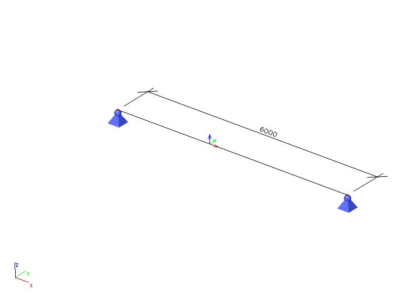

# ResultInternalForce2DEdge

**Internal force on 2D edge**

Internal forces on edge of 2D member. The coordinate system of the results is the coordinate system of the member the results belong to.

```{image} ../.gitbook/assets/48_resultinternalforce2dedge_1.gif
:width: 400px
```

## Specification in the excel

| Column Header | Data Type | Example / enum definition | Required | Description |
|---|---|---|---|---|
| Result on | Enum | On edge | yes | Specify where the result is, only option is 'on edge'. Prepared for future expansion (on opening edge..)  |
| 2D member | String | B1 | yes | Reference to the name of 2D member in [StructuralSurfaceMember](../structural-analysis-elements/structuralsurfacemember.md) |
| Edge | Integer | 2 | yes | The index starting with 1. The order is according to order of “edges” property in [StructuralSurfaceMember](../structural-analysis-elements/structuralsurfacemember.md) |
| Result for | Enum | Load case<br>Load combination | yes | Specifies from where the result is coming from (from Load Case, Load Combination) |
| Load case | String | LC1 | yes, if Result for = Load case | Reference to the name of [StructuralLoadCase](../loads/structuralloadcase.md) |
| Load combination | String | COM1 | yes, if Result for = Combination | Reference to the name of [StructuralLoadCombination](../loads/structuralloadcombination.md) |
| Combination key | String | 1.35LC1+1.5LC2+1.5LC3+1.5LC4 | no | Allows to define exact combination per result section<br><br>Structure of string:<br>”LoadFactor1LoadCase1+LoadFactor2LoadCase2<br>+LoadFactorN*LoadCaseN”<br>For envelopes and national standard (code) combinations, this column specifies for which exact combination the result is computed |
| Section at [m] | Double | 0.100 | yes | X coordinate on the edge(distance from the start node) where the result is located |
| Index | Integer | 1 | yes | Index of the section on edge |
| mx [kNm/m] | Double | 3.00 | yes | Result value of bending moment mx |
| my [kNm/m] | Double | 3.00 | yes | Result value of bending moment my |
| mxy [kNm/m] | Double | 3.00 | yes | Result value of torsion moment mxy |
| vx [kN/m] | Double | 3.00 | yes | Result value of shear force vx |
| vy [kN/m] | Double | 3.00 | yes | Result value of shear force vy |
| nx [kN/m] | Double | 3.00 | yes | Result value of membrane force nx |
| ny [kN/m] | Double | 3.00 | yes | Result value of membrane force ny |
| nxy [kN/m] | Double | 3.00 | yes | Result value of shear force nxy |

## Notes

>### Index
>
>This attribute defines an order of the section on the edge, starting with 1 and increasing from the **start** to the **end** of the edge. This property helps to specify if the internal force is on the "left" or on the right side of the section.
>
>See example on a beam below:
>
>

```{hint}
See index 6 and 7. One section, two values for normal (N) force. \
Section with lower index (6) identifies value on the left (closer to the origin of X-axis of the beam).\
Section with a higher index (7) identifies value on the right (further from the origin of X-axis of the beam).
```