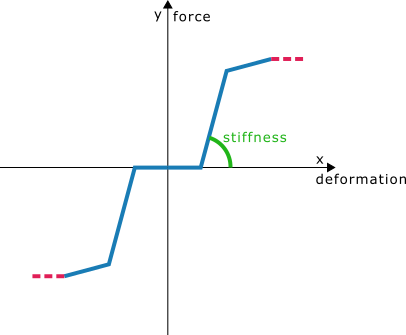
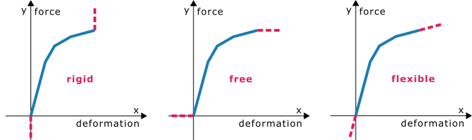

# NonlinearFunction

**Nonlinear function**

Nonlinear function defines the change of stiffness based on the deformation. It is a definition of a graph where the horizontal x-axis is the deformation and the vertical y-axis is the force or moment caused by the deformation (translation or rotation).

| Column header| Data type | Example / enum definition | Required | Description |
| :---: | :---: | :---: | :---: | :---: |
| Name | String |Nonlin fun 1 | yes | Human readable unique name of NonlinearFunction |
| Type | Enum | Translation Rotation | yes | Type defines whether the function is for Translation in [m, MN], or rotation in [rad, kNm] |
| Translation function | String | -0.05; -1\| 0; 0\| 0.05; 5.0 | yes, if Type = Translation | Coordinates of a function for translational stiffness in \|[m]; [MN]\|. Recommended maximum value for y axis is 1e10, anything above should be considered rigid. The format of the data is: x1; y1\|x2; y2\|x3; y3\|xi; yi\|xi+1; yi+1.The coordinates of the points are divided by ";" and each point is separated by "\|". Points should be written in order from left to right on the x axis. For each translation or rotation there can be only one force or moment – it is not possible to draw vertical lines. The minimum distance between two consecutive points must not be smaller than 1e-6. X and Y coordinates of one point must be either both positive or negative. The graph must go through the origin 0; 0. |
| Rotation function | String | -0.05; -1\| 0; 0\| 0.05; 5.0 | Yes, if Type = Rotation | Coordinates of a function for rotational stiffness \|[rad]; [kNm]\|. Recommended maximum value for y axis is 1e10, anything above should be considered rigid. The format of the data is: x1; y1\|x2; y2\|x3; y3\|xi; yi\|xi+1; yi+1.The coordinates of the points are divided by ";" and each point is separated by "\|". Points should be written in order from left to right on the x axis. For each translation or rotation there can be only one force or moment – it is not possible to draw vertical lines. The minimum distance between two consecutive points must not be smaller than 1e-6. X and Y coordinates of one point must be either both positive or negative. The graph must go through the origin 0; 0.
| Positive end | Enum | Rigid Free Flexible | yes | This enum defines the continuation of the function after the last point in the graph 'Rigid' means vertical end of function 'Free' means horizontal end of function 'Flexible' means continuing of function in same direction of last part of function. | 
| Negative end | Enum | Rigid Free Flexible | yes | This enum defines the continuation of the function before the first point in the graph.  'Rigid' means vertical end of function 'Free' means horizontal end of function 'Flexible' means continuing of function in same direction of last part of function |
| Id | String | 39f238a5-01d0-45cf-a2eb-958170fd4f39 | no | Unique attribute designation |

Notes:
Nonlinear function can be displayed in a graph, look at the example below to see the difference between Rigid, Free and Flexible ends.  
 

It is not possible to draw vertical lines. Use rigid positive or negative ends to create rigid behavior or create a line that is almost vertical.