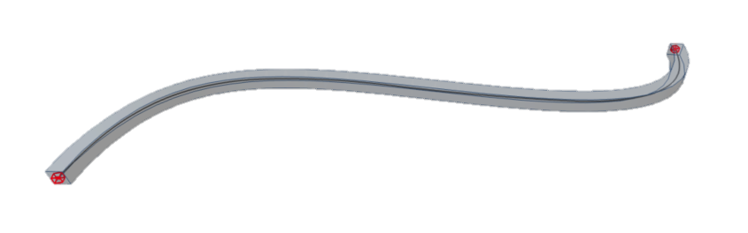

# Geometry

Basic construction elements are simple geometry types, that are used for shape definition of structural members and geometrical object. With defining the further attributes to these elements from the lists Structural analysis elements, Supports and hinges and Loads the complete structural model is created. All values refer to the list [StrucutralPointConnection](https://saf.guide/Content/A_Objects/5_StructuralPointConnection.htm).

Following geometrical types are available:

<table>
  <thead>
    <tr>
      <th style="text-align:left"></th>
      <th style="text-align:left">Geometry type</th>
      <th style="text-align:left">Type definition</th>
      <th style="text-align:left">Insertion data explanation</th>
      <th style="text-align:left">SAF geometry strings</th>
      <th style="text-align:left">Notes</th>
    </tr>
  </thead>
  <tbody>
    <tr>
      <td style="text-align:left">
        
      </td>
      <td style="text-align:left">Line</td>
      <td style="text-align:left">Straight line between two nodes</td>
      <td style="text-align:left">
        
Start point , End point

        
N1;N2

      </td>
      <td style="text-align:left">Line</td>
      <td style="text-align:left">-</td>
    </tr>
    <tr>
      <td style="text-align:left">
        
      </td>
      <td style="text-align:left">Circular Arc</td>
      <td style="text-align:left">Arch defined with 3 nodes</td>
      <td style="text-align:left">
        
Start point, Intermediate point, End point

        
N3;N4;N5

      </td>
      <td style="text-align:left">Circular Arc</td>
      <td style="text-align:left">-</td>
    </tr>
    <tr>
      <td style="text-align:left"></td>
      <td style="text-align:left">Parabolic Arc</td>
      <td style="text-align:left">
        
Parabolic arch defined with 3 nodes
           
        

        

      </td>
      <td style="text-align:left">
        
Start point, Intermediate point, End point
           
           
        

        

           
        

        
N6;N7;N8

      </td>
      <td style="text-align:left">Parabolic Arc</td>
      <td style="text-align:left">-</td>
    </tr>
    <tr>
      <td style="text-align:left"></td>
      <td style="text-align:left">Bezier</td>
      <td style="text-align:left">Cubic Bezier curve</td>
      <td style="text-align:left">
        
Start point, 2nd point of control polygon (vertex), 3rd point of control
          polygon (vertex), End point

        
N9;Vertex_B1_1;

        
Vertex_B1_2;N10
           
        

        

           
        

        

      </td>
      <td style="text-align:left">Bezier</td>
      <td style="text-align:left">
        
N9 and N10 stands for start and end node

        
Vertex_B1_1, Vertex_B1_2 define vertexes of bezier curve

        
All values refers to list StrucutralPointConnection

        
Bezier curve is parabolic, when 2nd and 3rd control points are the identical
          (values of coordinates are the same)

      </td>
    </tr>
    <tr>
      <td style="text-align:left"></td>
      <td style="text-align:left">Spline</td>
      <td style="text-align:left">Curved line defined by polynomial function</td>
      <td style="text-align:left">
        
Start point, Set of mid points, End point
           
        

        

           
        

        
N11;N12;N13;N14;N15;N16;N17;N18
           
        

        

           
        

      </td>
      <td style="text-align:left">Spline-8</td>
      <td style="text-align:left">&quot;Spline-<em>&quot; where &quot;</em>&quot; stands for number of nodes
        defining the spline</td>
    </tr>
    <tr>
      <td style="text-align:left"></td>
      <td style="text-align:left">Circle</td>
      <td style="text-align:left">Circle</td>
      <td style="text-align:left">
        
Center Point, Point on the perimeter
           
        

        

           
        

        
N36;N37
           
        

        

           
        

        
Or

        
Three point on perimeter
           
        

        

           
        

        
N36;N37;N38
           
        

        

           
        

        

      </td>
      <td style="text-align:left">
        
Circle and Point
           
        

        

           
        

        
or

        
Circle by 3 points
           
        

        

           
        

      </td>
      <td style="text-align:left">Circle is not valid to define StrucutralCurveMember
         
      </td>
    </tr>
    <tr>
      <td style="text-align:left"></td>
      <td style="text-align:left">Polyline</td>
      <td style="text-align:left">Combination of in nodes connected geometric types
         
      </td>
      <td style="text-align:left">
        
list of nodes
           
        

        

           
        

        
N21;N22;N23;N24;N25;N26;N27;N28;N29; N30;N31;N32;N33;Vertex_B1_1;VertexB_1_2;N34;N35
           
        

        

           
        

        

      </td>
      <td style="text-align:left">Line;Line;Spline-7;Line;Circular Arc;Line;Bezier;Line</td>
      <td style="text-align:left">
        
Detail explanation can be found in notes below
           
        

        

      </td>
    </tr>
  </tbody>
</table>

Basic construction elements are simple geometry types, that are used for shape definition of structural members and geometrical object. With defining the further attributes to these elements from the lists Structural analysis elements, Supports and hinges and Loads the complete structural model is created. All values refer to the list [StrucutralPointConnection](https://saf.guide/Content/A_Objects/5_StructuralPointConnection.htm).

Basic construction elements are simple geometry types, that are used for shape definition of structural members and geometrical object. With defining the further attributes to these elements from the lists Structural analysis elements, Supports and hinges and Loads the complete structural model is created. All values refer to the list [StrucutralPointConnection](https://saf.guide/Content/A_Objects/5_StructuralPointConnection.htm).

Basic construction elements are simple geometry types, that are used for shape definition of structural members and geometrical object. With defining the further attributes to these elements from the lists Structural analysis elements, Supports and hinges and Loads the complete structural model is created. All values refer to the list [StrucutralPointConnection](https://saf.guide/Content/A_Objects/5_StructuralPointConnection.htm).

