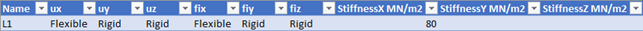
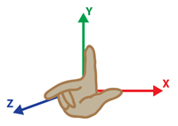
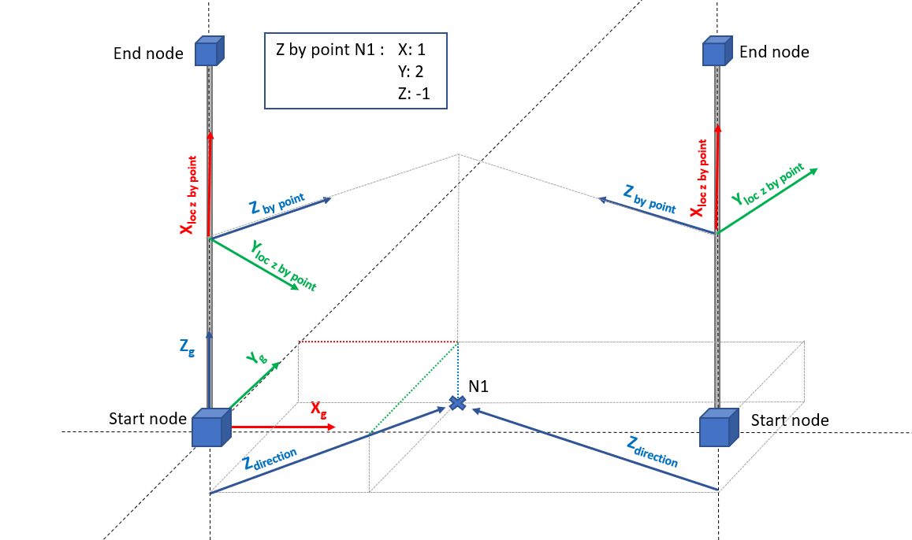
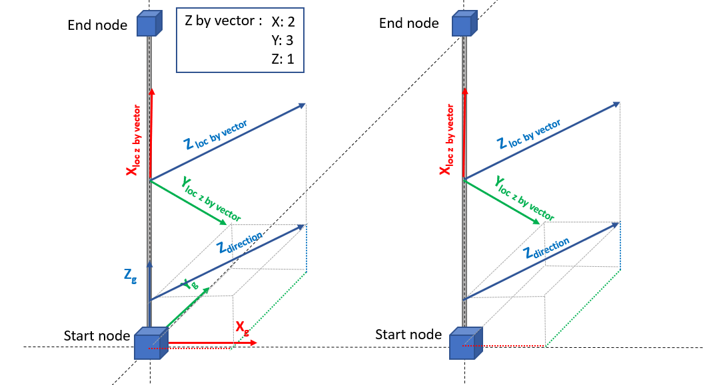
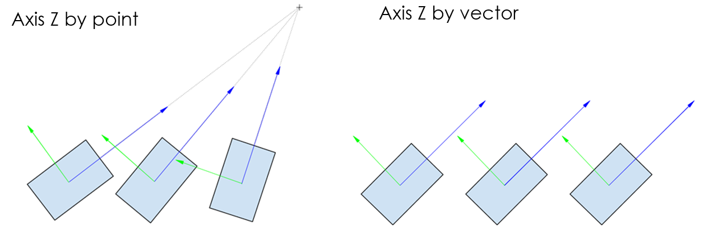
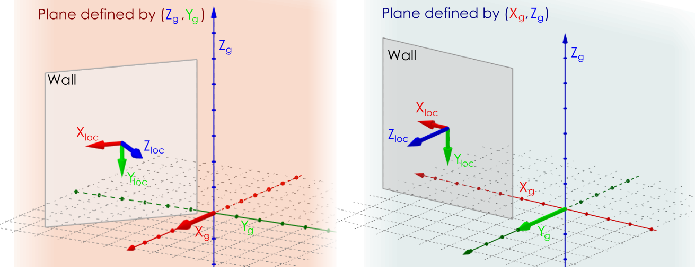
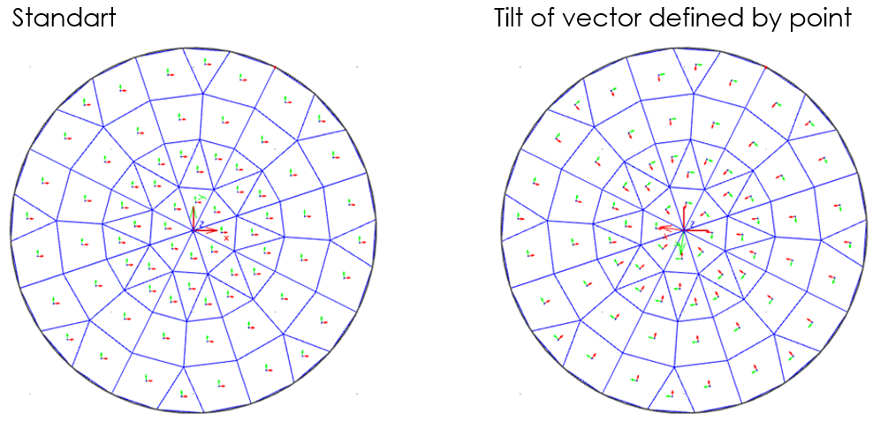

# Introduction

## Excel

Each list in excel represents one object definition. The name of the list must match the exact name of the object. Each list is divided into rows, columns and cells:

The row represents one item \(member\) – node, beam, plate, support, etc…

The column represents one property attribute of a member – name, type, colour, shape, etc…

The cell represents one property value – 3m, layer 1, wall \(80\), etc …

Excel screenshot examples:

**Sheet:**

**Columns and rows:**

**Cell types:**

**Double** - A floating point number  
**Integer** – A whole number which has a minimum value of 0.  
**Enum** - Ordered listing of all the items in a collection used for data validation. Only allowed values from the list can be inputted.  
**String** - A sequence of characters, Text.


Any numeric value \(Double, Integer\) has to be formatted as a number in an excel sheet.


In SAF, supported units are **metric** and **imperial**. Units are defined in the "Model" sheet.


Units can be optionally displayed in property headers.  
The unit system used in SAF file is given on [Model](https://saf.guide/Content/2_Project%20and%20model%20specifications.htm) sheet page by the user.  
Values given in SAF format should correspond to predefined values per system unit set. Table of predefined and expected units can be reviewed on [Project and specification page.](https://saf.guide/Content/2_Project%20and%20model%20specifications.htm)\*\*\*\*



The order of lists and columns does not matter, for import. Important is to consistently follow its naming.


## **Coordinate systems**

For all orientation of loads and coordinate system **right-handed rule** is valid.

The system provides for:

* unambiguous positioning of the member in space,
* unambiguous definition of load and boundary conditions,
* unambiguous interpretation of results.

It may help you to determine the direction of the individual structural elements axis if you remember what you \(probably\) learnt at school. Take your right hand, position your thumb, index finger and middle finger so that they are perpendicular to each other. Then the following applies \(see also the image below\):

* the thumb points in the direction of the x-axis,
* the index finger points in the direction of the y-axis,
* the middle finger points in the direction of the z-axis.

### **LCS - Local coordinate systems**

Each structural entity, meaning each member, has got its own local co-ordinate system. This co-ordinate system is a three-dimensional right-handed Cartesian co-ordinate system.

Each member has several possibilities of enums, defining the Local Coordinate System \(LCS\). For further understanding of enums defining the LCS of the [StrucutralCurveMember](https://saf.guide/Content/A_Objects/7_StructuralCurveMember.htm) and [StructuralSurfaceMember](https://saf.guide/Content/A_Objects/8_StructuralSurfaceMember.htm) see the following:

For **1D members**, there are several options on how to define LCS of [StrucutralCurveMember](https://saf.guide/Content/A_Objects/7_StructuralCurveMember.htm):

### LCS enum set on **" by point"**

When is LCS enum set on **" by point"** explanation is the following:

* X-axis orientation is given by system line of the member
* X-axis direction is defined by the start point and end point of the member
* Z-axis orientation is given by the intersection of a plane perpendicular to x and a plane defined by x-axis and point
* Z-axis direction follow the point
* Y-axis orientation and direction is defined by the right-hand rule

### LCS enum set on **"by vector"**

When is LCS enum set on **"by vector"** explanation is the following:

* X-axis orientation is given by system line of the member
* X-axis direction is defined by the start point and end point of the member
* Z-axis orientation and direction is given by vector coordinates
* Y-axis orientation and direction is defined by right-hand rule

### General vector as LCS **"by vector"**

User can set the LCS "by vector" with the vector which is not perpendicular to the centre line of the 1D member. Such a vector is projected to perpendicular as shown in animation below. The user-defined vector is the yellow one. The yellow vector is not in perpendicular plane to the centre line of the member, so blue and yellow vector are not parallel.

The difference between definition of LCS **"axis** y **or** z **by point**" and **"axis** y **or** z **by vector"** is presented on the picture below.

### LCS enum set on **"axis** y **or** z **by vector"**

When is LCS enum set on **"axis** y **or** z **by vector"** explanation is similar to [StructuralCurveMember ](https://saf.guide/Content/A_Objects/8_StructuralSurfaceMember.htm)presented above with the following additional information:

* For non-vertical 2D elements \(slabs\):
  * the Z-axis direction is perpendicular to the plane of the slab, the orientation is always the same as the positive global Z-axis \(in the other words, the local Z-axis is always upwards\)
* For vertical 2D members \(walls\):
  * Y or X axis is given by the vector \(depending on chosen option in the SAF excel file\).
  * The Z axis direction is perpendicular to the plane of the wall and:
    * The orientation follows the positive half space defined by positive global X and plane defined by global Z and global Y.
    * In case, this is not possible \(wall in plane/or parallel to global Y global X plane\), then local Z follows the positive half space defined by positive global Y and plane defined by global X and global Z axis. See picture below.
  * The last axis of LCS is calculated by the right-hand rule

### LCS enum set on "**Tilt of vector defined by point**"

When is LCS enum set on "**Tilt of vector defined by point**" explanation is the following:

The tilt of the vector defined by point is a special type of LCS for mesh elements of 2D members. You can define one point in global coordinates and all local x-axis \(y-axis\) of mesh elements follow this point. It is an analogy to LCS by point for 1D members. This special case is mostly used when you need to add data which are depending on LCS of meshes \(e.g. reinforcement, results\) and should follow radial layout \(Circle slabs, silos, etc…\). An example is presented below.

## **Unique IDs**

Unique IDs – Unique identifier number for each object in the project and the model level. If the IDs are available in project, model and each object could be recognized and tracked for revisions with a third party software. Filling the cells with ID is not mandatory for analytical exchange format.

