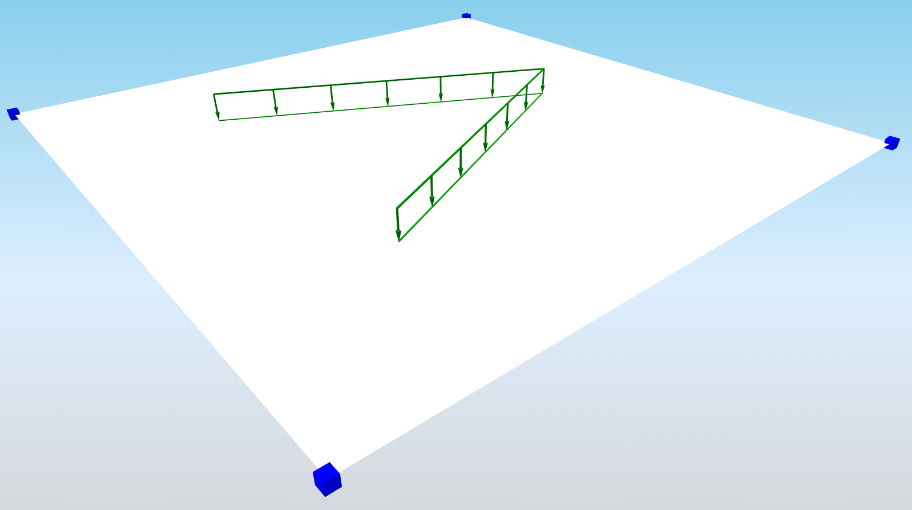

# StructuralCurveActionFree

## Free line force

The Free line load is related to slabs. The load is not defined by the entity it acts on, but by a specific load border. Free loads are defined by means of "loading entities" that may overlap or affect one or more slabs.

### Specification in the excel:

<table>
  <thead>
    <tr>
      <th style="text-align:center">Name of the column header</th>
      <th style="text-align:center">Type of data</th>
      <th style="text-align:center">Value example or enum definition</th>
      <th style="text-align:center">Required value</th>
      <th style="text-align:left">Description</th>
    </tr>
  </thead>
  <tbody>
    <tr>
      <td style="text-align:center">Name</td>
      <td style="text-align:center">String</td>
      <td style="text-align:center">LF5</td>
      <td style="text-align:center">yes</td>
      <td style="text-align:left">Human readable unique name of the force</td>
    </tr>
    <tr>
      <td style="text-align:center">Type</td>
      <td style="text-align:center">String</td>
      <td style="text-align:center">Standard</td>
      <td style="text-align:center">no</td>
      <td style="text-align:left">This property defines what the load is caused by, E.g. Standard, Wind,
        Snow, Self weight, Hoar Frost, Predefined, Plane Load, Water Pond, Water
        Pressure, Soil Pressure, Generated Water, Generated Soil</td>
    </tr>
    <tr>
      <td style="text-align:center">Distribution</td>
      <td style="text-align:center">Enum</td>
      <td style="text-align:center">
        
Uniform

        

        
Trapez

      </td>
      <td style="text-align:center">yes</td>
      <td style="text-align:left">The load may be either constant along its length or linearly variable
        (trapezoidal).</td>
    </tr>
    <tr>
      <td style="text-align:center">Direction</td>
      <td style="text-align:center">Enum</td>
      <td style="text-align:center">
        
X

        

        
Y

        

        
Z

        

        
Vector

      </td>
      <td style="text-align:center">yes</td>
      <td style="text-align:left">
        
Specifies the base direction of the load

        
X, Y, Z - action will be applied in one of these directions

        
Vector - size and direction calculated from vector

      </td>
    </tr>
    <tr>
      <td style="text-align:center">Value 1 [kN/m]</td>
      <td style="text-align:center">Double</td>
      <td style="text-align:center">-150</td>
      <td style="text-align:center">yes, if Direction = X,Y or Z</td>
      <td style="text-align:left">Specifies the first size of the load in kiloNewtons per meter</td>
    </tr>
    <tr>
      <td style="text-align:center">Value 2 [kN/m]</td>
      <td style="text-align:center">Double</td>
      <td style="text-align:center">-180</td>
      <td style="text-align:center">
        
yes, if Direction = X,Y or Z

        

        
yes, if Dsitribution = Trapez

      </td>
      <td style="text-align:left">Specifies the second size of the load in kiloNewtons per meter</td>
    </tr>
    <tr>
      <td style="text-align:center">Vector 1(X;Y;Z) [kN/m]</td>
      <td style="text-align:center">String</td>
      <td style="text-align:center">(10;10;0)</td>
      <td style="text-align:center">yes, if Direction = Vector</td>
      <td style="text-align:left">
        
Specifies the first size of the load in, direction by vector

        
Note: Vector1 and Vector2 needs to be in same direction

      </td>
    </tr>
    <tr>
      <td style="text-align:center">Vector 2(X;Y;Z) [kN/m]</td>
      <td style="text-align:center">String</td>
      <td style="text-align:center">(20;20;0)</td>
      <td style="text-align:center">
        
yes, if Direction = Vector

        

        
yes, if Dsitribution = Trapez

      </td>
      <td style="text-align:left">
        
Specifies the second size of the load in, direction by vector

        
Note: Vector1 and Vector2 needs to be in same direction

      </td>
    </tr>
    <tr>
      <td style="text-align:center">Load case</td>
      <td style="text-align:center">String</td>
      <td style="text-align:center">LC1</td>
      <td style="text-align:center">yes</td>
      <td style="text-align:left">The name of the load case to which the force belongs</td>
    </tr>
    <tr>
      <td style="text-align:center">Coordinate X [m]</td>
      <td style="text-align:center">String</td>
      <td style="text-align:center">0.000; 2.050; 4.850; -2.000</td>
      <td style="text-align:center">yes</td>
      <td style="text-align:left">The list of X coordinates of the nodes which define the geometry of the
        line free load. Each coordinate is separated by semicolon and space.</td>
    </tr>
    <tr>
      <td style="text-align:center">Coordinate Y [m]</td>
      <td style="text-align:center">String</td>
      <td style="text-align:center">0.500; 1.050; 2.650; -1.500</td>
      <td style="text-align:center">yes</td>
      <td style="text-align:left">The list of Y coordinates of the nodes which define the geometry of the
        line free load. Each coordinate is separated by semicolon and space.</td>
    </tr>
    <tr>
      <td style="text-align:center">Coordinate Z [m]</td>
      <td style="text-align:center">String</td>
      <td style="text-align:center">0.000; 0.000; 0.000; 0.000</td>
      <td style="text-align:center">yes</td>
      <td style="text-align:left">The list of Z coordinates of the nodes which define the geometry of the
        line free load. Each coordinate is separated by semicolon and space.</td>
    </tr>
    <tr>
      <td style="text-align:center">Segments</td>
      <td style="text-align:center">String</td>
      <td style="text-align:center">Line; Circular Arc; Bezier; Parabolic arc; Spline</td>
      <td style="text-align:center">yes</td>
      <td style="text-align:left">List of the shape of each segment which is part of the curve, separated
        by semicolon if there are multiple</td>
    </tr>
    <tr>
      <td style="text-align:center">Coordinate system</td>
      <td style="text-align:center">Enum</td>
      <td style="text-align:center">
        
Global

        
Local

      </td>
      <td style="text-align:center">yes</td>
      <td style="text-align:left">Defines co-ordinate system of the member in which the load is applied</td>
    </tr>
    <tr>
      <td style="text-align:center">Location</td>
      <td style="text-align:center">Enum</td>
      <td style="text-align:center">
        
Length

        
Projection

      </td>
      <td style="text-align:center">yes</td>
      <td style="text-align:left">Specifies whether the load is &quot;put directly on an inclined 1D member&quot;
        or whether the &quot;projection on plan&quot; is defined.</td>
    </tr>
    <tr>
      <td style="text-align:center">Id</td>
      <td style="text-align:center">String</td>
      <td style="text-align:center">39f238a5-01d0-45cf-a2eb-958170fd4f39</td>
      <td style="text-align:center">no</td>
      <td style="text-align:left">Unique attribute designation</td>
    </tr>
  </tbody>
</table>

