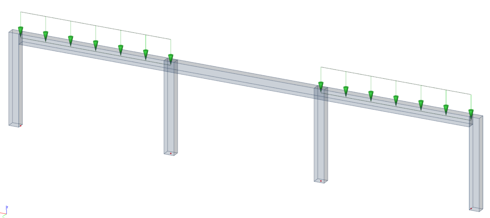

# StructuralCurveMoment

## Line Moment on the beam

The Line moment load models load distributed over a 1D member \([StructuralCurveMember](../structural-analysis-elements/structuralcurvemember.md#1d-member-beam-column)\), 1D member Rib \([StructuralCurveMemberRib](../structural-analysis-elements/structuralcurvememberrib.md#2d-member-rib)\) or on a slab edge \([StructuralSurfaceMember](../structural-analysis-elements/structuralsurfacemember.md#2d-member-plate-wall)\). It may be action along the whole 1D member or only on its part. It can be constant or trapezoidal, acting in three main directions X, Y, Z \(global or local coordinate system\).

Specification in the excel:

<table>
  <thead>
    <tr>
      <th style="text-align:center">Name of the column header</th>
      <th style="text-align:center">Type of data</th>
      <th style="text-align:center">Value example or enum definition</th>
      <th style="text-align:center">Required value</th>
      <th style="text-align:left">Description</th>
    </tr>
  </thead>
  <tbody>
    <tr>
      <td style="text-align:center">Name</td>
      <td style="text-align:center">String</td>
      <td style="text-align:center">LMS1</td>
      <td style="text-align:center">yes</td>
      <td style="text-align:left">Human readable unique name of the force</td>
    </tr>
    <tr>
      <td style="text-align:center">Type</td>
      <td style="text-align:center">String</td>
      <td style="text-align:center">Standard</td>
      <td style="text-align:center">no</td>
      <td style="text-align:left">This property defines what the load is caused by, E.g. Standard, Wind,
        Snow, Self weight, Hoar Frost, Predefined, Plane Load, Water Pond, Water
        Pressure, Soil Pressure, Generated Water, Generated Soil</td>
    </tr>
    <tr>
      <td style="text-align:center">Force action</td>
      <td style="text-align:center">Enum</td>
      <td style="text-align:center">
        
On beam

        

        
On edge

        

        
On subregion edge

        

        
On opening edge

        

        
On rib

      </td>
      <td style="text-align:center">yes</td>
      <td style="text-align:left">Specifies on which type of object the force acts</td>
    </tr>
    <tr>
      <td style="text-align:center">Distribution</td>
      <td style="text-align:center">Enum</td>
      <td style="text-align:center">
        
Uniform

        

        
Trapez

      </td>
      <td style="text-align:center">yes</td>
      <td style="text-align:left">The line moment may be either constant along the 1D member or linearly
        variable (trapezoidal).</td>
    </tr>
    <tr>
      <td style="text-align:center">Direction</td>
      <td style="text-align:center">Enum</td>
      <td style="text-align:center">
        
Mx

        

        
My

        

        
Mz

      </td>
      <td style="text-align:center">yes</td>
      <td style="text-align:left">Specifies the base direction of the load</td>
    </tr>
    <tr>
      <td style="text-align:center">Value 1 [kNm/m]</td>
      <td style="text-align:center">Double</td>
      <td style="text-align:center">-150</td>
      <td style="text-align:center">yes</td>
      <td style="text-align:left">
        
Specifies the first size of the moment in kilonewton meters per meter

        
Value1 is always closer to origin (see notes)

      </td>
    </tr>
    <tr>
      <td style="text-align:center">Value 2 [kNm/m]</td>
      <td style="text-align:center">Double</td>
      <td style="text-align:center">-180</td>
      <td style="text-align:center">yes</td>
      <td style="text-align:left">
        
Specifies the second size of the load in kilonewton meters per meter

        
Value1 is always further from origin (see notes)

      </td>
    </tr>
    <tr>
      <td style="text-align:center">Member</td>
      <td style="text-align:center">String</td>
      <td style="text-align:center">B11</td>
      <td style="text-align:center">yes, if Force action = On beam</td>
      <td style="text-align:left">The name of the <a href="../structural-analysis-elements/structuralcurvemember.md#1d-member-beam-column">StructuralCurveMember </a>on
        which the load is applied</td>
    </tr>
    <tr>
      <td style="text-align:center">Member Rib</td>
      <td style="text-align:center">String</td>
      <td style="text-align:center">B11</td>
      <td style="text-align:center">yes, if Force action = On rib</td>
      <td style="text-align:left">The name of the <a href="../structural-analysis-elements/structuralcurvememberrib.md#2d-member-rib">StructuralCurveMemberRib </a>on
        which the load is applied</td>
    </tr>
    <tr>
      <td style="text-align:center">2D Member</td>
      <td style="text-align:center">String</td>
      <td style="text-align:center">S1</td>
      <td style="text-align:center">yes, if Force action = On edge
         or On subregion edge
         or On opening edge</td>
      <td style="text-align:left">The name of the <a href="../structural-analysis-elements/structuralsurfacemember.md#2d-member-plate-wall">StructuralSurfaceMember </a>or
        <a
        href="../structural-analysis-elements/structuralsurfacememberregion.md#region-of-different-plate-thickness">StructuralSurfaceMemberRegion</a>or <a href="../structural-analysis-elements/structuralsurfacememberopening.md#opening-in-surface-member">StructuralSurfaceMemberOpening </a>on
          which the load is applied. <a href="structuralcurveaction.md#line-force-on-the-beam">StructuralCurveAction </a>can
          act either on a 2D member edge or on internal edge.</td>
    </tr>
    <tr>
      <td style="text-align:center">Edge</td>
      <td style="text-align:center">Integer</td>
      <td style="text-align:center">1</td>
      <td style="text-align:center">yes, if Force action acts on 2D Member edge</td>
      <td style="text-align:left">Index of the edge of the the <a href="../structural-analysis-elements/structuralsurfacemember.md#2d-member-plate-wall">StructuralSurfaceMember</a> on
        which the load is applied</td>
    </tr>
    <tr>
      <td style="text-align:center">Internal edge</td>
      <td style="text-align:center">String</td>
      <td style="text-align:center">ES2</td>
      <td style="text-align:center">yes, if Force action = On edge</td>
      <td style="text-align:left">The name of the <a href="../structural-analysis-elements/structuralcurveedge.md#internal-edge">StructuralCurveEdge</a> on
        which is the load applied. StructuralCurveMoment can act either on a 2D
        member edge or on internal edge.</td>
    </tr>
    <tr>
      <td style="text-align:center">Load case</td>
      <td style="text-align:center">String</td>
      <td style="text-align:center">LC1</td>
      <td style="text-align:center">yes</td>
      <td style="text-align:left">The name of the load case to which the force belongs</td>
    </tr>
    <tr>
      <td style="text-align:center">Coordinate system</td>
      <td style="text-align:center">Enum</td>
      <td style="text-align:center">
        
Global

        

        
Local

      </td>
      <td style="text-align:center">yes</td>
      <td style="text-align:left">Defines the co-ordinate system of the member in which the load is applied</td>
    </tr>
    <tr>
      <td style="text-align:center">Location</td>
      <td style="text-align:center">Enum</td>
      <td style="text-align:center">
        
Length

        

        
Projection

      </td>
      <td style="text-align:center">yes</td>
      <td style="text-align:left">Specifies whether the load is &quot;put directly on an inclined 1D member&quot;
        or whether the &quot;projection on plan&quot; is defined.</td>
    </tr>
    <tr>
      <td style="text-align:center">Coordinate definition</td>
      <td style="text-align:center">Enum</td>
      <td style="text-align:center">
        
Absolute

        

        
Relative

      </td>
      <td style="text-align:center">yes</td>
      <td style="text-align:left">Selects the coordinate system that is used to define the length of the
        line load. Relative means without units. To define length of the load in
        meters input absolute</td>
    </tr>
    <tr>
      <td style="text-align:center">Origin</td>
      <td style="text-align:center">Enum</td>
      <td style="text-align:center">
        
From start

        

        
From end

      </td>
      <td style="text-align:center">yes</td>
      <td style="text-align:left">Specifies the origin of the coordinate system used for the definition
        of the length of the force</td>
    </tr>
    <tr>
      <td style="text-align:center">Extent</td>
      <td style="text-align:center">Enum</td>
      <td style="text-align:center">
        
Full

        

        
Span

      </td>
      <td style="text-align:center">yes</td>
      <td style="text-align:left">Defines if a load is extended just over a span instead of the whole 1D
        member, it is used if a 1D member consists of more than one span. This
        feature is not fully supported, only two spans are supported in the moment.</td>
    </tr>
    <tr>
      <td style="text-align:center">Start point [m]</td>
      <td style="text-align:center">Double</td>
      <td style="text-align:center">
        
value in meters for Coordinate definition = Absolute

        
0,0

        
value in percentage for Coordinate definition = Relative

        
0,0

      </td>
      <td style="text-align:center">yes</td>
      <td style="text-align:left">Defines the position of the start point of the moment in relative or absolute
        coordinates [m]</td>
    </tr>
    <tr>
      <td style="text-align:center">End point [m]</td>
      <td style="text-align:center">Double</td>
      <td style="text-align:center">
        
value in meters for Coordinate definition = Absolute

        
5,25

        
value in percentage for Coordinate definition = Relative

        
1,0

      </td>
      <td style="text-align:center">yes</td>
      <td style="text-align:left">Defines the position of the end point of the moment in relative or absolute
        coordinates [m]</td>
    </tr>
    <tr>
      <td style="text-align:center">Parent ID</td>
      <td style="text-align:center">String</td>
      <td style="text-align:center">67b35d84-3d04-47aa-aa4a-dc1263982320</td>
      <td style="text-align:center">no</td>
      <td style="text-align:left">
        
Is filled for objects created be dividing curved geometry to series of
          straight line objects.
           
           Parent ID will ensure that curved edge is imported as straight parts to
          nonsupporting application, and back to original supporting application
          as curved geometry.

        
To ensure successful round trip of segmented objects and their related
          objects, Parent ID needs to be present in both directions.

      </td>
    </tr>
    <tr>
      <td style="text-align:center">Id</td>
      <td style="text-align:center">String</td>
      <td style="text-align:center">39f238a5-01d0-45cf-a2eb-958170fd4f39</td>
      <td style="text-align:center">no</td>
      <td style="text-align:left">Unique attribute designation</td>
    </tr>
  </tbody>
</table>

## Notes


Difference between Location type Length and Projection can be seen in the picture. Location is used only if Coordinate system is Global.



An example of use of parameter Extent is in the in the picture below. In case of Span the load acts only on the span which is defined by internal nodes



An example with Distribution type Trapez and with different values 1 and 2 can be seen in the following picture. Coordinate definition is relative, start point 0 and end point 0,3. StructuralCurveAction 1 has origin "From start" and StructuralCurveAction 2 has origin "From end". In this case the parameter extent doesn’t make any difference, only in case of beams consisting of more parts.


