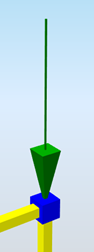
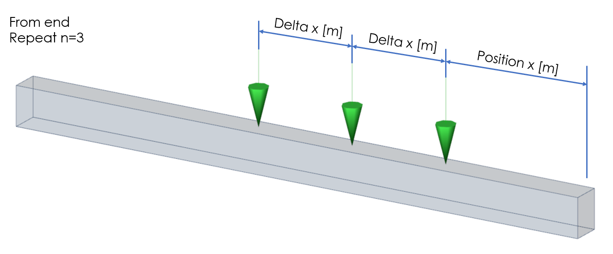

# StructuralPointAction

## Point force

Instances of StructuralPointAction define a point load applied to the node \([StructuralPointConnection](../structural-analysis-elements/structuralpointconnection.md#node)\) and also the location of the point load on a 1D member \([StructuralCurveMember](../structural-analysis-elements/structuralcurvemember.md#1d-member-beam-column)\).

The point force can be defined in three main directions \(global or local coordinate system\). Every point force has to be assigned to a load case.

### Specification in the excel

<table>
  <thead>
    <tr>
      <th style="text-align:center">Name of the column header</th>
      <th style="text-align:center">Type of data</th>
      <th style="text-align:center">Value example or enum definition</th>
      <th style="text-align:left">Required value</th>
      <th style="text-align:left">Description</th>
    </tr>
  </thead>
  <tbody>
    <tr>
      <td style="text-align:center">Name</td>
      <td style="text-align:center">String</td>
      <td style="text-align:center">F3</td>
      <td style="text-align:left">yes</td>
      <td style="text-align:left">Human readable unique name of the force</td>
    </tr>
    <tr>
      <td style="text-align:center">Type</td>
      <td style="text-align:center">String</td>
      <td style="text-align:center">Standard</td>
      <td style="text-align:left">no</td>
      <td style="text-align:left">This property defines what the load is caused by, E.g. Standard, Wind,
        Snow, Self weight, Hoar Frost, Predefined, Plane Load, Water Pond, Water
        Pressure, Soil Pressure, Generated Water, Generated Soil</td>
    </tr>
    <tr>
      <td style="text-align:center">Direction</td>
      <td style="text-align:center">Enum</td>
      <td style="text-align:center">
        
X

        

        
Y

        

        
Z

        

        
Vector

      </td>
      <td style="text-align:left">yes</td>
      <td style="text-align:left">
        
Specifies the base direction of the load

        
X, Y, Z - action will be applied in one of these directions

        
Vector - size and direction calculated from vector

      </td>
    </tr>
    <tr>
      <td style="text-align:center">Force action</td>
      <td style="text-align:center">Enum</td>
      <td style="text-align:center">
        
On beam

        

        
In node

      </td>
      <td style="text-align:left">yes</td>
      <td style="text-align:left">Specifies on which type of object the force acts</td>
    </tr>
    <tr>
      <td style="text-align:center">Reference node</td>
      <td style="text-align:center">String</td>
      <td style="text-align:center">N3</td>
      <td style="text-align:left">yes, if Force action = In node</td>
      <td style="text-align:left">The name of the reference node</td>
    </tr>
    <tr>
      <td style="text-align:center">Reference member</td>
      <td style="text-align:center">String</td>
      <td style="text-align:center">B1</td>
      <td style="text-align:left">yes, if Force action = On beam</td>
      <td style="text-align:left">The name of the reference member</td>
    </tr>
    <tr>
      <td style="text-align:center">Value [kN]</td>
      <td style="text-align:center">Double</td>
      <td style="text-align:center">-150</td>
      <td style="text-align:left">yes, if Direction = X,Y or Z</td>
      <td style="text-align:left">Specifies the size of the load in, acts in one direction</td>
    </tr>
    <tr>
      <td style="text-align:center">Vector (X;Y;Z) [kN]</td>
      <td style="text-align:center">String</td>
      <td style="text-align:center">(10;10;0)</td>
      <td style="text-align:left">yes, if Direction = Vector</td>
      <td style="text-align:left">Specifies the size of the load in , direction by vector</td>
    </tr>
    <tr>
      <td style="text-align:center">Load case</td>
      <td style="text-align:center">String</td>
      <td style="text-align:center">LC2</td>
      <td style="text-align:left">yes</td>
      <td style="text-align:left">The name of the load case to which the force belongs</td>
    </tr>
    <tr>
      <td style="text-align:center">Coordinate system</td>
      <td style="text-align:center">Enum</td>
      <td style="text-align:center">
        
Global

        

        
Local

      </td>
      <td style="text-align:left">yes</td>
      <td style="text-align:left">
        
Defines the co-ordinate system of the member in which the load is applied

        
For &quot; Local&quot;, coordinate system is defined by node or 1D member

      </td>
    </tr>
    <tr>
      <td style="text-align:center">Origin</td>
      <td style="text-align:center">Enum</td>
      <td style="text-align:center">
        
From start

        

        
From end

      </td>
      <td style="text-align:left">yes, if Force action = On beam</td>
      <td style="text-align:left">Specifies where the origin for the position co-ordinate measurement is</td>
    </tr>
    <tr>
      <td style="text-align:center">Coordinate definition</td>
      <td style="text-align:center">Enum</td>
      <td style="text-align:center">
        
Absolute

        

        
Relative

      </td>
      <td style="text-align:left">yes, if Force action = On beam</td>
      <td style="text-align:left">Specifies the definition of the position. It may be absolute or relative</td>
    </tr>
    <tr>
      <td style="text-align:center">Position x [m]</td>
      <td style="text-align:center">Double</td>
      <td style="text-align:center">
        
value in meters for Coordinate definition = Absolute

        
5,25

        
value in percentage for Coordinate definition = Relative

        
1,0

      </td>
      <td style="text-align:left">yes, if Force action = On beam</td>
      <td style="text-align:left">Defines the position of the load on the 1D member in local coordinate
        system in relative or in absolute coordinates [m]</td>
    </tr>
    <tr>
      <td style="text-align:center">Repeat (n)</td>
      <td style="text-align:center">Integer</td>
      <td style="text-align:center">0</td>
      <td style="text-align:left">yes, if Force action = On beam</td>
      <td style="text-align:left">Defines the number of forces acting on the beam. If the number is greater
        than 1, the forces are distributed uniformly over the 1D member</td>
    </tr>
    <tr>
      <td style="text-align:center">Delta x [m]</td>
      <td style="text-align:center">Double</td>
      <td style="text-align:center">0,3</td>
      <td style="text-align:left">yes, if Repeat (n) &gt; 1</td>
      <td style="text-align:left">
        
Defines the distance between forces acting on the 1D member in relative
          or in absolute coordinates [m]

        
(only applicable when ForceAction = OnBeam)

      </td>
    </tr>
    <tr>
      <td style="text-align:center">Id</td>
      <td style="text-align:center">String</td>
      <td style="text-align:center">39f238a5-01d0-45cf-a2eb-958170fd4f39</td>
      <td style="text-align:left">no</td>
      <td style="text-align:left">Unique attribute designation</td>
    </tr>
  </tbody>
</table>

## Notes


An example of use of Repeat \(n\) is given below. The forces are distributed uniformly meaning that the value Delta x is used for uniform distribution along the 1D member for multiple point forces.


