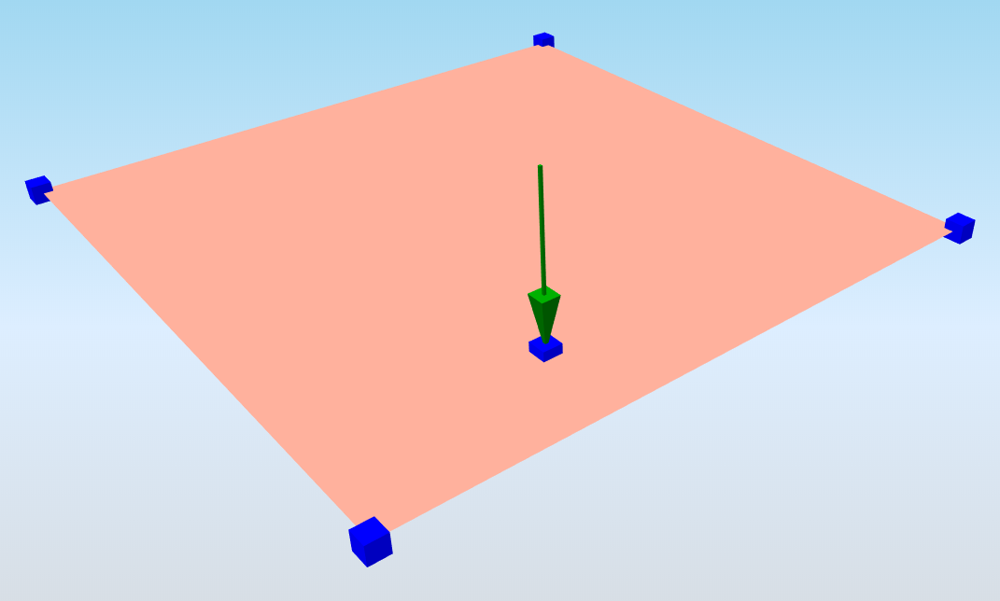

# StructuralPointActionFree

## Free point load

The Free point load is related to slabs. The load is not defined by the entity it acts on, but by a specific load point. Free loads are defined by means of "loading entities" that may overlap or affect one or more slabs.

Specification in the excel:

<table>
  <thead>
    <tr>
      <th style="text-align:center">Name of the column header</th>
      <th style="text-align:center">Type of data</th>
      <th style="text-align:center">Value example or enum definition</th>
      <th style="text-align:center">Required value</th>
      <th style="text-align:left">Description</th>
    </tr>
  </thead>
  <tbody>
    <tr>
      <td style="text-align:center">Name</td>
      <td style="text-align:center">String</td>
      <td style="text-align:center">FF1</td>
      <td style="text-align:center">yes</td>
      <td style="text-align:left">Human readable unique name of the force</td>
    </tr>
    <tr>
      <td style="text-align:center">Type</td>
      <td style="text-align:center">String</td>
      <td style="text-align:center">Standard</td>
      <td style="text-align:center">no</td>
      <td style="text-align:left">This property defines what the load is caused by, E.g. Standard, Wind,
        Snow, Self weight, Hoar Frost, Predefined, Plane Load, Water Pond, Water
        Pressure, Soil Pressure, Generated Water, Generated Soil</td>
    </tr>
    <tr>
      <td style="text-align:center">Direction</td>
      <td style="text-align:center">Enum</td>
      <td style="text-align:center">
        
X

        

        
Y

        

        
Z

        

        
Vector

      </td>
      <td style="text-align:center">yes</td>
      <td style="text-align:left">
        
Specifies the base direction of the load

        
X, Y, Z - action will be applied in one of these directions

        
Vector - size and direction calculated from vector

      </td>
    </tr>
    <tr>
      <td style="text-align:center">Value [kN]</td>
      <td style="text-align:center">Double</td>
      <td style="text-align:center">-1</td>
      <td style="text-align:center">yes, if Direction = X,Y or Z</td>
      <td style="text-align:left">Specifies the size of the load</td>
    </tr>
    <tr>
      <td style="text-align:center">Vector (X;Y;Z) [kN]</td>
      <td style="text-align:center">String</td>
      <td style="text-align:center">(10;10;0)</td>
      <td style="text-align:center">yes, if Direction = Vector</td>
      <td style="text-align:left">Specifies the size of the load in , direction by vector</td>
    </tr>
    <tr>
      <td style="text-align:center">Load case</td>
      <td style="text-align:center">String</td>
      <td style="text-align:center">LC2</td>
      <td style="text-align:center">yes</td>
      <td style="text-align:left">The name of the load case to which the force belongs</td>
    </tr>
    <tr>
      <td style="text-align:center">Coordinate X [m]</td>
      <td style="text-align:center">Double</td>
      <td style="text-align:center">-1,000</td>
      <td style="text-align:center">yes</td>
      <td style="text-align:left">The X coordinate of the point force</td>
    </tr>
    <tr>
      <td style="text-align:center">Coordinate Y [m]</td>
      <td style="text-align:center">Double</td>
      <td style="text-align:center">1,000</td>
      <td style="text-align:center">yes</td>
      <td style="text-align:left">The Y coordinate of the point force</td>
    </tr>
    <tr>
      <td style="text-align:center">Coordinate Z [m]</td>
      <td style="text-align:center">Double</td>
      <td style="text-align:center">3,250</td>
      <td style="text-align:center">yes</td>
      <td style="text-align:left">The Z coordinate of the point force</td>
    </tr>
    <tr>
      <td style="text-align:center">Coordinate system</td>
      <td style="text-align:center">String</td>
      <td style="text-align:center">Global</td>
      <td style="text-align:center">yes</td>
      <td style="text-align:left">Defines the co-ordinate system of the member in which the load is applied.
        Only global coordinate system is supported for free point loads</td>
    </tr>
    <tr>
      <td style="text-align:center">Id</td>
      <td style="text-align:center">String</td>
      <td style="text-align:center">39f238a5-01d0-45cf-a2eb-958170fd4f39</td>
      <td style="text-align:center">no</td>
      <td style="text-align:left">Unique attribute designation</td>
    </tr>
  </tbody>
</table>

