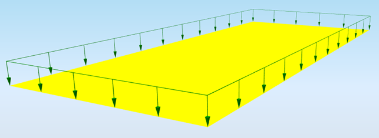

# StructuralSurfaceAction

## Surface load

Defines actions on surfaces – plates, walls. The surface load is defined on the whole slab automatically. If only a part of the main slab is supposed to be subject to this load, a subregion \([StructuralSurfaceMemberRegion](../structural-analysis-elements/structuralsurfacememberregion.md#region-of-different-plate-thickness)\) must be defined inside the main slab.

Specification in the excel:

<table>
  <thead>
    <tr>
      <th style="text-align:center">Name of the column header</th>
      <th style="text-align:center">Type of data</th>
      <th style="text-align:center">Value example or enum definition</th>
      <th style="text-align:center">Required value</th>
      <th style="text-align:left">Description</th>
    </tr>
  </thead>
  <tbody>
    <tr>
      <td style="text-align:center">Name</td>
      <td style="text-align:center">String</td>
      <td style="text-align:center">PF3</td>
      <td style="text-align:center">yes</td>
      <td style="text-align:left">Human readable unique name of the force</td>
    </tr>
    <tr>
      <td style="text-align:center">Direction</td>
      <td style="text-align:center">Enum</td>
      <td style="text-align:center">
        
X

        

        
Y

        

        
Z

      </td>
      <td style="text-align:center">yes</td>
      <td style="text-align:left">Specifies the base direction of the load</td>
    </tr>
    <tr>
      <td style="text-align:center">Type</td>
      <td style="text-align:center">String</td>
      <td style="text-align:center">Standard</td>
      <td style="text-align:center">no</td>
      <td style="text-align:left">This property defines what the load is caused by, E.g. Standard, Wind,
        Snow, Self weight, Hoar Frost, Predefined, Plane Load, Water Pond, Water
        Pressure, Soil Pressure, Generated Water, Generated Soil</td>
    </tr>
    <tr>
      <td style="text-align:center">Value [kN/m2]</td>
      <td style="text-align:center">Double</td>
      <td style="text-align:center">-10</td>
      <td style="text-align:center">yes</td>
      <td style="text-align:left">Specifies the size of the load in kiloNewtons per square meter.</td>
    </tr>
    <tr>
      <td style="text-align:center">2D Member</td>
      <td style="text-align:center">String</td>
      <td style="text-align:center">S15</td>
      <td style="text-align:center">yes</td>
      <td style="text-align:left">The name of the <a href="https://saf.guide/Content/A_Objects/8_StructuralSurfaceMember.htm">StructuralSurfaceMember</a> or
        <a
        href="https://saf.guide/Content/A_Objects/36_StructuralSurfaceActionDistribution.htm">StructuralSurfaceActionDistribution</a>which is the surface load related
          to.</td>
    </tr>
    <tr>
      <td style="text-align:center">2D Member Region</td>
      <td style="text-align:center">String</td>
      <td style="text-align:center">R1</td>
      <td style="text-align:center">no</td>
      <td style="text-align:left">The name of the <a href="https://saf.guide/Content/A_Objects/10_StructuralSurfaceMemberRegion.htm">StructuralSurfaceMemberRegion</a> to
        which is the surface action related if it is available on 2D member.</td>
    </tr>
    <tr>
      <td style="text-align:center">Load case</td>
      <td style="text-align:center">String</td>
      <td style="text-align:center">LC5</td>
      <td style="text-align:center">yes</td>
      <td style="text-align:left">The name of the load case to which the force belongs</td>
    </tr>
    <tr>
      <td style="text-align:center">Coordinate system</td>
      <td style="text-align:center">Enum</td>
      <td style="text-align:center">
        
Global

        

        
Local

      </td>
      <td style="text-align:center">yes</td>
      <td style="text-align:left">Defines the co-ordinate system of the member in which the load is applied</td>
    </tr>
    <tr>
      <td style="text-align:center">Location</td>
      <td style="text-align:center">Enum</td>
      <td style="text-align:center">
        
Length

        

        
Projection

      </td>
      <td style="text-align:center">yes</td>
      <td style="text-align:left">Specifies whether the load is &quot;put directly on an inclined 2D member&quot;
        or whether the &quot;projection on plan&quot; is defined.</td>
    </tr>
    <tr>
      <td style="text-align:center">Parent ID</td>
      <td style="text-align:center">String</td>
      <td style="text-align:center">67b35d84-3d04-47aa-aa4a-dc1263982320</td>
      <td style="text-align:center">no</td>
      <td style="text-align:left">
        
Is filled for objects created be dividing curved geometry to series of
          straight line objects.
           
           Parent ID will ensure that curved edge is imported as straight parts to
          nonsupporting application, and back to original supporting application
          as curved geometry.

        
To ensure successful round trip of segmented objects and their related
          objects, Parent ID needs to be present in both directions.

      </td>
    </tr>
    <tr>
      <td style="text-align:center">Id</td>
      <td style="text-align:center">String</td>
      <td style="text-align:center">39f238a5-01d0-45cf-a2eb-958170fd4f39</td>
      <td style="text-align:center">no</td>
      <td style="text-align:left">Unique attribute designation</td>
    </tr>
  </tbody>
</table>

