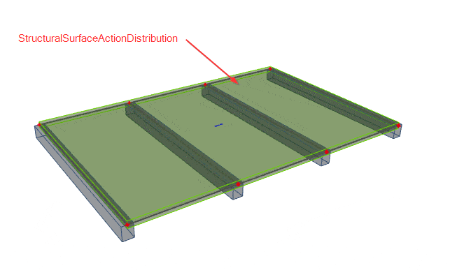

# StructuralSurfaceActionDistribution

## Load panels, Load distribution

StructuralSurfaceActionDistribution object describes how surface load can be distributed to other members.

Specification in the excel:

<table>
  <thead>
    <tr>
      <th style="text-align:center">Name of the column header</th>
      <th style="text-align:center">Type of data</th>
      <th style="text-align:center">Value example or enum definition</th>
      <th style="text-align:center">Required value</th>
      <th style="text-align:left">Description</th>
    </tr>
  </thead>
  <tbody>
    <tr>
      <td style="text-align:center">Name</td>
      <td style="text-align:center">String</td>
      <td style="text-align:center">FL1</td>
      <td style="text-align:center">yes</td>
      <td style="text-align:left">Human readable unique name of the Arbitrary definition</td>
    </tr>
    <tr>
      <td style="text-align:center">Type</td>
      <td style="text-align:center">Enum</td>
      <td style="text-align:center">
        
Nodes

        

        
Edges

        

        
Beams and edges
           
        

      </td>
      <td style="text-align:center">yes</td>
      <td style="text-align:left">
        
Defines where the load should be distributed.

        
<b>Nodes</b> - load is expected to be distributed to nodes of StructuralSurfaceActionDistribution

        
<b>Edges</b> - load is expected to be distributed to edges of StructuralSurfaceActionDistribution

        
<b>Beams and edges</b> - load is expected to be distributed to edges and
          specified beams of StructuralSurfaceActionDistribution
           
        

      </td>
    </tr>
    <tr>
      <td style="text-align:center">Nodes</td>
      <td style="text-align:center">String</td>
      <td style="text-align:center">N81; N263; N659; N660</td>
      <td style="text-align:center">yes</td>
      <td style="text-align:left">All nodes that belongs to StructuralSurfaceActionDistribution member and
        defines its geometric shape. The names of the nodes are separated by ;
        (semicolon) and space.</td>
    </tr>
    <tr>
      <td style="text-align:center">Edges</td>
      <td style="text-align:center">String</td>
      <td style="text-align:center">
        
Line; Line; Circular Arc; Line

        
or

        
Line;Spline-5;Line;Parabolic Arc;Line

      </td>
      <td style="text-align:center">yes</td>
      <td style="text-align:left">
        
Defines the shape of the curve between two next nodes (or more nodes depends
          on edge type). Supported strings are:

        <ul>
          <li>Line</li>
          <li>Circular Arc</li>
          <li>Circle by 3 points</li>
          <li>Circle and Point</li>
          <li>Parabolic arc</li>
          <li>Bezier</li>
          <li>Spline-x</li>
        </ul>
        
Where &quot;x&quot; number of nodes defining the spline

        
The names are separated by ; (semicolon) and space. It possible to also
          define circle geometry by using &quot;Circle and Point&quot; or &quot;Circle
          by 3 points&quot;. In case of &quot;Circle and point&quot; two nodes have
          to be defined, centre of the circle and a point on a circle. The circle
          defined by two points is always horizontal.

      </td>
    </tr>
    <tr>
      <td style="text-align:center">Layer</td>
      <td style="text-align:center">String</td>
      <td style="text-align:center">Load panel</td>
      <td style="text-align:center">no</td>
      <td style="text-align:left">Custom created layer. The layer can thus comprise entities that have something
        in common (e.g. one floor, columns of one floor, columns of the same length,
        etc.)</td>
    </tr>
    <tr>
      <td style="text-align:center">LCS Type</td>
      <td style="text-align:center">Enum</td>
      <td style="text-align:center">
        
x by vector

        

        
y by vector

        

        
Tilt of vector defined by point

      </td>
      <td style="text-align:center">yes</td>
      <td style="text-align:left">
        
Defines type of the local coordinate system of the StructuralSurfaceActionDistribution.
          Option &#x201C;Tilt of vector defined by point&#x201D; allows change of
          orientation of the LCS to one point. For this, you have to specify coordinates
          of the vector.

        
For further understanding see <a href="https://saf.guide/Content/1_Introduction.htm">Introduction</a>
        

      </td>
    </tr>
    <tr>
      <td style="text-align:center">Coordinate X [m]</td>
      <td style="text-align:center">Double</td>
      <td style="text-align:center">1</td>
      <td style="text-align:center">yes</td>
      <td style="text-align:left">Coordinate of the vector of the LCS in X direction</td>
    </tr>
    <tr>
      <td style="text-align:center">Coordinate Y [m]</td>
      <td style="text-align:center">Double</td>
      <td style="text-align:center">0</td>
      <td style="text-align:center">yes</td>
      <td style="text-align:left">Coordinate of the vector of the LCS in Y direction</td>
    </tr>
    <tr>
      <td style="text-align:center">Coordinate Z [m]</td>
      <td style="text-align:center">Double</td>
      <td style="text-align:center">1,2</td>
      <td style="text-align:center">yes</td>
      <td style="text-align:left">Coordinate of the vector of the LCS in Z direction</td>
    </tr>
    <tr>
      <td style="text-align:center">LCS Rotation [deg]</td>
      <td style="text-align:center">Double</td>
      <td style="text-align:center">45.00</td>
      <td style="text-align:center">yes</td>
      <td style="text-align:left">
        
This value defines the rotation of local axes of the StructuralSurfaceActionDistribution
          member.

        
It is angle around Z axis (axis which is perpendicular to plane) and defines
          distribution angle.

        
Positive value = anti clock wise.

      </td>
    </tr>
    <tr>
      <td style="text-align:center">Distribution to</td>
      <td style="text-align:center">Enum</td>
      <td style="text-align:center">
        
One way - X

        

        
One way - Y

        

        
Two way

      </td>
      <td style="text-align:center">yes</td>
      <td style="text-align:left">
        
Defines how the load will be distributed.

        
<b>One way - X</b> - Load will be distributed only to members parallel
          with X direction (X axis of LCS)

        

        
<b>One way - Y</b> - Load will be distributed only to members parallel
          with Y direction (Y axis of LCS

        
)

        
<b>Two way</b> - Load will be distributed equally to both directions

      </td>
    </tr>
    <tr>
      <td style="text-align:center">Load applied to</td>
      <td style="text-align:center">String</td>
      <td style="text-align:center">B1 ; B2 ; B3 ; B5</td>
      <td style="text-align:center">yes</td>
      <td style="text-align:left">
        
Allows to define the subset of loaded <b>beams</b>.

        
Taken into account only if <b>Type = Beams and edges</b>
        

        
If blank = all beams are loaded

      </td>
    </tr>
    <tr>
      <td style="text-align:center">Id</td>
      <td style="text-align:center">String</td>
      <td style="text-align:center">39f238a5-01d0-45cf-a2eb-958170fd4f39</td>
      <td style="text-align:center">no</td>
      <td style="text-align:left">Unique attribute designation</td>
    </tr>
  </tbody>
</table>

