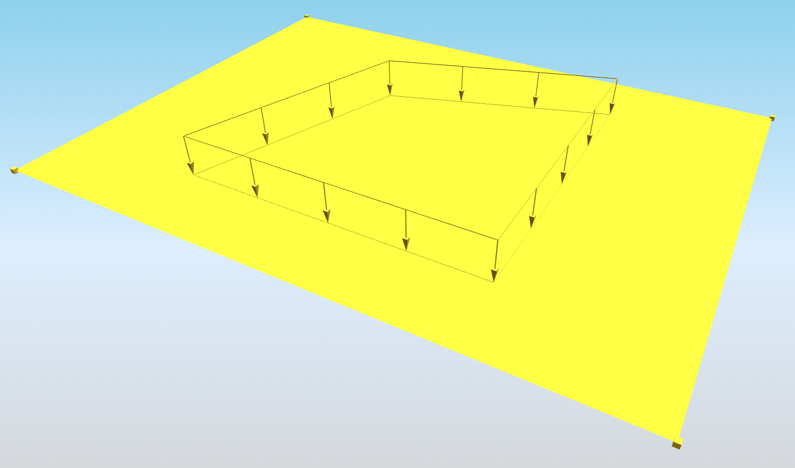
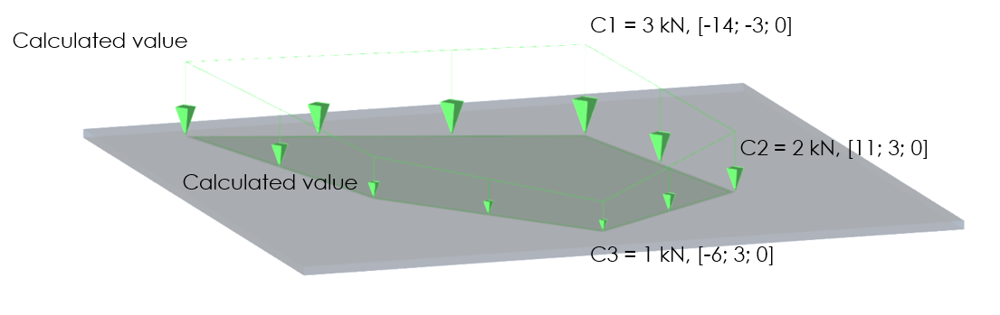

# StructuralSurfaceActionFree

## Free surface load

The Free surface load is related to slabs. The load is not defined by the entity it acts on, but by a specific load border. Free loads are defined by means of "loading entities" that may overlap or affect one or more slabs.

Specification in the excel:

<table>
  <thead>
    <tr>
      <th style="text-align:center">Name of the column header</th>
      <th style="text-align:center">Type of data</th>
      <th style="text-align:center">Value example or enum definition</th>
      <th style="text-align:center">Required value</th>
      <th style="text-align:left">Description</th>
    </tr>
  </thead>
  <tbody>
    <tr>
      <td style="text-align:center">Name</td>
      <td style="text-align:center">String</td>
      <td style="text-align:center">FF1</td>
      <td style="text-align:center">yes</td>
      <td style="text-align:left">Human readable unique name of the force</td>
    </tr>
    <tr>
      <td style="text-align:center">Direction</td>
      <td style="text-align:center">Enum</td>
      <td style="text-align:center">
        
X

        

        
Y

        

        
Z

      </td>
      <td style="text-align:center">yes</td>
      <td style="text-align:left">Specifies the base direction of the load</td>
    </tr>
    <tr>
      <td style="text-align:center">Type</td>
      <td style="text-align:center">String</td>
      <td style="text-align:center">Standard</td>
      <td style="text-align:center">no</td>
      <td style="text-align:left">This property defines what the load is caused by, E.g. Standard, Wind,
        Snow, Self weight, Hoar Frost, Predefined, Plane Load, Water Pond, Water
        Pressure, Soil Pressure, Generated Water, Generated Soil</td>
    </tr>
    <tr>
      <td style="text-align:center">Distribution</td>
      <td style="text-align:center">Enum</td>
      <td style="text-align:center">
        
Uniform

        

        
DirectionX

        

        
DirectionY

        

        
DirectionXY

      </td>
      <td style="text-align:center">yes</td>
      <td style="text-align:left">
        
The load may be either constant across the slab or linearly variable

        
&quot;DirectionX&quot; and &quot;DirectionY&quot; enums are defining that,
          the value of the surface load is linearly variable according to the one
          of the user-selected axis

        
&quot;DirectionXY&quot; value inclination of surface load is defined in
          both directions well

      </td>
    </tr>
    <tr>
      <td style="text-align:center">q [kN/m2]</td>
      <td style="text-align:center">String</td>
      <td style="text-align:center">
        
-10

        
(for &quot;Distribution&quot; set to &quot;Uniform&quot;)

        
or

        
C1:-5; C2:-7

        
(for &quot;Distribution&quot; set to &quot;Direction*&quot;)

        
or

        
C1:-3; C2:-2; C3:-1

        
(for &quot;Distribution&quot; set to &quot;DirectionXY&quot;)

      </td>
      <td style="text-align:center">yes</td>
      <td style="text-align:left">
        
Specifies the size of the load in kiloNewtons per square meter.

        
if Distribution is Direction X, Direction Y or Direction XY then the vertexes
          of the polygon of the free load have to be specified. For distribution
          Direction X and Direction Y two vertexes, for distribution in Direction
          XY, three vertexes. The format have to be following:

        
C&quot;number of vertex of the load polygon&quot; : &quot;value of the
          load in this vertex&quot;

        
The number of the vertex corresponds to the coordinate order. So the first
          coordinate means C1, the second C2 and so on

        
For further understanding of &quot;C&quot; attributes see notes below
          table

      </td>
    </tr>
    <tr>
      <td style="text-align:center">Load case</td>
      <td style="text-align:center">String</td>
      <td style="text-align:center">LC5</td>
      <td style="text-align:center">yes</td>
      <td style="text-align:left">The name of the load case to which the force belongs</td>
    </tr>
    <tr>
      <td style="text-align:center">Coordinate X [m]</td>
      <td style="text-align:center">Double</td>
      <td style="text-align:center">0.000; 2.050; 4.850; -2.000</td>
      <td style="text-align:center">yes</td>
      <td style="text-align:left">The list of X coordinates of the nodes which define the geometry of the
        surface free load. Each coordinate is separated by semicolon and space.</td>
    </tr>
    <tr>
      <td style="text-align:center">Coordinate Y [m]</td>
      <td style="text-align:center">Double</td>
      <td style="text-align:center">0.500; 1.050; 2.650; -1.500</td>
      <td style="text-align:center">yes</td>
      <td style="text-align:left">The list of Y coordinates of the nodes which define the geometry of the
        surface free load. Each coordinate is separated by semicolon and space.</td>
    </tr>
    <tr>
      <td style="text-align:center">Coordinate Z [m]</td>
      <td style="text-align:center">Double</td>
      <td style="text-align:center">0.000; 0.000; 0.000; 0.000</td>
      <td style="text-align:center">yes</td>
      <td style="text-align:left">The list of Z coordinates of the nodes which define the geometry of the
        surface free load. Each coordinate is separated by semicolon and space.</td>
    </tr>
    <tr>
      <td style="text-align:center">Edges</td>
      <td style="text-align:center">String</td>
      <td style="text-align:center">Line; Line; Line; Line</td>
      <td style="text-align:center">yes</td>
      <td style="text-align:left">Defines shape of the curve between two next nodes. Supported strings are:
        Line; Bezier; Circle arc; Parabolic arc; Spline. The names are separated
        by ; (semicolon) and space.</td>
    </tr>
    <tr>
      <td style="text-align:center">Coordinate system</td>
      <td style="text-align:center">Enum</td>
      <td style="text-align:center">
        
Global

        

        
Local

      </td>
      <td style="text-align:center">yes</td>
      <td style="text-align:left">Defines co-ordinate system of the member in which the load is applied</td>
    </tr>
    <tr>
      <td style="text-align:center">Location</td>
      <td style="text-align:center">Enum</td>
      <td style="text-align:center">
        
Length

        

        
Projection

      </td>
      <td style="text-align:center">yes</td>
      <td style="text-align:left">Specifies whether the load is &quot;put directly on an inclined 2D member&quot;
        or whether the &quot;projection on plan&quot; is defined.</td>
    </tr>
    <tr>
      <td style="text-align:center">Id</td>
      <td style="text-align:center">String</td>
      <td style="text-align:center">39f238a5-01d0-45cf-a2eb-958170fd4f39</td>
      <td style="text-align:center">no</td>
      <td style="text-align:left">Unique attribute designation</td>
    </tr>
  </tbody>
</table>

## Notes


When is "Distribution" set to "DirectionX" or "DirectionY" the system is the same, but only two C values have to be defined.

When "Distribution" is set to "DirectionXY" is necessary to define 3 "C" vertexes. These Vertexes are defining projection onto slab and Value of the load as well. According to position and load value of "C" vertexes is load plane defined and every other vertex of the surface load is calculated. See example below.


