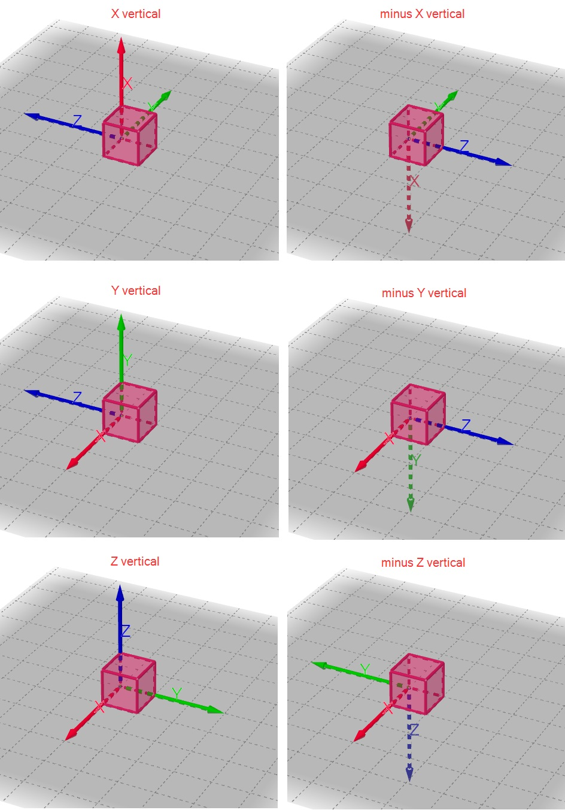
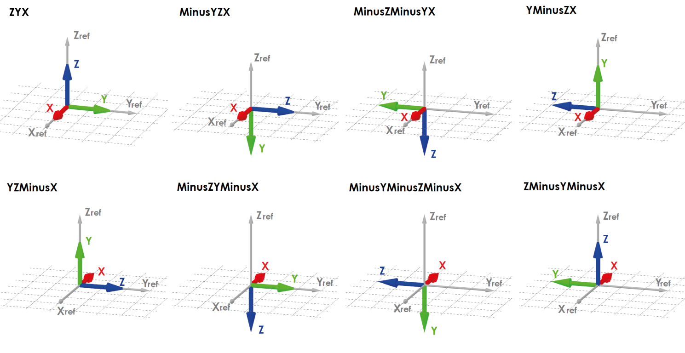

# Project and model specifications


Structure of sheets "Project" and "Model" is different from all the other sheets. Properties are oriented in columns not in rows as usual.


## Project

In the list called “Project”, you can specify basic information about your project.

The specification in excel:

| Name of the row | Type of data | Value example or enum definition | Required value | Description |
| :--- | :--- | :--- | :--- | :--- |
| Name | String | Park Office | no | The name of the project |
| Description | String | Administrative complex | no | The description of the project |
| Project nr | String | 23/2019 | no | Project numerical designation |
| Created | Date Time | 2018-12-16 15:48:50 | no | Creation time, in UTC, in format yyyy-mm-dd hh:mm |
| Last update | Date Time | 2018-12-23 23:58:59 | no | Last update time, in UTC, in format yyyy-mm-dd hh:mm |
| Project type | String | Building construction | no | The type of the project. The project type can be assigned to e.g. "Building construction" or "Infrastructure construction" |
| Project kind | String | New building | no | The kind of the project. The project kind can be assigned to e.g. "Extension", "Finish", "New building", "Reconstruction" |
| Building type | String | Business | no | Kind of use of the building such as Administrative, Residential, etc… |
| Status | String | Planning stage | no | Status of the project |
| Location | String | South Bohemia | no | Location of the designed project |
| Id | String | bba1ede8-4106-47fd-b5e1-48637ab87f50 | no | ID of project. |

## Model

In the list called “model” you can specify basic info about your project.

The specification in excel:

<table>
  <thead>
    <tr>
      <th style="text-align:left">Name of the row</th>
      <th style="text-align:left">Type of data</th>
      <th style="text-align:left">Value example or enum definition</th>
      <th style="text-align:left">Required value</th>
      <th style="text-align:left">Description</th>
    </tr>
  </thead>
  <tbody>
    <tr>
      <td style="text-align:left">Name</td>
      <td style="text-align:left">String</td>
      <td style="text-align:left">Park Office - object A</td>
      <td style="text-align:left">no</td>
      <td style="text-align:left">The name of the model</td>
    </tr>
    <tr>
      <td style="text-align:left">Description</td>
      <td style="text-align:left">String</td>
      <td style="text-align:left">Highrise</td>
      <td style="text-align:left">no</td>
      <td style="text-align:left">The description of the model</td>
    </tr>
    <tr>
      <td style="text-align:left">Discipline</td>
      <td style="text-align:left">String</td>
      <td style="text-align:left">Load-bearing structure</td>
      <td style="text-align:left">no</td>
      <td style="text-align:left">Discipline can be set as Undefined, Architecture, HVAC, Load-bearing structure,
        Terrain, Facility etc.</td>
    </tr>
    <tr>
      <td style="text-align:left">Level of detail</td>
      <td style="text-align:left">String</td>
      <td style="text-align:left">Draft</td>
      <td style="text-align:left">no</td>
      <td style="text-align:left">Describe level of detail of the model</td>
    </tr>
    <tr>
      <td style="text-align:left">Status</td>
      <td style="text-align:left">String</td>
      <td style="text-align:left">Planning stage</td>
      <td style="text-align:left">no</td>
      <td style="text-align:left">Description of model status</td>
    </tr>
    <tr>
      <td style="text-align:left">Owner</td>
      <td style="text-align:left">String</td>
      <td style="text-align:left">Person A</td>
      <td style="text-align:left">no</td>
      <td style="text-align:left">Define the owner of the model</td>
    </tr>
    <tr>
      <td style="text-align:left">Revision number</td>
      <td style="text-align:left">String</td>
      <td style="text-align:left">rev.02</td>
      <td style="text-align:left">no</td>
      <td style="text-align:left">Current revision number</td>
    </tr>
    <tr>
      <td style="text-align:left">Created</td>
      <td style="text-align:left">Date Time</td>
      <td style="text-align:left">2018-12-16</td>
      <td style="text-align:left">no</td>
      <td style="text-align:left">Creation time, in UTC, in ISO format year-month-day</td>
    </tr>
    <tr>
      <td style="text-align:left">Last update</td>
      <td style="text-align:left">Date Time</td>
      <td style="text-align:left">2018-12-19</td>
      <td style="text-align:left">no</td>
      <td style="text-align:left">Last update time, in UTC, in ISO format year-month-day</td>
    </tr>
    <tr>
      <td style="text-align:left">Source type</td>
      <td style="text-align:left">String</td>
      <td style="text-align:left">Structural analysis model</td>
      <td style="text-align:left">no</td>
      <td style="text-align:left">Definition of the source data</td>
    </tr>
    <tr>
      <td style="text-align:left">Source application</td>
      <td style="text-align:left">String</td>
      <td style="text-align:left">Scia Engineer</td>
      <td style="text-align:left">no</td>
      <td style="text-align:left">Definition of the source application</td>
    </tr>
    <tr>
      <td style="text-align:left">SAF Version</td>
      <td style="text-align:left">String</td>
      <td style="text-align:left">1.0.3</td>
      <td style="text-align:left">yes</td>
      <td style="text-align:left">Definition of used version of the Structural Analysis Format</td>
    </tr>
    <tr>
      <td style="text-align:left">Source company</td>
      <td style="text-align:left">String</td>
      <td style="text-align:left">Statical company</td>
      <td style="text-align:left">no</td>
      <td style="text-align:left">Define the author company of source data</td>
    </tr>
    <tr>
      <td style="text-align:left">Global coordinate system</td>
      <td style="text-align:left">Enum</td>
      <td style="text-align:left">
        
X vertical

        

        
Y vertical

        

        
Z vertical

        

        
minus X vertical

        

        
minus Y vertical

        

        
minus Z vertical

      </td>
      <td style="text-align:left">yes</td>
      <td style="text-align:left">
        
Define the space orientation of the coordinates system for model

        
Right hand rule applies all the time.

        
X vertical - X axis goes against gravity

        
Y vertical - Y axis goes against gravity

        
Z vertical - Z axis goes against gravity

        
minus X vertical - X axis goes in direction of gravity

        
minus Y vertical - Y axis goes in direction of gravity

        
minus Z vertical - Z axis goes in direction of gravity

        
* For further explanation see notes below
           
        

      </td>
    </tr>
    <tr>
      <td style="text-align:left">LCS of cross-section</td>
      <td style="text-align:left">Enum</td>
      <td style="text-align:left">
        
ZYX

        

        
MinusYZX

        

        
MinusZMinusYX

        

        
YMinusZX

        

        
YZMinusX

        

        
MinusZYMinusX

        

        
MinusYMinusZMinusX

        

        
ZMinusYMinusX

      </td>
      <td style="text-align:left">yes</td>
      <td style="text-align:left">
        
Define the LCS orientation of used cross-section.

        
With row &quot;LCS of cross-section&quot; the user is able to define,
          how the LCS of cross section is defined in his software. This will give
          opportunity to receiving application of SAF file to correctly interpret
          LCS of cross section with different standard. The x-axis is always in the
          centre line and all possible cases are described by this enum.

        
For further explanation see notes below

      </td>
    </tr>
    <tr>
      <td style="text-align:left">System of units</td>
      <td style="text-align:left">Enum</td>
      <td style="text-align:left">
        
Metric

        

        
Imperial

      </td>
      <td style="text-align:left">yes</td>
      <td style="text-align:left">Define the type of units system used in model</td>
    </tr>
    <tr>
      <td style="text-align:left">National code</td>
      <td style="text-align:left">Enum</td>
      <td style="text-align:left">
        
EC-Standard-EN

        

        
EC-ONORM-EN (Austrian NA)

        

        
EC-NBN-EN (Belgian NA)

        

        
EC-BS-EN (British NA)

        

        
EC-CYS-EN (Cypriot NA)

        

        
EC-CSN-EN (Czech NA)

        

        
EC-DS-EN (Danish NA)

        

        
EC-NEN-EN (Dutch NA)

        

        
EC-SFS-EN (Finnish NA)

        

        
EC-NF-EN (French NA)

        

        
EC-DIN-EN (German NA)

        

        
EC-ELOT-EN (Greek NA)

        

        
EC-IS-EN (Irish NA)

        

        
EC-UNI-EN (Italian NA)

        

        
EC-LU-EN (Luxembourgian NA)

        

        
EC-MS-EN (Malaysian NA)

        

        
EC-NS-EN (Norwegian NA)

        

        
EC-PN-EN (Polish NA)

        

        
EC-SR-EN (Romanian NA)

        

        
EC-SS-EN (Singaporean NA)

        

        
EC-STN-EN (Slovakian NA)

        

        
EC-SIST-EN (Slovenian NA)

        

        
EC-UNE-EN (Spanish NA)

        

        
EC-SS-EN (Swedish NA)

        

        
IBC

        

        
NBR

      </td>
      <td style="text-align:left">yes</td>
      <td style="text-align:left">Sets national code used for structural analysis</td>
    </tr>
    <tr>
      <td style="text-align:left">Ignored objects</td>
      <td style="text-align:left">String</td>
      <td style="text-align:left">StructuralCrossSection;StructuralPointAction</td>
      <td style="text-align:left">no</td>
      <td style="text-align:left">
        
Field used for update work-flow

        
Specify the object(s) that should be excluded from update

        
Multiple objects are divided by a semicolon

        
See notes for all SAF objects
           
        

      </td>
    </tr>
    <tr>
      <td style="text-align:left">Ignored groups</td>
      <td style="text-align:left">String</td>
      <td style="text-align:left">SupportsAndHinges;StructuralLoad</td>
      <td style="text-align:left">no</td>
      <td style="text-align:left">
        
Field used for update work-flow

        
Specify the groups(s) that should be excluded from update

        
Groups are parent to objects - each group consists of multiple objects

        
Multiple groups are divided by a semicolon

        
See notes for all SAF groups

      </td>
    </tr>
    <tr>
      <td style="text-align:left">Id</td>
      <td style="text-align:left">String</td>
      <td style="text-align:left">bba1ede8-4106-47fd-b5e1-48637ab87f47</td>
      <td style="text-align:left">no</td>
      <td style="text-align:left">ID of model.</td>
    </tr>
  </tbody>
</table>

## Notes


### **Global coordinate system:**


  


### **LCS of cross-section:**

*  The graphical interpretation of values for row "**LCS of cross-section**" is represented below. Please keep in mind that x-axis is always in centre-line of the member. "**LCS of cross-section**" desribes how is LCS of CSS library handled and how is CSS applied on the the member.
* The first axis of the enum is the vertical one, positive direction is Zref. The second axis of the enum is the horizontal one, positive direction is Yref. Last is the axis in cente-line of the member, positive direction is Xref.



### **System of units**

* Column headers should respect this setting and change unit accordingly, also values should be in specified units
* See [table](units.md) of units for headers

### **Ignored objects/groups:**

* See [table](ignore.md) of units for headers


