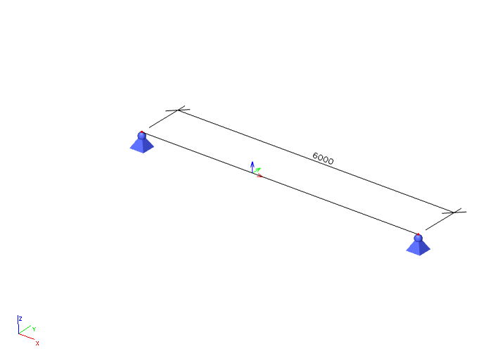

# ResultInternalForce1D

## Internal force 1D

Internal forces on line, beam, member. Result in member axis \(not in principal axis\).

### Specification in the excel:

<table>
  <thead>
    <tr>
      <th style="text-align:center">Name of the column header</th>
      <th style="text-align:center">Type of data</th>
      <th style="text-align:center">Value example or enum definition</th>
      <th style="text-align:center">Required value</th>
      <th style="text-align:left">Description</th>
    </tr>
  </thead>
  <tbody>
    <tr>
      <td style="text-align:center">Result on</td>
      <td style="text-align:center">Enum</td>
      <td style="text-align:center">
        
On beam

        

        
On rib

      </td>
      <td style="text-align:center">yes</td>
      <td style="text-align:left">
        
Specify object where the result is

        

        
On beam - <a href="../structural-analysis-elements/structuralcurvemember.md#1d-member-beam-column">StructuralCurveMember</a>
        

        

        
On rib - <a href="../structural-analysis-elements/structuralcurvememberrib.md#2d-member-rib">StructuralCurveMemberRib</a>
        

      </td>
    </tr>
    <tr>
      <td style="text-align:center">Member</td>
      <td style="text-align:center">String</td>
      <td style="text-align:center">B1</td>
      <td style="text-align:center">yes, if Result on = On beam</td>
      <td style="text-align:left">Reference to the name of 1D member - <a href="../structural-analysis-elements/structuralcurvemember.md#1d-member-beam-column">StructuralCurveMember</a>
      </td>
    </tr>
    <tr>
      <td style="text-align:center">Member Rib</td>
      <td style="text-align:center">String</td>
      <td style="text-align:center">B2</td>
      <td style="text-align:center">yes, if Result on = On rib</td>
      <td style="text-align:left">Reference to the name of 1D member rib - <a href="../structural-analysis-elements/structuralcurvememberrib.md#2d-member-rib">StructuralCurveMemberRib</a>
      </td>
    </tr>
    <tr>
      <td style="text-align:center">Result for</td>
      <td style="text-align:center">Enum</td>
      <td style="text-align:center">
        
Load case

        

        
Combination

      </td>
      <td style="text-align:center">yes</td>
      <td style="text-align:left">Specifies from where the result is coming from (from Load Case, Load Combination)</td>
    </tr>
    <tr>
      <td style="text-align:center">Load case</td>
      <td style="text-align:center">String</td>
      <td style="text-align:center">LC1</td>
      <td style="text-align:center">yes, if Result for = Load case</td>
      <td style="text-align:left">Reference to the name of
         <a href="../loads/structuralloadcase.md#load-case">StructuralLoadCase</a>
      </td>
    </tr>
    <tr>
      <td style="text-align:center">Load combination</td>
      <td style="text-align:center">String</td>
      <td style="text-align:center">COM1</td>
      <td style="text-align:center">yes, if Result for = Combination</td>
      <td style="text-align:left">Reference to the name of<a href="../loads/structuralloadcombination.md#load-combination"> StructuralLoadCombination</a>
      </td>
    </tr>
    <tr>
      <td style="text-align:center">Section at [m]</td>
      <td style="text-align:center">Double</td>
      <td style="text-align:center">0,100</td>
      <td style="text-align:center">yes</td>
      <td style="text-align:left">X coordinate on the beam (distance from the start node) where the result
        is located</td>
    </tr>
    <tr>
      <td style="text-align:center">Index</td>
      <td style="text-align:center">Integer</td>
      <td style="text-align:center">1</td>
      <td style="text-align:center">yes</td>
      <td style="text-align:left">Index of the section on beam. See <a href="resultinternalforce1d.md#notes">notes</a>.</td>
    </tr>
    <tr>
      <td style="text-align:center">Vz [kN]</td>
      <td style="text-align:center">Double</td>
      <td style="text-align:center">3,00</td>
      <td style="text-align:center">yes</td>
      <td style="text-align:left">
        
Result value of Vz

        
(Shear force in Z axis direction)

      </td>
    </tr>
    <tr>
      <td style="text-align:center">Mx [kNm]</td>
      <td style="text-align:center">Double</td>
      <td style="text-align:center">0,000</td>
      <td style="text-align:center">yes</td>
      <td style="text-align:left">
        
Result value of Mx

        
(Moment around X axis)

      </td>
    </tr>
    <tr>
      <td style="text-align:center">My [kNm]</td>
      <td style="text-align:center">Double</td>
      <td style="text-align:center">4,500</td>
      <td style="text-align:center">yes</td>
      <td style="text-align:left">
        
Result value of My

        
(Moment around Y axis)

      </td>
    </tr>
    <tr>
      <td style="text-align:center">Mz [kNm]</td>
      <td style="text-align:center">Double</td>
      <td style="text-align:center">4,500</td>
      <td style="text-align:center">yes</td>
      <td style="text-align:left">Result value of Mz (Moment around Z axis)</td>
    </tr>
  </tbody>
</table>

## Notes


### Multiple tables in one sheet

The amount of data can be limited due the [limitation of xlsx](https://support.microsoft.com/en-us/office/excel-specifications-and-limits-1672b34d-7043-467e-8e27-269d656771c3) format.

Therefore the results can be written to SAF in a form of multiple tables. In the similiar logic as the [StructuralProxyElement](../structural-analysis-elements/structuralproxyelement.md#general-solids).  



### **Index** 

This attribute defines an order of the section on the beam, starting with 1 and increasing from the **start** to the **end** of the beam. This property helps to specify if the internal force is on the "left" or on the right side of the section.

See example below:



See the index 6 and 7. One section, two values for normal \(N\) force.   
Section with lower index \(6\) identifies value on the left \(closer to the origin of X-axis of the beam\).  
Section with a higher index \(7\) identifies value on the right \(further from the origin of X-axis of the beam\).


