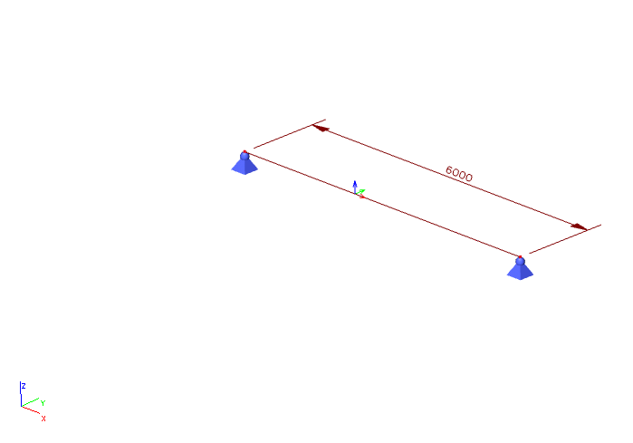

# ResultInternalForce1D

## Internal force 1D

Internal forces on line, beam, member. Result in member axis \(not in principal axis\).

Specification in the excel:

<table>
  <thead>
    <tr>
      <th style="text-align:left">Name of the column header</th>
      <th style="text-align:left">Type of data</th>
      <th style="text-align:left">Value example or enum definition</th>
      <th style="text-align:left">Required value</th>
      <th style="text-align:left">Description</th>
    </tr>
  </thead>
  <tbody>
    <tr>
      <td style="text-align:left">1D member</td>
      <td style="text-align:left">String</td>
      <td style="text-align:left">B1</td>
      <td style="text-align:left">yes</td>
      <td style="text-align:left">Reference to 1D member</td>
    </tr>
    <tr>
      <td style="text-align:left">Load case</td>
      <td style="text-align:left">String</td>
      <td style="text-align:left">LC1</td>
      <td style="text-align:left">yes</td>
      <td style="text-align:left">Reference to load case from where the result is comming from</td>
    </tr>
    <tr>
      <td style="text-align:left">Section at [m]</td>
      <td style="text-align:left">Double</td>
      <td style="text-align:left">0.100</td>
      <td style="text-align:left">yes</td>
      <td style="text-align:left">X coordinate on the beam (distance from the start node) where the result
        is located</td>
    </tr>
    <tr>
      <td style="text-align:left">N [kN]</td>
      <td style="text-align:left">Double</td>
      <td style="text-align:left">3,00</td>
      <td style="text-align:left">yes</td>
      <td style="text-align:left">
        
Result value of N

        
(Normal force)

      </td>
    </tr>
    <tr>
      <td style="text-align:left">Vy [kN]</td>
      <td style="text-align:left">Double</td>
      <td style="text-align:left">3,00</td>
      <td style="text-align:left">yes</td>
      <td style="text-align:left">
        
Result value of Vy

        
(Shear force in Y axis direction)

      </td>
    </tr>
    <tr>
      <td style="text-align:left">Vz [kN]</td>
      <td style="text-align:left">Double</td>
      <td style="text-align:left">3,00</td>
      <td style="text-align:left">yes</td>
      <td style="text-align:left">
        
Result value of Vz

        
(Shear force in Z axis direction)

      </td>
    </tr>
    <tr>
      <td style="text-align:left">Mx [kNm]</td>
      <td style="text-align:left">Double</td>
      <td style="text-align:left">0,000</td>
      <td style="text-align:left">yes</td>
      <td style="text-align:left">
        
Result value of Mx

        
(Moment around X axis)

      </td>
    </tr>
    <tr>
      <td style="text-align:left">My [kNm]</td>
      <td style="text-align:left">Double</td>
      <td style="text-align:left">4,500</td>
      <td style="text-align:left">yes</td>
      <td style="text-align:left">
        
Result value of My

        
(Moment around Y axis)

      </td>
    </tr>
    <tr>
      <td style="text-align:left">Mz [kNm]</td>
      <td style="text-align:left">Double</td>
      <td style="text-align:left">4,500</td>
      <td style="text-align:left">yes</td>
      <td style="text-align:left">Result value of Mz (Moment around Z axis)</td>
    </tr>
  </tbody>
</table>

