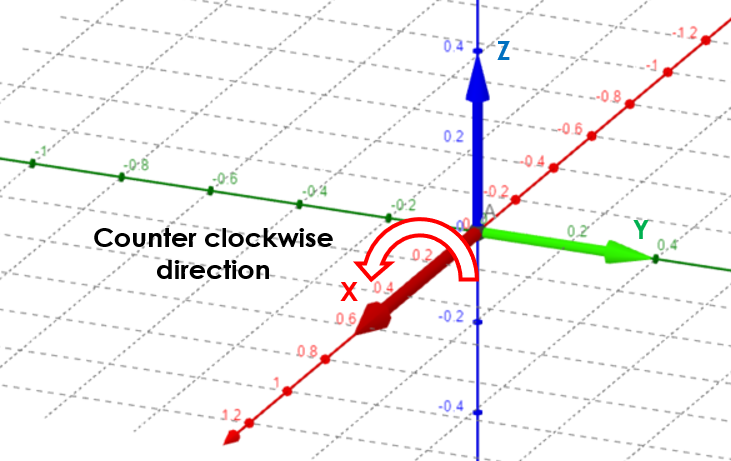

# CompositeShapeDef

## Composite Shape Definition

Composite Shape definition is **required** when the cross-section type in [StructuralCrossSection](structuralcrosssection.md#cross-section) sheet is set as "General".

For **manufactured** types of a cross-section, is Composite Shape Definition is **optional**, offering the possibility to share detailed shape definition, for better classification of the profile.

Specification in excel:

<table>
  <thead>
    <tr>
      <th style="text-align:center">Name of the column header</th>
      <th style="text-align:center">Type of data</th>
      <th style="text-align:center">Value example or enum definition</th>
      <th style="text-align:center">Required value</th>
      <th style="text-align:left">Description</th>
    </tr>
  </thead>
  <tbody>
    <tr>
      <td style="text-align:center">Name</td>
      <td style="text-align:center">String</td>
      <td style="text-align:center">GEN_1</td>
      <td style="text-align:center">yes</td>
      <td style="text-align:left">Name of the profile from the <a href="structuralcrosssection.md#cross-section">StructuralCrossSection</a> object
        sheet</td>
    </tr>
    <tr>
      <td style="text-align:center">Material name #</td>
      <td style="text-align:center">String</td>
      <td style="text-align:center">MAT_1</td>
      <td style="text-align:center">yes, if polygon is not opening</td>
      <td style="text-align:left">Name reference to the existing <a href="structuralmaterial.md#material">StructuralMaterial</a> object</td>
    </tr>
    <tr>
      <td style="text-align:center">Polygon contour #</td>
      <td style="text-align:center">String</td>
      <td style="text-align:center">-75.0; 105.0| -175.0; 5.0| 175.0; 5.0| 75.0; 105.0</td>
      <td style="text-align:center">yes (at least one)</td>
      <td style="text-align:left">
        
This attribute is used to define the cross-section geometry as a polygon
          contour.

        
One cross-section shape can consist of more polygons.

        
<b>Openings</b> contour are defined clockwise.

        
<b>Common polygons</b> counterclockwise.

        

        
The format of the data is:

        
y1; z1|y2; z2|y3; z3|yi; zi|yi+1; zi+1

        

        
The coordinates of the vertices are divided by &quot;;&quot; and each
          vertex separated by &quot;|&quot;

        

        
Keep in mind: enter dimensions in millimeters [mm] or inches [inch] (based
          on System of units set in <a href="../getting-started/project-and-model-specifications/#model">Project and model</a> specifications)

      </td>
    </tr>
    <tr>
      <td style="text-align:center">Id</td>
      <td style="text-align:center">String</td>
      <td style="text-align:center">39f238a5-01d0-45cf-a2eb-958170fd4f39</td>
      <td style="text-align:center">no</td>
      <td style="text-align:left">Unique attribute designation</td>
    </tr>
  </tbody>
</table>

## Notes


The symbol "\#" means indexing of the name columns, depends on how many polygons is used, starts from 1

The contour defined clockwise is opening

The contour defined counter clockwise is polygon of the general cross-section \(relation between LCS and counter clockwise direction is shown below\)



Each polygon has a defined material which is name reference to existing material in [StructuralMaterial](structuralmaterial.md#material) sheet

* The opening has no material definition
* Each polygon contour has to be closed
* The set of all polygons and openings defines one general cross-section \(one row in the Excel table\)
* The number of polygons is limited to 99. The definition of the general shape has to consist of at least one polygon which is not the opening.
* CompositeShapeDef example with opening is shown below. A,B,C,D are defining the contour of cross-section \(counter clockwise polygon\) and E,F,K,L are defining the opening \(clockwise polygon\).


