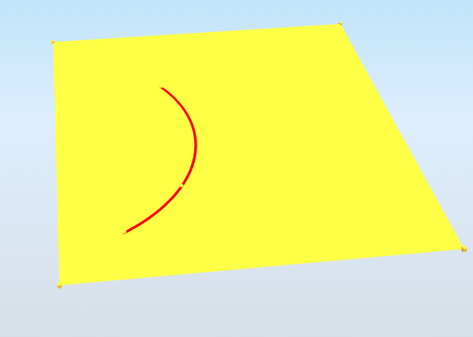

# StructuralCurveEdge

## Internal edge

Internal edge \(StructuralCurveEdge\) is an object within a 2D Member \([StructuralSurfaceMember](structuralsurfacemember.md)\) on which the line force \(StructuralCurveAction\) can act. StructuralCurveEdge can be placed on [StructuralSurfaceMemberRegion](structuralsurfacememberregion.md), but the relation is always to 2D member \(StructuralSurfaceMember\) where StructuralSurfaceMemberRegion is placed. 


If StructuralCurveEdge does not geometrically fit to the StructuralSurfaceMember it is assigned to, it is considered a logically invalid input. Cases like this one have to be solved by validation during the import of excel data to the specific software. The validation has to be implemented together with the import/export of SAF.


Specification in the excel:

<table>
  <thead>
    <tr>
      <th style="text-align:center">Name of the column header</th>
      <th style="text-align:center">Type of data</th>
      <th style="text-align:center">Value example or enum definition</th>
      <th style="text-align:center">Required value</th>
      <th style="text-align:left">Description</th>
    </tr>
  </thead>
  <tbody>
    <tr>
      <td style="text-align:center">Name</td>
      <td style="text-align:center">String</td>
      <td style="text-align:center">IE1</td>
      <td style="text-align:center">yes</td>
      <td style="text-align:left">Human readable unique name of the internal edge</td>
    </tr>
    <tr>
      <td style="text-align:center">2D member</td>
      <td style="text-align:center">String</td>
      <td style="text-align:center">S2</td>
      <td style="text-align:center">yes</td>
      <td style="text-align:left">The name of the <a href="structuralsurfacemember.md">StructuralSurfaceMember</a> (plate,
        wall) on which the internal edge is placed</td>
    </tr>
    <tr>
      <td style="text-align:center">Nodes</td>
      <td style="text-align:center">String</td>
      <td style="text-align:center">N1; N2</td>
      <td style="text-align:center">yes</td>
      <td style="text-align:left">
        
All nodes that belong to the curve edge and define its geometric shape.

        
The names of the nodes are separated by ; (semicolon) and space.

        
The order of the nodes has to be from beginning to end.

      </td>
    </tr>
    <tr>
      <td style="text-align:center">Segments</td>
      <td style="text-align:center">String</td>
      <td style="text-align:center">Line; Circular Arc</td>
      <td style="text-align:center">yes</td>
      <td style="text-align:left">
        
Defines the shape of the curve between two next nodes.

        
Supported strings are:

        
Line and Circular Arc. The names are separated by ; (semicolon) and space.

      </td>
    </tr>
    <tr>
      <td style="text-align:center">Parent ID</td>
      <td style="text-align:center">String</td>
      <td style="text-align:center">67b35d84-3d04-47aa-aa4a-dc1263982320</td>
      <td style="text-align:center">no</td>
      <td style="text-align:left">
        
Is filled for objects created be dividing curved geometry to series of
          straight line objects.

        
Parent ID will ensure that curved edge is imported as straight parts to
          nonsupporting application, and back to original supporting application
          as curved geometry. To ensure successful round trip of segmented objects
          and their related objects, Parent ID needs to be present in both directions.

      </td>
    </tr>
    <tr>
      <td style="text-align:center">Id</td>
      <td style="text-align:center">String</td>
      <td style="text-align:center">36606732-25e0-4fd7-ae35-bb8cb1bdcf46</td>
      <td style="text-align:center">no</td>
      <td style="text-align:left">Unique attribute designation</td>
    </tr>
  </tbody>
</table>

