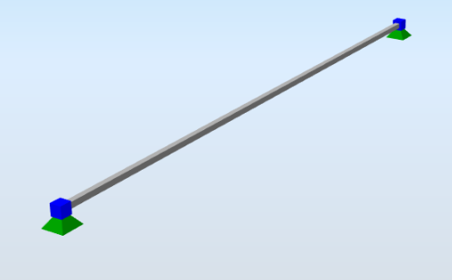
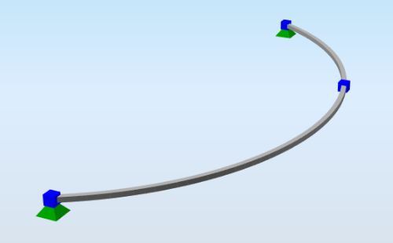
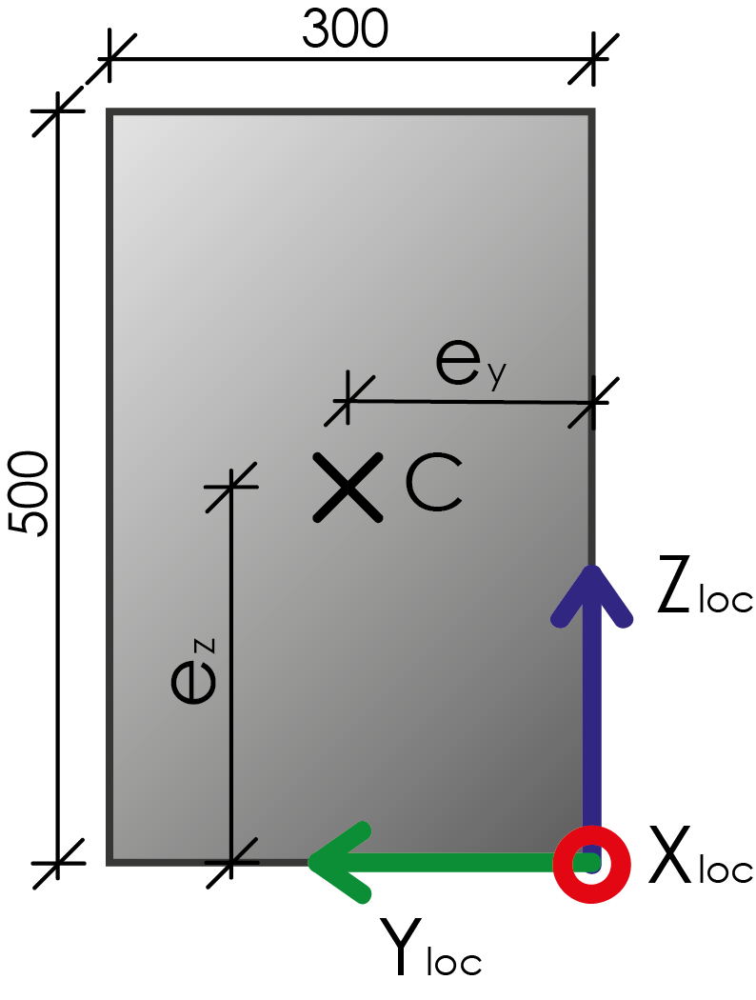

# StructuralCurveMember

## 1D Member \(Beam, Column,…\)

A general 1D member is defined by its two end-points \(or we can say nodes\). Therefore, the 1D member position must be specified by two points: first, the starting or begin point and then the end point. A set of properties can also be defined.

Each 1D member has got a unique local co-ordinate system, the origin of which is located in the starting point of a 1D member. The x-axis is always identical with the longitudinal beam axis and its direction is from the starting point towards the end point and is placed to centroid of the cross-section. By default, the y-axis is generally horizontal \(unless the beam orientation prevents this\) and the z-axis is generally vertical \(again, unless the beam orientation in space prevents this configuration\). In case of vertical members by default the local y-axis has the same direction as global y-axis.

The local co-ordinate system can be rotated around its x-axis if required.

In addition to this local co-ordinate system, also a principal \(or main\) co-ordinate system can be referred to on a 1D member. The principal co-ordinate system of a 1D member is related to the principal co-ordinate system of the cross-section of a 1D member.

### Specification in the excel

<table>
  <thead>
    <tr>
      <th style="text-align:center">Name of the column header</th>
      <th style="text-align:center">Type of data</th>
      <th style="text-align:center">Value example or enum definition</th>
      <th style="text-align:center">Required value</th>
      <th style="text-align:left">Description</th>
    </tr>
  </thead>
  <tbody>
    <tr>
      <td style="text-align:center">Name</td>
      <td style="text-align:center">String</td>
      <td style="text-align:center">B1</td>
      <td style="text-align:center">yes</td>
      <td style="text-align:left">Human readable unique name of the 1D member</td>
    </tr>
    <tr>
      <td style="text-align:center">Type</td>
      <td style="text-align:center">String</td>
      <td style="text-align:center">General</td>
      <td style="text-align:center">no</td>
      <td style="text-align:left">
        
The type of the 1D member, used within the analytical model.

        
E.g. General, Beam, Column, GableColumn, SecondaryColumn, Rafter, Purlin,
          RoofBracing, WallBracing, Girt, TrussChord, TrussDiagonal, PlateRib, BeamSlab,
          HollowCoreSlab, CompositePlateRib, CompositeBeamRib

      </td>
    </tr>
    <tr>
      <td style="text-align:center">Cross section</td>
      <td style="text-align:center">String</td>
      <td style="text-align:center">CS1</td>
      <td style="text-align:center">yes</td>
      <td style="text-align:left">The name reference to the existing, valid name of the StructuralCrossSection
        object</td>
    </tr>
    <tr>
      <td style="text-align:center">Arbitrary definition</td>
      <td style="text-align:center">String</td>
      <td style="text-align:center">AD1</td>
      <td style="text-align:center">no</td>
      <td style="text-align:left">The reference to Arbitrary/Tapered/Haunched beam definition StructuralCurveMemberVarying</td>
    </tr>
    <tr>
      <td style="text-align:center">Nodes</td>
      <td style="text-align:center">String</td>
      <td style="text-align:center">N2; N3; N4</td>
      <td style="text-align:center">yes</td>
      <td style="text-align:left">
        
All nodes that belong to the curve member and define its geometric shape.

        
The names of the nodes are separated by ; (semicolon) and space. The order
          of the nodes has to be from beginning to end.

      </td>
    </tr>
    <tr>
      <td style="text-align:center">Segments</td>
      <td style="text-align:center">String</td>
      <td style="text-align:center">Line; Circular Arc; Bezier; Parabolic arc; Spline</td>
      <td style="text-align:center">yes</td>
      <td style="text-align:left">Defines the shape of the curve between two next nodes. The names are separated
        by ; (semicolon) and space.</td>
    </tr>
    <tr>
      <td style="text-align:center">Begin node</td>
      <td style="text-align:center">String</td>
      <td style="text-align:center">N1</td>
      <td style="text-align:center">yes</td>
      <td style="text-align:left">
        
The starting node of the 1D member.

        
Has to be specified in the StructuralPointConnection sheet

      </td>
    </tr>
    <tr>
      <td style="text-align:center">End node</td>
      <td style="text-align:center">String</td>
      <td style="text-align:center">N2</td>
      <td style="text-align:center">yes</td>
      <td style="text-align:left">
        
The end node of the 1D member.

        
Has to be specified in the StructuralPointConnection sheet

      </td>
    </tr>
    <tr>
      <td style="text-align:center">Internal nodes</td>
      <td style="text-align:center">String</td>
      <td style="text-align:center">N77; N78</td>
      <td style="text-align:center">no</td>
      <td style="text-align:left">
        
Internal nodes belonging to StructuralCurveMember defined in StructuralPointConnection.

        
Internal nodes are not geometry defining The names of the nodes are separated
          by ; (semicolon) and space.

      </td>
    </tr>
    <tr>
      <td style="text-align:center">Length [m]</td>
      <td style="text-align:center">Double</td>
      <td style="text-align:center">6.425</td>
      <td style="text-align:center">no</td>
      <td style="text-align:left">Distance between begin and end node of the curve member.</td>
    </tr>
    <tr>
      <td style="text-align:center">Geometrical shape</td>
      <td style="text-align:center">Enum</td>
      <td style="text-align:center">
        
Line

        

        
Circular Arc

        

        
Parabolic Arc

        

        
Bezier

        

        
Spline

        

        
Polyline

      </td>
      <td style="text-align:center">no</td>
      <td style="text-align:left">Description of the geometrical type of curve member in general. If the
        member consists of more than one segments, Geometrical shape is automatically
        set to Polyline.</td>
    </tr>
    <tr>
      <td style="text-align:center">LCS</td>
      <td style="text-align:center">Enum</td>
      <td style="text-align:center">
        
y by vector

        

        
z by vector

        

        
y by point

        

        
z by point

      </td>
      <td style="text-align:center">yes</td>
      <td style="text-align:left">Local coordinate system. This item specifies the way the local axes of
        the 1D member are determined. For further understanding see <a href="../getting-started/introduction.md">Introduction</a>
      </td>
    </tr>
    <tr>
      <td style="text-align:center">LCS Rotation [deg]</td>
      <td style="text-align:center">Double</td>
      <td style="text-align:center">45.00</td>
      <td style="text-align:center">yes</td>
      <td style="text-align:left">This value defines the rotation of local axes of the 1D member around
        its x-axis</td>
    </tr>
    <tr>
      <td style="text-align:center">Coordinate X [m]</td>
      <td style="text-align:center">Double</td>
      <td style="text-align:center">0,0</td>
      <td style="text-align:center">yes</td>
      <td style="text-align:left">Coordinate of the vector of the LCS in X direction</td>
    </tr>
    <tr>
      <td style="text-align:center">Coordinate Y [m]</td>
      <td style="text-align:center">Double</td>
      <td style="text-align:center">0,1</td>
      <td style="text-align:center">yes</td>
      <td style="text-align:left">Coordinate of the vector of the LCS in Y direction</td>
    </tr>
    <tr>
      <td style="text-align:center">Coordinate Z [m]</td>
      <td style="text-align:center">Double</td>
      <td style="text-align:center">0,0</td>
      <td style="text-align:center">yes</td>
      <td style="text-align:left">Coordinate of the vector of the LCS in Z direction</td>
    </tr>
    <tr>
      <td style="text-align:center">System line</td>
      <td style="text-align:center">Enum</td>
      <td style="text-align:center">
        
Centre

        

        
Top

        

        
Bottom

        

        
Left

        

        
Right

        

        
Top left

        

        
Top right

        

        
Bottom left

        

        
Bottom right

      </td>
      <td style="text-align:center">yes</td>
      <td style="text-align:left">
        
The system line is in fact the local x-axis of the member. The attribute
          of system line applies eccentricities to the member equal to the cross-section
          dimensions of the member in the specified direction.

        
Default position of the system line is in the centre of the gravity of
          the cross-section.

        
The position of the system line affects results in same way as eccentricities
          do.

        
Top - align top surface to center line

        
Bottom - align bottom surface to center line

        
Left - align left surface to center line

        
Right - align right surface to center line

        
For further explanation see notes below.

      </td>
    </tr>
    <tr>
      <td style="text-align:center">Structural Y Eccentricity of Beg Node [mm]</td>
      <td style="text-align:center">Double</td>
      <td style="text-align:center">-150</td>
      <td style="text-align:center">no</td>
      <td style="text-align:left">
        
Define the position difference between a physical element and its analytical
          member representation in Y direction (Beg node).

        
Used to build up physical (structural body from analysis member).

        
DOES NOT affect internal forces.

      </td>
    </tr>
    <tr>
      <td style="text-align:center">Structural Z Eccentricity of Beg Node [mm]</td>
      <td style="text-align:center">Double</td>
      <td style="text-align:center">75</td>
      <td style="text-align:center">no</td>
      <td style="text-align:left">
        
Define the position difference between a physical element and its analytical
          member representation in Z direction (Beg node).

        
Used to build up physical (structural body from analysis member).

        
DOES NOT affect internal forces.

      </td>
    </tr>
    <tr>
      <td style="text-align:center">Structural Y Eccentricity of End Node [mm]</td>
      <td style="text-align:center">Double</td>
      <td style="text-align:center">75</td>
      <td style="text-align:center">no</td>
      <td style="text-align:left">
        
Define the position difference between a physical element and its analytical
          member representation in Y direction (End node).

        
Used to build up physical (structural body from analysis member).

        
DOES NOT affect internal forces.

      </td>
    </tr>
    <tr>
      <td style="text-align:center">Structural Z Eccentricity of End Node [mm]</td>
      <td style="text-align:center">Double</td>
      <td style="text-align:center">75</td>
      <td style="text-align:center">no</td>
      <td style="text-align:left">
        
Define the position difference between a physical element and its analytical
          member representation in Z direction (End node).

        
Used to build up physical (structural body from analysis member).

        
DOES NOT affect internal forces.

      </td>
    </tr>
    <tr>
      <td style="text-align:center">Analysis Y Eccentricity of Beg Node [mm]</td>
      <td style="text-align:center">Double</td>
      <td style="text-align:center">75</td>
      <td style="text-align:center">yes</td>
      <td style="text-align:left">
        
Define the position difference between a physical element and its analytical
          member representation in Y direction (Beg node).

        
Used to build up physical (structural body from analysis member).

        
DO affects internal forces.

      </td>
    </tr>
    <tr>
      <td style="text-align:center">Analysis Z Eccentricity of Beg Node [mm]</td>
      <td style="text-align:center">Double</td>
      <td style="text-align:center">75</td>
      <td style="text-align:center">yes</td>
      <td style="text-align:left">
        
Define the position difference between a physical element and its analytical
          member representation in Z direction (Beg node).

        
Used to build up physical (structural body from analysis member).

        
DO affects internal forces.

      </td>
    </tr>
    <tr>
      <td style="text-align:center">Analysis Y Eccentricity of End Node [mm]</td>
      <td style="text-align:center">Double</td>
      <td style="text-align:center">75</td>
      <td style="text-align:center">yes</td>
      <td style="text-align:left">
        
Define the position difference between a physical element and its analytical
          member representation in Y direction (End node).

        
Used to build up physical (structural body from analysis member).

        
DO affects internal forces.

      </td>
    </tr>
    <tr>
      <td style="text-align:center">Analysis Z Eccentricity of End Node [mm]</td>
      <td style="text-align:center">Double</td>
      <td style="text-align:center">75</td>
      <td style="text-align:center">yes</td>
      <td style="text-align:left">
        
Define the position difference between a physical element and its analytical
          member representation in Z direction (End node).

        
Used to build up physical (structural body from analysis member).

        
DO affects internal forces.

      </td>
    </tr>
    <tr>
      <td style="text-align:center">Layer</td>
      <td style="text-align:center">String</td>
      <td style="text-align:center">1st floor</td>
      <td style="text-align:center">no</td>
      <td style="text-align:left">
        
Custom created layer.

        
The layer can thus comprise entities that have something in common (e.g.
          one floor, columns of one floor, columns of the same length, etc.)

      </td>
    </tr>
    <tr>
      <td style="text-align:center">Behaviour in analysis</td>
      <td style="text-align:center">Enum</td>
      <td style="text-align:center">
        
Standard

        

        
Axial force only

        

        
Compression only

        

        
Tension only

      </td>
      <td style="text-align:center">yes</td>
      <td style="text-align:left">From the finite element analysis point of view, the 1D member can act
        like a standard 1D member or like a hinged (pinned) rod. The difference
        is that the standard 1D member is capable of transferring all the internal
        forces, while the latter variant only provides for transferring of the
        axial force.</td>
    </tr>
    <tr>
      <td style="text-align:center">Color</td>
      <td style="text-align:center">String</td>
      <td style="text-align:center">#7FFFFF00</td>
      <td style="text-align:center">no</td>
      <td style="text-align:left">Defines colour and transparency of the object. Colour is defined by Hex
        format #AARRGGBB. Transparency is controlled by the alpha channel AA. If
        no colour is set then default colour is used.</td>
    </tr>
    <tr>
      <td style="text-align:center">Parent ID</td>
      <td style="text-align:center">String</td>
      <td style="text-align:center">67b35d84-3d04-47aa-aa4a-dc1263982320</td>
      <td style="text-align:center">no</td>
      <td style="text-align:left">Is filled for objects created be dividing curved geometry to series of
        straight line objects. Parent ID will ensure that curved edge is imported
        as straight parts to nonsupporting application, and back to original supporting
        application as curved geometry. To ensure successful round trip of segmented
        objects and their related objects, Parent ID needs to be present in both
        directions.</td>
    </tr>
    <tr>
      <td style="text-align:center">Id</td>
      <td style="text-align:center">String</td>
      <td style="text-align:center">39f238a5-01d0-45cf-a2eb-958170fd4f39</td>
      <td style="text-align:center">no</td>
      <td style="text-align:left">Unique attribute designation</td>
    </tr>
  </tbody>
</table>

## Notes


Complete enumeration of the Formcode, Supported shapes of cross-section and Description ID can be found in chapter Annexes. These properties are set in the object [StructuralCrossSection](structuralcrosssection.md#cross-section).

Rotation of local co-ordinate system is measured from origin position of local y-axis and the orientation follows positive rotation according to the right-handed rule.

Reference to Alignment enums - examples of alignments.

* pictures below represents view parallel to direction of center line \(LCS respects right hand rule\)



An example of use of System line type Bottom right can be seen in the picture below. If the shape of the cross-section is not rectangular then boundary box of the cross-section is considered for position of the system line. The results take in count eccentricities, in example: ey=150 mm, ez=250 mm.



Axis reference is only to illustrate this example, your application can have different cross-section LCS than shown in this example. Alignment of system line should be reflected to your relevant eccentricities based on your cross section LCS.


