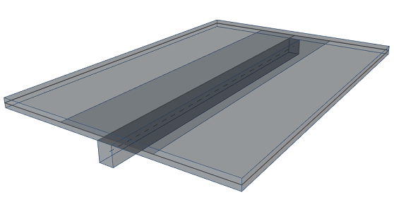
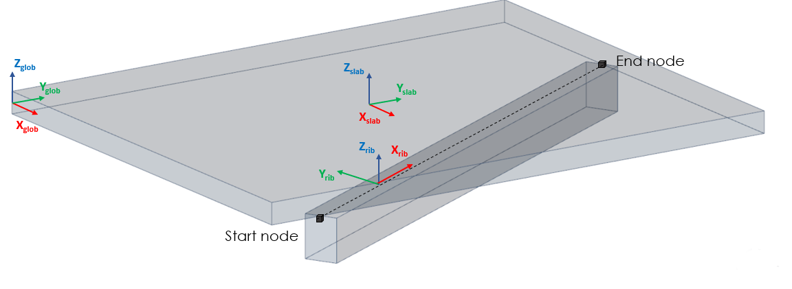

# StructuralCurveMemberRib

## 2D member rib

The 2D member rib is a 1D member related to slabs. The part of the slab which cooperates with the rib is called the effective width. Different values of effective widths can be considered for checks and for calculation of the internal forces.

Specification in the excel:

<table>
  <thead>
    <tr>
      <th style="text-align:center">Name of the column header</th>
      <th style="text-align:center">Type of data</th>
      <th style="text-align:center">Value example or enum definition</th>
      <th style="text-align:center">Required value</th>
      <th style="text-align:left">Description</th>
    </tr>
  </thead>
  <tbody>
    <tr>
      <td style="text-align:center">Name</td>
      <td style="text-align:center">String</td>
      <td style="text-align:center">B1</td>
      <td style="text-align:center">yes</td>
      <td style="text-align:left">Human readable unique name of the rib</td>
    </tr>
    <tr>
      <td style="text-align:center">2D member</td>
      <td style="text-align:center">String</td>
      <td style="text-align:center">S1</td>
      <td style="text-align:center">yes</td>
      <td style="text-align:left">The name of the structural surface member on which the rib is placed</td>
    </tr>
    <tr>
      <td style="text-align:center">Cross section</td>
      <td style="text-align:center">String</td>
      <td style="text-align:center">CS1</td>
      <td style="text-align:center">yes</td>
      <td style="text-align:left">The name reference to the existing, valid name of the StructuralCrossSection
        object.</td>
    </tr>
    <tr>
      <td style="text-align:center">Nodes</td>
      <td style="text-align:center">String</td>
      <td style="text-align:center">N1;N2</td>
      <td style="text-align:center">yes</td>
      <td style="text-align:left">All nodes that belong to the curve member and define its geometric shape.
        The names of the nodes are separated by ; (semicolon) and space. The order
        of the nodes has to be from beginning to end.</td>
    </tr>
    <tr>
      <td style="text-align:center">Segments</td>
      <td style="text-align:center">String</td>
      <td style="text-align:center">Line; Circular Arc</td>
      <td style="text-align:center">yes</td>
      <td style="text-align:left">Defines shape of the curve between two next nodes. Supported strings are:
        Line; Circular Arc; Parabolic arc; Bezier; Spline. The names are separated
        by ; (semicolon) and space.</td>
    </tr>
    <tr>
      <td style="text-align:center">Begin node</td>
      <td style="text-align:center">String</td>
      <td style="text-align:center">N1</td>
      <td style="text-align:center">yes</td>
      <td style="text-align:left">The starting node of the 1D member. Has to be specified in the StructuralPointConnection
        sheet</td>
    </tr>
    <tr>
      <td style="text-align:center">End node</td>
      <td style="text-align:center">String</td>
      <td style="text-align:center">N2</td>
      <td style="text-align:center">yes</td>
      <td style="text-align:left">The end node of the 1D member. Has to be specified in the StructuralPointConnection
        sheet</td>
    </tr>
    <tr>
      <td style="text-align:center">Internal nodes</td>
      <td style="text-align:center">String</td>
      <td style="text-align:center">N17; N18</td>
      <td style="text-align:center">no</td>
      <td style="text-align:left">Internal nodes belonging to StructuralCurveMemberRib defined in StructuralPointConnection
        Internal nodes are not geometry defining The names of the nodes are separated
        by ; (semicolon) and space</td>
    </tr>
    <tr>
      <td style="text-align:center">Length [m]</td>
      <td style="text-align:center">Double</td>
      <td style="text-align:center">5,37</td>
      <td style="text-align:center">no</td>
      <td style="text-align:left">Distance between begin and end node of the curve member in meters</td>
    </tr>
    <tr>
      <td style="text-align:center">Geometrical shape</td>
      <td style="text-align:center">Enum</td>
      <td style="text-align:center">
        
Line

        

        
Circular Arc

        

        
Parabolic Arc

        

        
Bezier

        

        
Spline

        

        
Polyline

      </td>
      <td style="text-align:center">yes</td>
      <td style="text-align:left">Description of the geometrical type of curve member in general. If the
        member consists of more than one segments, Geometrical shape is automatically
        set to Polyline.</td>
    </tr>
    <tr>
      <td style="text-align:center">Alignment</td>
      <td style="text-align:center">Enum</td>
      <td style="text-align:center">
        
Bottom

        

        
Centre

        

        
Top

      </td>
      <td style="text-align:center">yes</td>
      <td style="text-align:left">This property item determines the position of the system-lines on the
        cross-section of the rib. The user defined value - custom value defines
        position of the system line of the rib on local Z axis (ez).</td>
    </tr>
    <tr>
      <td style="text-align:center">Eccentricity ez [mm]</td>
      <td style="text-align:center">Double</td>
      <td style="text-align:center">150</td>
      <td style="text-align:center">yes</td>
      <td style="text-align:left">Eccentricity of the member system line in Z direction of the local coordinate
        system from the centre of the gravity of the cross-section</td>
    </tr>
    <tr>
      <td style="text-align:center">Type of connection</td>
      <td style="text-align:center">Enum</td>
      <td style="text-align:center">
        
Full shear connection

        

        
Partial shear connection

        

        
Without Composite Action

        

        
User Defined Eccentricity

      </td>
      <td style="text-align:center">yes</td>
      <td style="text-align:left">Determines the degree of shear connection between the rib and the plate
        Full shear connection - in this case, the composite beam is modelled as
        an eccentric plate rib (real eccentricity). The composite effect is taken
        into account directly through the real eccentricity of the 1D member Partial
        shear connection - In this case, the composite beam is modelled as a plate
        rib without eccentricity. In order to consider the composite action, the
        stiffness of the beam is adjusted to take into account the effect of the
        eccentricity and of the participating deck width. Without Composite Action
        - assumes that there is no longitudinal shear connection between the beam
        and the deck User Defined Eccentricity - serves for any plate rib linked
        to a non-composite deck</td>
    </tr>
    <tr>
      <td style="text-align:center">Shape of the rib</td>
      <td style="text-align:center">Enum</td>
      <td style="text-align:center">
        
T Symmetric

        

        
Right Left

        

        
T Non-symmetric

      </td>
      <td style="text-align:center">yes</td>
      <td style="text-align:left">Determines the shape of the effective width of the rib</td>
    </tr>
    <tr>
      <td style="text-align:center">Layer</td>
      <td style="text-align:center">String</td>
      <td style="text-align:center">Layer 1</td>
      <td style="text-align:center">no</td>
      <td style="text-align:left">Custom created layer. The layer can thus comprise entities that have something
        in common (e.g. one floor, columns of one floor, columns of the same length,
        etc.)</td>
    </tr>
    <tr>
      <td style="text-align:center">Behaviour in analysis</td>
      <td style="text-align:center">Enum</td>
      <td style="text-align:center">
        
Standard

        

        
Axial Force Only

      </td>
      <td style="text-align:center">yes</td>
      <td style="text-align:left">From the finite element analysis point of view, the 1D member can act
        like a standard 1D member or like a hinged (pinned) rod. The difference
        is that the standard 1D member is capable of transferring all the internal
        forces, while the latter variant only provides for transferring of the
        axial force.</td>
    </tr>
    <tr>
      <td style="text-align:center">Effective width</td>
      <td style="text-align:center">Enum</td>
      <td style="text-align:center">
        
Number Of Thickness

        

        
Width

      </td>
      <td style="text-align:center">yes</td>
      <td style="text-align:left">Determines the method which is considered for specifying the effective
        width. Number of thickness - the multiple thickness of the slab to which
        is rib connected. The parametric way how to specify the effective width.
        Width - Direct numerical input of the effective width of the slab</td>
    </tr>
    <tr>
      <td style="text-align:center">Width left for check [mm]</td>
      <td style="text-align:center">Double</td>
      <td style="text-align:center">500</td>
      <td style="text-align:center">yes, if Shape of the rib is Right, Left or T Non-symmetric</td>
      <td style="text-align:left">Effective width on the left side (depends on LCS), used for check. If
        Effective width is set to &quot;Number Of Thickness&quot;, then inputted
        value is considered as unitless multiplier</td>
    </tr>
    <tr>
      <td style="text-align:center">Width right for check [mm]</td>
      <td style="text-align:center">Double</td>
      <td style="text-align:center">500</td>
      <td style="text-align:center">yes, if Shape of the rib is Right, Left or T Non-symmetric</td>
      <td style="text-align:left">Effective width on the right side (depends on LCS), used for check. If
        Effective width is set to &quot;Number Of Thickness&quot;, then inputted
        value is considered as unitless multiplier</td>
    </tr>
    <tr>
      <td style="text-align:center">Width left for internal forces [mm]</td>
      <td style="text-align:center">Double</td>
      <td style="text-align:center">500</td>
      <td style="text-align:center">yes, if Shape of the rib is Right, Left or T Non-symmetric</td>
      <td style="text-align:left">Effective width on the left side (depends on LCS), used for calculation
        of internal forces. If Effective width is set to &quot;Number Of Thickness&quot;,
        then inputted value is considered as unitless multiplier</td>
    </tr>
    <tr>
      <td style="text-align:center">Width right for internal forces [mm]</td>
      <td style="text-align:center">Double</td>
      <td style="text-align:center">500</td>
      <td style="text-align:center">yes, if Shape of the rib is Right, Left or T Non-symmetric</td>
      <td style="text-align:left">Effective width on the right side (depends on LCS), used for calculation
        of internal forces. If Effective width is set to &quot;Number Of Thickness&quot;,
        then inputted value is considered as unitless multiplier</td>
    </tr>
    <tr>
      <td style="text-align:center">Color</td>
      <td style="text-align:center">String</td>
      <td style="text-align:center">#808080</td>
      <td style="text-align:center">no</td>
      <td style="text-align:left">Defines color and transparency of the object. Color is defined by Hex
        format #AARRGGBB. Transparency is controlled by the alpha channel AA. If
        no color is set then default color is used.</td>
    </tr>
    <tr>
      <td style="text-align:center">Parent ID</td>
      <td style="text-align:center">String</td>
      <td style="text-align:center">67b35d84-3d04-47aa-aa4a-dc1263982320</td>
      <td style="text-align:center">no</td>
      <td style="text-align:left">Is filled for objects created be dividing curved geometry to series of
        straight line objects. Parent ID will ensure that curved edge is imported
        as straight parts to nonsupporting application, and back to original supporting
        application as curved geometry. To ensure successful round trip of segmented
        objects and their related objects, Parent ID needs to be present in both
        directions.</td>
    </tr>
    <tr>
      <td style="text-align:center">Id</td>
      <td style="text-align:center">String</td>
      <td style="text-align:center">39f238a5-01d0-45cf-a2eb-958170fd4f39</td>
      <td style="text-align:center">no</td>
      <td style="text-align:left">Unique attribute designation</td>
    </tr>
  </tbody>
</table>

## Notes


 **LCS of the rib** is set due to the following rules: X is set from the start node to the end node, Z is set in parallelly to Z LCS in the slab \([StructuralSurfaceMember](https://saf.guide/Content/A_Objects/8_StructuralSurfaceMember.htm)\), Y is determined by right hand rule.



Complete enumeration of the Formcode and Description ID can be found in chapter Annexes, in this documentation.


