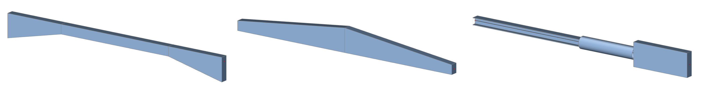
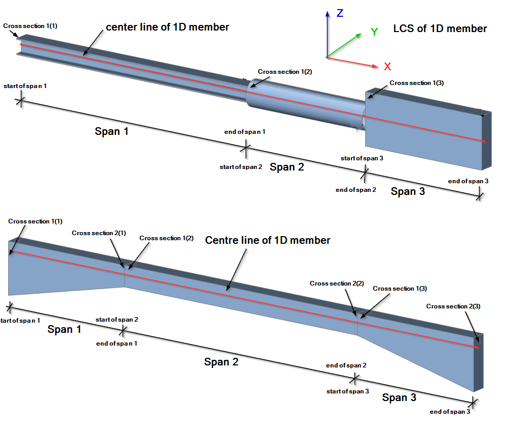
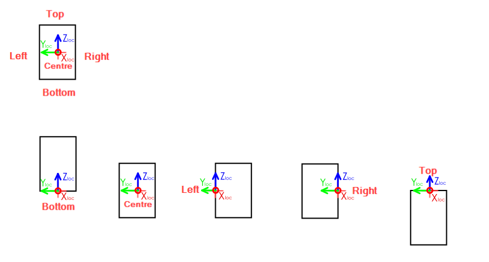
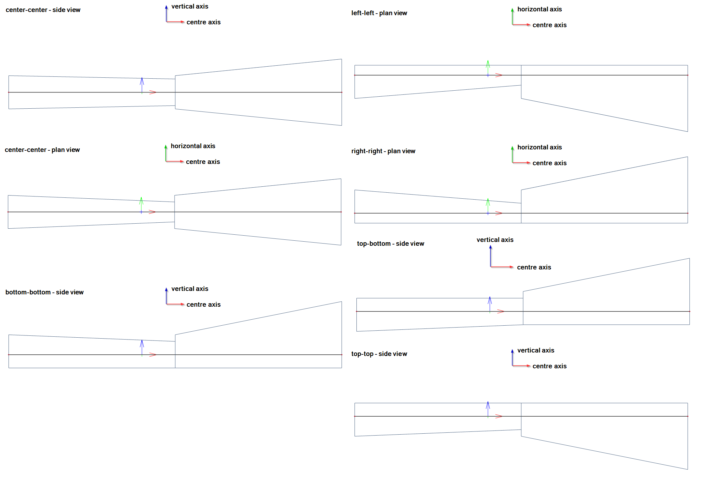

# StructuralCurveMemberVarying

## 1D Member Varying \(Arbitrary, Tapered, Haunch,…\)

StructuralCurveMemberVarying object describes changing cross section along the length \(center line\) of existing 1D member \(StructuralCurveMember\).

Specification in the excel:

<table>
  <thead>
    <tr>
      <th style="text-align:center">Name of the column header</th>
      <th style="text-align:center">Type of data</th>
      <th style="text-align:center">Value example or enum definition</th>
      <th style="text-align:center">Required value</th>
      <th style="text-align:left">Description</th>
    </tr>
  </thead>
  <tbody>
    <tr>
      <td style="text-align:center">Name</td>
      <td style="text-align:center">String</td>
      <td style="text-align:center">AD1</td>
      <td style="text-align:center">yes</td>
      <td style="text-align:left">Human readable unique name of the Arbitrary definition</td>
    </tr>
    <tr>
      <td style="text-align:center">Cross sections #</td>
      <td style="text-align:center">String</td>
      <td style="text-align:center">CS1,CS2 CS3</td>
      <td style="text-align:center">yes</td>
      <td style="text-align:left">
        
The value refers to name of existing cross section.

        
Can be inputted as <b>pairs </b>or as <b>single</b>.

        
Pairs are separated by &quot;,&quot; and first one refers to Cross section
          at the start of the segment, second to an end of the segment. Pairs indicates
          linear change of cross section. <b>Therefore they need to be same type and shape</b>.

        
Single reference indicates prismatic beam along the span.

        
 <b>#</b> means indexing of the cross sections, e.g. Cross sections 1, Cross
          sections 2, &#x2026; Cross sections 99. It depends on how many spans are
          defined in the StructuralCurveMemberVarying.

      </td>
    </tr>
    <tr>
      <td style="text-align:center">Span #</td>
      <td style="text-align:center">Double</td>
      <td style="text-align:center">0,3</td>
      <td style="text-align:center">yes</td>
      <td style="text-align:left">
        
Relative length of the segment.

        
<b>Sum of all values per line has to be equal to 1,0.</b>
        

        
<b># </b>means indexing of the span, e.g. Span 1, Span 2, &#x2026; Span
          99. It depends on how many spans are defined in the in the<b> </b>StructuralCurveMemberVarying.

      </td>
    </tr>
    <tr>
      <td style="text-align:center">Alignment #</td>
      <td style="text-align:center">Enum</td>
      <td style="text-align:center">
        
Centre

        

        
Top

        

        
Bottom

        

        
Left

        

        
Right

        

        
Top left

        

        
Top right

        

        
Bottom left

        

        
Bottom right

      </td>
      <td style="text-align:center">yes</td>
      <td style="text-align:left">
        
Alignment of each segment (span) can be defined here.

        
First span:

        
<b>Centre </b>- In plan view as well as in side view the midline of the
          1D member remains straight and horizontal. Both left and right surface
          are inclined to allow the cross-section change its width. The centre line
          of the 1D member (i.e. the centroid axis) of the 1D member remains straight.
          Both top and bottom surface are symmetrically inclined to allow the cross-section
          change its height.

        
<b>Top </b>- The top surface of the 1D member remains flat and horizontal.
          The bottom surface is inclined in order to provide for the change of the
          height. Top surface is in direction of vertical axis of CSS. Bottom - The
          bottom surface of the 1D member remains flat and horizontal. The top surface
          is inclined in order to provide for the change of the height. Bottom surface
          is in opposite direction of vertical axis of CSS.

        
<b>Left </b>- The left surface of the 1D member remains flat and horizontal.
          The right surface is inclined in order to provide for the change of the
          width. Left surface is in direction of horizontal axis of CSS.

        
<b>Right </b>- The right surface of the 1D member remains flat and horizontal.
          The left surface is inclined in order to provide for the change of the
          width. Right surface is in opposite direction of horizontal axis of CSS.

        
<b>Other than first span:</b>
        

        
Same rules applies with respect to previous span. See pictures in notes
          section.

        
<b># </b>means indexing of the Alignment, e.g. Alignment 1, Alignment
          2, &#x2026; Alignment 99. It depends on how many spans are defined in the
          arbitrary definition.

      </td>
    </tr>
    <tr>
      <td style="text-align:center">Id</td>
      <td style="text-align:center">String</td>
      <td style="text-align:center">39f238a5-01d0-45cf-a2eb-958170fd4f39</td>
      <td style="text-align:center">no</td>
      <td style="text-align:left">Unique attribute designation</td>
    </tr>
    <tr>
      <td style="text-align:center">Segments</td>
      <td style="text-align:center">String</td>
      <td style="text-align:center">Line; Circular Arc; Bezier; Parabolic arc; Spline</td>
      <td style="text-align:center">yes</td>
      <td style="text-align:left">Defines the shape of the curve between two next nodes. The names are separated
        by ; (semicolon) and space.</td>
    </tr>
    <tr>
      <td style="text-align:center">Begin node</td>
      <td style="text-align:center">String</td>
      <td style="text-align:center">N1</td>
      <td style="text-align:center">yes</td>
      <td style="text-align:left">The starting node of the 1D member. Has to be specified in the StructuralPointConnection
        sheet</td>
    </tr>
    <tr>
      <td style="text-align:center">End node</td>
      <td style="text-align:center">String</td>
      <td style="text-align:center">N2</td>
      <td style="text-align:center">yes</td>
      <td style="text-align:left">The end node of the 1D member. Has to be specified in the StructuralPointConnection
        sheet</td>
    </tr>
    <tr>
      <td style="text-align:center">Internal nodes</td>
      <td style="text-align:center">String</td>
      <td style="text-align:center">N77; N78</td>
      <td style="text-align:center">no</td>
      <td style="text-align:left">Internal nodes belonging to StructuralCurveMember defined in StructuralPointConnection
        Internal nodes are not geometry defining The names of the nodes are separated
        by ; (semicolon) and space</td>
    </tr>
    <tr>
      <td style="text-align:center">Length [m]</td>
      <td style="text-align:center">Double</td>
      <td style="text-align:center">6.425</td>
      <td style="text-align:center">no</td>
      <td style="text-align:left">Distance between begin and end node of the curve member in meters</td>
    </tr>
    <tr>
      <td style="text-align:center">Geometrical shape</td>
      <td style="text-align:center">Enum</td>
      <td style="text-align:center">
        
Line

        

        
Circular Arc

        

        
Parabolic Arc

        

        
Bezier Spline

        

        
Polyline

      </td>
      <td style="text-align:center">no</td>
      <td style="text-align:left">Description of the geometrical type of curve member in general. If the
        member consists of more than one segments, Geometrical shape is automatically
        set to Polyline.</td>
    </tr>
    <tr>
      <td style="text-align:center">LCS</td>
      <td style="text-align:center">Enum</td>
      <td style="text-align:center">
        
y by vector

        

        
z by vector

        

        
y by point

        

        
z by point

      </td>
      <td style="text-align:center">yes</td>
      <td style="text-align:left">Local coordinate system. This item specifies the way the local axes of
        the 1D member are determined. For further understanding see Introduction</td>
    </tr>
    <tr>
      <td style="text-align:center">LCS Rotation [deg]</td>
      <td style="text-align:center">Double</td>
      <td style="text-align:center">45.00</td>
      <td style="text-align:center">yes</td>
      <td style="text-align:left">This value defines the rotation of local axes of the 1D member around
        its x-axis</td>
    </tr>
    <tr>
      <td style="text-align:center">Coordinate X [m]</td>
      <td style="text-align:center">Double</td>
      <td style="text-align:center">0,0</td>
      <td style="text-align:center">yes</td>
      <td style="text-align:left">Coordinate of the vector of the LCS in X direction</td>
    </tr>
    <tr>
      <td style="text-align:center">Coordinate Y [m]</td>
      <td style="text-align:center">Double</td>
      <td style="text-align:center">0,1</td>
      <td style="text-align:center">yes</td>
      <td style="text-align:left">Coordinate of the vector of the LCS in Y direction</td>
    </tr>
    <tr>
      <td style="text-align:center">Coordinate Z [m]</td>
      <td style="text-align:center">Double</td>
      <td style="text-align:center">0,0</td>
      <td style="text-align:center">yes</td>
      <td style="text-align:left">Coordinate of the vector of the LCS in Z direction</td>
    </tr>
    <tr>
      <td style="text-align:center">System line</td>
      <td style="text-align:center">Enum</td>
      <td style="text-align:center">
        
Centre

        

        
Top

        

        
Bottom

        

        
Left

        

        
Right

        

        
Top left

        

        
Top right

        

        
Bottom left

        

        
Bottom right

      </td>
      <td style="text-align:center">yes</td>
      <td style="text-align:left">The system line is in fact the local x-axis of the member. The attribute
        of system line applies eccentricities to the member equal to the cross-section
        dimensions of the member in the specified direction. Default position of
        the system line is in the centre of the gravity of the cross-section. The
        position of the system line affects results in same way as eccentricities
        do. Top - align top surface to center line Bottom - align bottom surface
        to center line Left - align left surface to center line Right -align right
        surface to center line For further explanation see notes below.</td>
    </tr>
    <tr>
      <td style="text-align:center">Structural Y Eccentricity of Beg Node [mm]</td>
      <td style="text-align:center">Double</td>
      <td style="text-align:center">-150</td>
      <td style="text-align:center">no</td>
      <td style="text-align:left">
        
Define the position difference between a physical element and its analytical
          member representation in Y direction (Beg node).

        
Used to build up physical (structural body from analysis member).

        
DOES NOT affect internal forces.

      </td>
    </tr>
    <tr>
      <td style="text-align:center">Structural Z Eccentricity of Beg Node [mm]</td>
      <td style="text-align:center">Double</td>
      <td style="text-align:center">75</td>
      <td style="text-align:center">no</td>
      <td style="text-align:left">
        
Define the position difference between a physical element and its analytical
          member representation in Z direction (Beg node).

        
Used to build up physical (structural body from analysis member).

        
DOES NOT affect internal forces.

      </td>
    </tr>
    <tr>
      <td style="text-align:center">Structural Y Eccentricity of End Node [mm]</td>
      <td style="text-align:center">Double</td>
      <td style="text-align:center">75</td>
      <td style="text-align:center">no</td>
      <td style="text-align:left">
        
Define the position difference between a physical element and its analytical
          member representation in Y direction (End node).

        
Used to build up physical (structural body from analysis member).

        
DOES NOT affect internal forces.

      </td>
    </tr>
    <tr>
      <td style="text-align:center">Structural Z Eccentricity of End Node [mm]</td>
      <td style="text-align:center">Double</td>
      <td style="text-align:center">75</td>
      <td style="text-align:center">no</td>
      <td style="text-align:left">
        
Define the position difference between a physical element and its analytical
          member representation in Z direction (End node).

        
Used to build up physical (structural body from analysis member).

        
DOES NOT affect internal forces.

      </td>
    </tr>
    <tr>
      <td style="text-align:center">Analysis Y Eccentricity of Beg Node [mm]</td>
      <td style="text-align:center">Double</td>
      <td style="text-align:center">75</td>
      <td style="text-align:center">yes</td>
      <td style="text-align:left">
        
Define the position difference between a physical element and its analytical
          member representation in Y direction (Beg node).

        
Used to build up physical (structural body from analysis member).

        
DO affects internal forces.

      </td>
    </tr>
    <tr>
      <td style="text-align:center">Analysis Z Eccentricity of Beg Node [mm]</td>
      <td style="text-align:center">Double</td>
      <td style="text-align:center">75</td>
      <td style="text-align:center">yes</td>
      <td style="text-align:left">
        
Define the position difference between a physical element and its analytical
          member representation in Z direction (Beg node).

        
Used to build up physical (structural body from analysis member).

        
DO affects internal forces.

      </td>
    </tr>
    <tr>
      <td style="text-align:center">Analysis Y Eccentricity of End Node [mm]</td>
      <td style="text-align:center">Double</td>
      <td style="text-align:center">75</td>
      <td style="text-align:center">yes</td>
      <td style="text-align:left">
        
Define the position difference between a physical element and its analytical
          member representation in Y direction (End node).

        
Used to build up physical (structural body from analysis member).

        
DO affects internal forces.

      </td>
    </tr>
    <tr>
      <td style="text-align:center">Analysis Z Eccentricity of End Node [mm]</td>
      <td style="text-align:center">Double</td>
      <td style="text-align:center">75</td>
      <td style="text-align:center">yes</td>
      <td style="text-align:left">
        
Define the position difference between a physical element and its analytical
          member representation in Z direction (End node).

        
Used to build up physical (structural body from analysis member).

        
DO affects internal forces.

      </td>
    </tr>
    <tr>
      <td style="text-align:center">Layer</td>
      <td style="text-align:center">String</td>
      <td style="text-align:center">1st floor</td>
      <td style="text-align:center">no</td>
      <td style="text-align:left">Custom created layer. The layer can thus comprise entities that have something
        in common (e.g. one floor, columns of one floor, columns of the same length,
        etc.)</td>
    </tr>
    <tr>
      <td style="text-align:center">Behaviour in analysis</td>
      <td style="text-align:center">Enum</td>
      <td style="text-align:center">
        
Standard

        

        
Axial force only

        

        
Compression only

        

        
Tension only

      </td>
      <td style="text-align:center">yes</td>
      <td style="text-align:left">From the finite element analysis point of view, the 1D member can act
        like a standard 1D member or like a hinged (pinned) rod. The difference
        is that the standard 1D member is capable of transferring all the internal
        forces, while the latter variant only provides for transferring of the
        axial force.</td>
    </tr>
    <tr>
      <td style="text-align:center">Color</td>
      <td style="text-align:center">String</td>
      <td style="text-align:center">#7FFFFF00</td>
      <td style="text-align:center">no</td>
      <td style="text-align:left">Defines colour and transparency of the object. Colour is defined by Hex
        format #AARRGGBB. Transparency is controlled by the alpha channel AA. If
        no colour is set then default colour is used.</td>
    </tr>
    <tr>
      <td style="text-align:center">Parent ID</td>
      <td style="text-align:center">String</td>
      <td style="text-align:center">67b35d84-3d04-47aa-aa4a-dc1263982320</td>
      <td style="text-align:center">no</td>
      <td style="text-align:left">Is filled for objects created be dividing curved geometry to series of
        straight line objects. Parent ID will ensure that curved edge is imported
        as straight parts to nonsupporting application, and back to original supporting
        application as curved geometry. To ensure successful round trip of segmented
        objects and their related objects, Parent ID needs to be present in both
        directions.</td>
    </tr>
    <tr>
      <td style="text-align:center">Id</td>
      <td style="text-align:center">String</td>
      <td style="text-align:center">39f238a5-01d0-45cf-a2eb-958170fd4f39</td>
      <td style="text-align:center">no</td>
      <td style="text-align:left">Unique attribute designation</td>
    </tr>
  </tbody>
</table>

## Notes


Reference to Alignment enums - direction of alignment in respect of CSS \(LCS respects right hand rule\).



Reference to Alignment enums - examples of alignments. \(LCS independent\)


