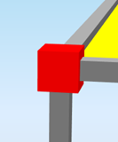

# StructuralPointConnection

## Node

The basic object specifies the geometry of the analytical model and its members. The nodes define other entity types. Each node is defined by the position in the modeling space and by its name. For example, a 1D member \([StructuralCurveMember](structuralcurvemember.md)\) is defined primarily by its two end-points that are nothing else but two nodes.

If required, special boundary conditions can be defined for the StructuralPointConnection by StructuralPointSupport.

Specification in the excel:

| Name   of the column header | Type of data | Value example or enum definition | Required value | Description |
| :---: | :---: | :---: | :---: | :--- |
| Name | String | N1 | yes | Human readable unique name of   the node |
| Coordinate   X \[m\] | Double | 0 | yes | Coordination of node in X   direction. Coordinate in GCS. |
| Coordinate   Y \[m\] | Double | 0 | yes | Coordination of node in Y   direction. Coordinate in GCS. |
| Coordinate   Z \[m\] | Double | 0 | yes | Coordination of node in Z   direction. Coordinate in GCS. |
| Id | String | 39f238a5-01d0-45cf-a2eb-958170fd4f39 | no | Unique attribute designation |

