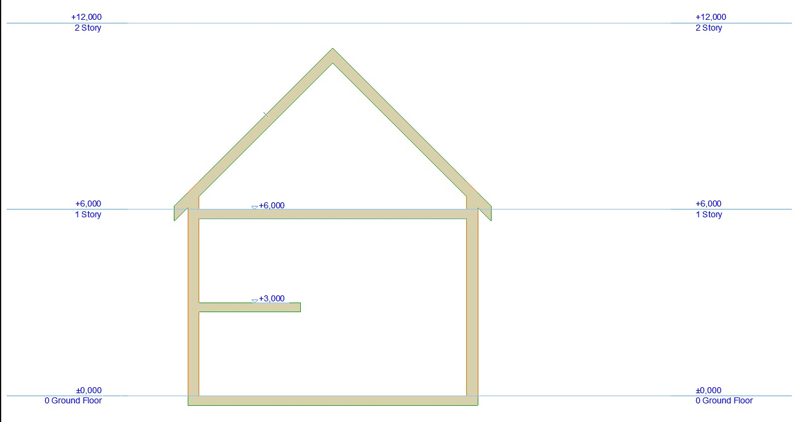
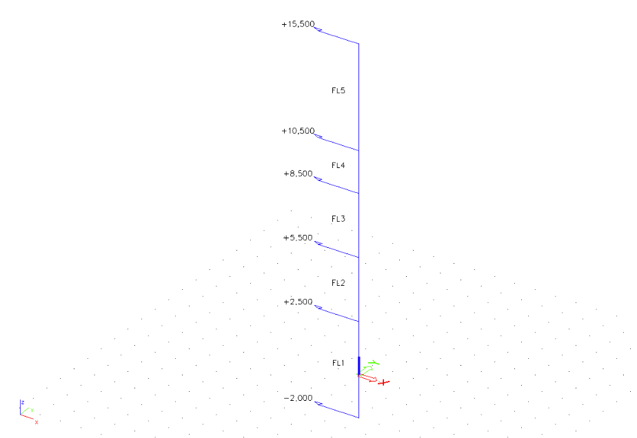

# StructuralStorey

## Storey, Floor levels...

StructuralStorey object describes definition of floor levels/storeys in structural model.

### Specification in the excel

<table>
  <thead>
    <tr>
      <th style="text-align:center">Name of the column header</th>
      <th style="text-align:center">Type of data</th>
      <th style="text-align:center">Value example or enum definition</th>
      <th style="text-align:center">Required value</th>
      <th style="text-align:left">Description</th>
    </tr>
  </thead>
  <tbody>
    <tr>
      <td style="text-align:center">Name</td>
      <td style="text-align:center">String</td>
      <td style="text-align:center">FL1</td>
      <td style="text-align:center">yes</td>
      <td style="text-align:left">Human readable unique name of the Arbitrary definition</td>
    </tr>
    <tr>
      <td style="text-align:center">Height level [m]</td>
      <td style="text-align:center">Double</td>
      <td style="text-align:center">
        
-2.000

        
2.500

        
5.500

        
8.500

        
10.500

        
15.500
           
        

      </td>
      <td style="text-align:center">yes</td>
      <td style="text-align:left">Height level [m] or [m] of the floor.
         Zero height level refers to horizontal plane of GCS (mostly XY plane).</td>
    </tr>
    <tr>
      <td style="text-align:center">Id</td>
      <td style="text-align:center">String</td>
      <td style="text-align:center">39f238a5-01d0-45cf-a2eb-958170fd4f39</td>
      <td style="text-align:center">no</td>
      <td style="text-align:left">Unique attribute designation</td>
    </tr>
  </tbody>
</table>

