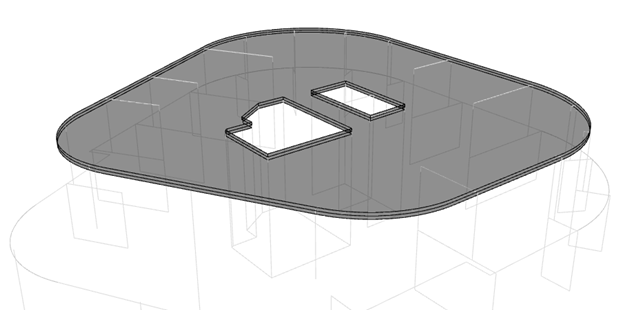
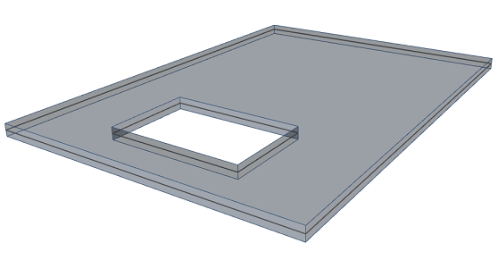

# StructuralSurfaceMemberOpening

## Opening in surface member

 Instances of StructuralSurfaceMemberOpening describe openings in face members \([StructuralSurfaceMember](structuralsurfacemember.md#2d-member-plate-wall)\). The geometry of the opening object is defined in the same way as geometry of 2D members - may be planar or curved with an arbitrary number of edges.

Specification in the excel:

| Name of the column header | Type of data | Value example or enum definition | Required value | Description |
| :---: | :---: | :---: | :---: | :--- |
| Name | String | O1 | yes | Human readable unique name of the object |
| 2D Member | String | S13 | yes | The name of the StructuralSurfaceMember to which is the opening situated. |
| Nodes | String | N81; N263; N659; N660 | yes | All nodes that belong to the surface member and define its geometric shape. The names of the nodes are separated by ; \(semicolon\) and space. |
| Edges | String | Line; Line; Line; Line | yes | Defines the shape of the curve between two next nodes. Supported strings are: Line; Bezier; Circular Arc; Parabolic arc; Spline;Circle and Point;Circle by 3 points. The names are separated by ; \(semicolon\) and space. |
| Area \[m2\] | Double | 1.259 | no | The value of the surface area of the StructuralSurfaceMemberOpening |
| Parent ID | String | 67b35d84-3d04-47aa-aa4a-dc1263982320 | no | Is filled for objects created be dividing curved geometry to series of straight line objects.  Parent ID will ensure that curved edge is imported as straight parts to nonsupporting application, and back to original supporting application as curved geometry. To ensure successful round trip of segmented objects and their related objects, Parent ID needs to be present in both directions. |
| Id | String | 39f238a5-01d0-45cf-a2eb-958170fd4f39 | no | Unique attribute designation |

