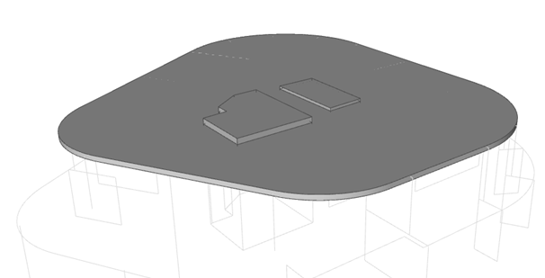
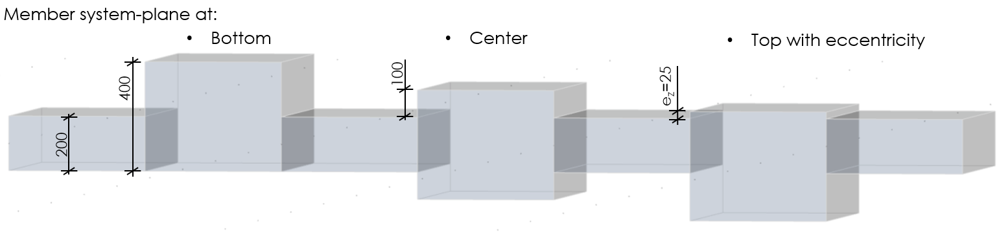

# StructuralSurfaceMemberRegion

## Region of different plate thickness

This object defines particular areas of the StructuralSurfaceMember with different thicknesses.

Specification in the excel:

<table>
  <thead>
    <tr>
      <th style="text-align:left">Name of the column header</th>
      <th style="text-align:left">Type of data</th>
      <th style="text-align:left">Value example or enum definition</th>
      <th style="text-align:left">Required value</th>
      <th style="text-align:left">Description</th>
    </tr>
  </thead>
  <tbody>
    <tr>
      <td style="text-align:left">Name</td>
      <td style="text-align:left">String</td>
      <td style="text-align:left">R1</td>
      <td style="text-align:left">yes</td>
      <td style="text-align:left">Human readable unique name of the object</td>
    </tr>
    <tr>
      <td style="text-align:left">Material</td>
      <td style="text-align:left">String</td>
      <td style="text-align:left">MAT_1</td>
      <td style="text-align:left">yes</td>
      <td style="text-align:left">The name reference to the existing, valid name of the <a href="https://saf.guide/Content/A_Objects/3_StructuralMaterial.htm">StructuralMaterial</a> object.</td>
    </tr>
    <tr>
      <td style="text-align:left">Thickness [mm]</td>
      <td style="text-align:left">Double</td>
      <td style="text-align:left">200</td>
      <td style="text-align:left">yes</td>
      <td style="text-align:left">The thickness of the StructuralSurfaceMemberRegion Thickness is considered
        in total.</td>
    </tr>
    <tr>
      <td style="text-align:left">System plane at</td>
      <td style="text-align:left">Enum</td>
      <td style="text-align:left">
        
Bottom

        
Centre

        
Top

      </td>
      <td style="text-align:left">yes</td>
      <td style="text-align:left">Defines position of the system plane (local x and y-axis) of the StructuralSurfaceMemberRegion
        and determines the alignment of the region. Top: the StructuralSurfaceMemberRegion
        is aligned with the top surface of the <a href="https://saf.guide/Content/A_Objects/8_StructuralSurfaceMember.htm">StructuralSurfaceMember</a>,
        Bottom: it is aligned with the bottom surface.</td>
    </tr>
    <tr>
      <td style="text-align:left">2D Member</td>
      <td style="text-align:left">String</td>
      <td style="text-align:left">S13</td>
      <td style="text-align:left">yes</td>
      <td style="text-align:left">The name of the <a href="https://saf.guide/Content/A_Objects/8_StructuralSurfaceMember.htm">StructuralSurfaceMember</a> to
        which is the region situated.</td>
    </tr>
    <tr>
      <td style="text-align:left">Nodes</td>
      <td style="text-align:left">String</td>
      <td style="text-align:left">N81; N263; N659; N660</td>
      <td style="text-align:left">yes</td>
      <td style="text-align:left">All nodes that belong to StructuralSurfaceMemberRegion and define its
        geometric shape. The names of the nodes are separated by ; (semicolon)
        and space.</td>
    </tr>
    <tr>
      <td style="text-align:left">Edges</td>
      <td style="text-align:left">String</td>
      <td style="text-align:left">Line; Line; Line; Line</td>
      <td style="text-align:left">yes</td>
      <td style="text-align:left">Defines shape of the curve between two next nodes. Supported strings are:
        Line; Bezier; Circular Arc; Parabolic arc; Spline. The names are separated
        by ; (semicolon) and space.</td>
    </tr>
    <tr>
      <td style="text-align:left">Eccentricity ez [mm]</td>
      <td style="text-align:left">Double</td>
      <td style="text-align:left">-125</td>
      <td style="text-align:left">yes</td>
      <td style="text-align:left">The eccentricity of the slab may be input. Eccentricity is measured from
        the system plane &#x2013; local x and y-axis and the direction is in local
        z-axis.</td>
    </tr>
    <tr>
      <td style="text-align:left">Area [m2]</td>
      <td style="text-align:left">Double</td>
      <td style="text-align:left">1.485</td>
      <td style="text-align:left">no</td>
      <td style="text-align:left">The value of the surface area of the StructuralSurfaceMemberRegion</td>
    </tr>
    <tr>
      <td style="text-align:left">Parent ID</td>
      <td style="text-align:left">String</td>
      <td style="text-align:left">67b35d84-3d04-47aa-aa4a-dc1263982320</td>
      <td style="text-align:left">no</td>
      <td style="text-align:left">
        
Is filled for objects created be dividing curved geometry to series of
          straight line objects.
           
           Parent ID will ensure that curved edge is imported as straight parts to
          nonsupporting application, and back to original supporting application
          as curved geometry.

        
To ensure successful round trip of segmented objects and their related
          objects, Parent ID needs to be present in both directions.

      </td>
    </tr>
    <tr>
      <td style="text-align:left">Id</td>
      <td style="text-align:left">String</td>
      <td style="text-align:left">39f238a5-01d0-45cf-a2eb-958170fd4f39</td>
      <td style="text-align:left">no</td>
      <td style="text-align:left">Unique attribute designation</td>
    </tr>
  </tbody>
</table>

## Notes


StructuralSurfaceMemberRegion examples of system-plane location and eccentricity effect.


