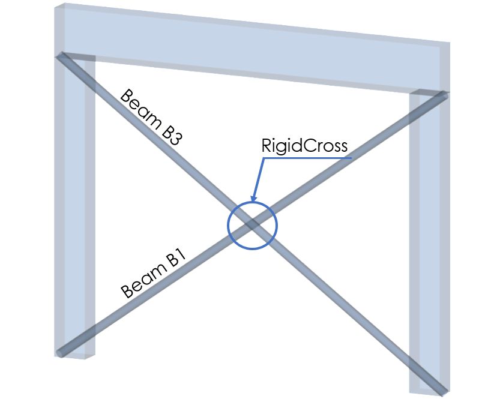

# RelConnectsRigidCross

## Rigid Cross

RigidCross is defining structural behavior of node \([StructuralPointConnection](../structural-analysis-elements/structuralpointconnection.md#node)\), where two 1D elements \([StructuralCurveMember](../structural-analysis-elements/structuralcurvemember.md#1d-member-beam-column)\) are being crossed. 1D members could be independent or dependency could be defined in following excel sheet. Rigid cross is often used for bracing of the structure.

### Specification in the excel

<table>
  <thead>
    <tr>
      <th style="text-align:center">Name of the column header</th>
      <th style="text-align:center">Type of data</th>
      <th style="text-align:center">Value example or enum definition</th>
      <th style="text-align:center">Required value</th>
      <th style="text-align:left">Description</th>
    </tr>
  </thead>
  <tbody>
    <tr>
      <td style="text-align:center">Name</td>
      <td style="text-align:center">String</td>
      <td style="text-align:center">RC1</td>
      <td style="text-align:center">yes</td>
      <td style="text-align:left">Human readable unique name of the object</td>
    </tr>
    <tr>
      <td style="text-align:center">1D Members</td>
      <td style="text-align:center">String</td>
      <td style="text-align:center">B1; B3</td>
      <td style="text-align:center">
        
yes

        
value from (<a href="../structural-analysis-elements/structuralcurvemember.md#1d-member-beam-column">StructuralCurveMember</a>)

      </td>
      <td style="text-align:left">
        
The name from (<a href="../structural-analysis-elements/structuralcurvemember.md#1d-member-beam-column">StrucutralCurveMember</a>)

        
Two 1D members should be defined

      </td>
    </tr>
    <tr>
      <td style="text-align:center">Type</td>
      <td style="text-align:center">Enum</td>
      <td style="text-align:center">
        
Fixed

        

        
Hinged

        

        
Custom

      </td>
      <td style="text-align:center">no</td>
      <td style="text-align:left">
        
Constraint of the Rigid Cross

        
The way the Rigid Cross acts in individual directions. Has informative
          character.

        
When all constraints are set to Rigid = Fixed

        
When all constraints are set to Free = Hinge

        
Custom allows user defined behavior of Cross link and creating the Coupler

      </td>
    </tr>
    <tr>
      <td style="text-align:center">u1</td>
      <td style="text-align:center">Enum</td>
      <td style="text-align:center">
        
Free

        

        
Rigid

        

        
Flexible

        

        
Compression only

        

        
Tension only

        

        
Flexible compression only

        

        
Flexible tension only

        

        
Non linear

      </td>
      <td style="text-align:center">yes</td>
      <td style="text-align:left">
        
Displacement of first connected member

        
Free - That is it imposes no constraint in the direction. Rigid - The
          connection in fully rigid in the specified direction. Flexible - The connection
          is flexible (elastic) in the specified direction. Non linear - resistance
          in specified direction could be defined

        
(Flexible) compression/tension only - acts rigid or flexible, only for
          defined strain (compression or tension)

      </td>
    </tr>
    <tr>
      <td style="text-align:center">u2</td>
      <td style="text-align:center">Enum</td>
      <td style="text-align:center">
        
Free

        

        
Rigid

        

        
Flexible

        

        
Compression only

        

        
Tension only

        

        
Flexible compression only

        

        
Flexible tension only

        

        
Non linear

      </td>
      <td style="text-align:center">yes</td>
      <td style="text-align:left">
        
Displacement of second connected member

        
Free - That is it imposes no constraint in the direction. Rigid - The
          connection in fully rigid in the specified direction. Flexible - The connection
          is flexible (elastic) in the specified direction. Non linear - resistance
          in specified direction could be defined

        
(Flexible) compression/tension only - acts rigid or flexible, only for
          defined strain (compression or tension)

      </td>
    </tr>
    <tr>
      <td style="text-align:center">u</td>
      <td style="text-align:center">Enum</td>
      <td style="text-align:center">
        
Free

        

        
Rigid

        

        
Flexible

        

        
Compression only

        

        
Tension only

        

        
Flexible compression only

        

        
Flexible tension only

        

        
Non linearr

      </td>
      <td style="text-align:center">yes</td>
      <td style="text-align:left">
        
Displacement of RigidCross

        
Free - That is it imposes no constraint in the direction. Rigid - The
          connection in fully rigid in the specified direction. Flexible - The connection
          is flexible (elastic) in the specified direction. Non linear - resistance
          in specified direction could be defined

        
(Flexible) compression/tension only - acts rigid or flexible, only for
          defined strain (compression or tension)

      </td>
    </tr>
    <tr>
      <td style="text-align:center">fi1</td>
      <td style="text-align:center">Enum</td>
      <td style="text-align:center">
        
Free

        

        
Rigid

        

        
Flexible

        

        
Non linear

      </td>
      <td style="text-align:center">yes</td>
      <td style="text-align:left">
        
Rotation for the first connected member

        
Free - That is it imposes no constraint in the direction. Rigid - The
          connection in fully rigid in the specified direction. Flexible - The connection
          is flexible (elastic) in the specified direction. Non linear - resistance
          in specified direction could be defined

      </td>
    </tr>
    <tr>
      <td style="text-align:center">fi2</td>
      <td style="text-align:center">Enum</td>
      <td style="text-align:center">
        
Free

        

        
Rigid

        

        
Flexible

        

        
Non linear

      </td>
      <td style="text-align:center">yes</td>
      <td style="text-align:left">
        
Rotation for the second connected member

        
Free - That is it imposes no constraint in the direction. Rigid - The
          connection in fully rigid in the specified direction. Flexible - The connection
          is flexible (elastic) in the specified direction. Non linear - resistance
          in specified direction could be defined

      </td>
    </tr>
    <tr>
      <td style="text-align:center">fi</td>
      <td style="text-align:center">Enum</td>
      <td style="text-align:center">
        
Free

        

        
Rigid

        

        
Flexible

        

        
Non linear

      </td>
      <td style="text-align:center">yes</td>
      <td style="text-align:left">
        
Rotation for the RigidCross

        
Free - That is it imposes no constraint in the direction. Rigid - The
          connection in fully rigid in the specified direction. Flexible - The connection
          is flexible (elastic) in the specified direction. Non linear - resistance
          in specified direction could be defined

      </td>
    </tr>
    <tr>
      <td style="text-align:center">Stiffness u1 [MN/m]</td>
      <td style="text-align:center">Double</td>
      <td style="text-align:center">3.0</td>
      <td style="text-align:center">yes, if u1 = Flexible, Flexible compression/tension only or Non linear</td>
      <td
      style="text-align:left">
        
The flexibility in direction of first member

        
Use this property only if the u1 is set Flexible, Flexible compression/tension
          only or Non linear

        </td>
    </tr>
    <tr>
      <td style="text-align:center">Resitance u1 [MN]</td>
      <td style="text-align:center">Double</td>
      <td style="text-align:center">0.20</td>
      <td style="text-align:center">yes, if u1 = Non linear</td>
      <td style="text-align:left">
        
The resistance in direction of first member

        
Use this property only if the u1 is set Non linear

      </td>
    </tr>
    <tr>
      <td style="text-align:center">Stiffness u2 [MN/m]</td>
      <td style="text-align:center">Double</td>
      <td style="text-align:center">3.0</td>
      <td style="text-align:center">yes, if u2 = Flexible, Flexible compression/tension only or Non linear</td>
      <td
      style="text-align:left">
        
The flexibility in direction of second member

        
Use this property only if the u2 is set Flexible, Flexible compression/tension
          only or Non linear

        </td>
    </tr>
    <tr>
      <td style="text-align:center">Resitance u2 [MN]</td>
      <td style="text-align:center">Double</td>
      <td style="text-align:center">0.20</td>
      <td style="text-align:center">yes, if u2 = Non linear</td>
      <td style="text-align:left">
        
The resistance in direction of second member

        
Use this property only if the u2 is set Non linear

      </td>
    </tr>
    <tr>
      <td style="text-align:center">Stiffness u [MN/m]</td>
      <td style="text-align:center">Double</td>
      <td style="text-align:center">5.0</td>
      <td style="text-align:center">yes, if u = Flexible, Flexible compression/tension only or Non linear</td>
      <td
      style="text-align:left">
        
The flexibility of the RigidCross

        
Use this property only if the u is set Flexible, Flexible compression/tension
          only or Non linear

        </td>
    </tr>
    <tr>
      <td style="text-align:center">Resitance u [MN]</td>
      <td style="text-align:center">Double</td>
      <td style="text-align:center">0.35</td>
      <td style="text-align:center">yes, if u = Non linear</td>
      <td style="text-align:left">
        
The resistance of the RigidCross

        
Use this property only if the u is set Non linear

      </td>
    </tr>
    <tr>
      <td style="text-align:center">Stiffness fi1 [MNm/rad]</td>
      <td style="text-align:center">Double</td>
      <td style="text-align:center">1.0</td>
      <td style="text-align:center">yes, if fi1 = Flexible, Flexible compression/tension only or Non linear</td>
      <td
      style="text-align:left">
        
Torsional stiffness around the 1st member

        
Use this property only if the fi1 is set Flexible or Non linear

        </td>
    </tr>
    <tr>
      <td style="text-align:center">Resistance fi1 [MNm]</td>
      <td style="text-align:center">Double</td>
      <td style="text-align:center">0.05</td>
      <td style="text-align:center">yes, if fi1 = Non linear</td>
      <td style="text-align:left">
        
Torsional resistance around the 1st member

        
Use this property only if the fi1 is set Non linear

      </td>
    </tr>
    <tr>
      <td style="text-align:center">Stiffness fi2 [MNm/rad]</td>
      <td style="text-align:center">Double</td>
      <td style="text-align:center">1.0</td>
      <td style="text-align:center">yes, if fi2 = Flexible, or Non linear</td>
      <td style="text-align:left">
        
Torsional stiffness around the 2st member

        
Use this property only if the fi2 is set Flexible or Non linear

      </td>
    </tr>
    <tr>
      <td style="text-align:center">Resistance fi2 [MNm]</td>
      <td style="text-align:center">Double</td>
      <td style="text-align:center">0.05</td>
      <td style="text-align:center">yes, if fi2 = Non linear</td>
      <td style="text-align:left">
        
Torsional resistance around the 2st member

        
Use this property only if the fi2 is set Non linear

      </td>
    </tr>
    <tr>
      <td style="text-align:center">Stiffness fi [MNm/rad]</td>
      <td style="text-align:center">Double</td>
      <td style="text-align:center">4.0</td>
      <td style="text-align:center">yes, if fi = Flexible or Non linear</td>
      <td style="text-align:left">
        
Torsional stiffness of the RigidCross

        
Use this property only if the fi is set Flexible or Non linear

      </td>
    </tr>
    <tr>
      <td style="text-align:center">Resistance fi [MNm]</td>
      <td style="text-align:center">Double</td>
      <td style="text-align:center">0.25</td>
      <td style="text-align:center">yes, if fi = Non linear</td>
      <td style="text-align:left">
        
Torsional resistance of the RigidCross

        
Use this property only if the fi is set Non linear

      </td>
    </tr>
    <tr>
      <td style="text-align:center">Parent ID</td>
      <td style="text-align:center">String</td>
      <td style="text-align:center">67b35d84-3d04-47aa-aa4a-dc1263982320</td>
      <td style="text-align:center">no</td>
      <td style="text-align:left">
        
Is filled for objects created be dividing curved geometry to series of
          straight line objects.
           
           Parent ID will ensure that curved edge is imported as straight parts to
          nonsupporting application, and back to original supporting application
          as curved geometry.

        
To ensure successful round trip of segmented objects and their related
          objects, Parent ID needs to be present in both directions.

      </td>
    </tr>
    <tr>
      <td style="text-align:center">Id</td>
      <td style="text-align:center">String</td>
      <td style="text-align:center">39f238a5-01d0-45cf-a2eb-958170fd4f39</td>
      <td style="text-align:center">no</td>
      <td style="text-align:left">Unique attribute designation</td>
    </tr>
  </tbody>
</table>

## Notes


**Resistance** is defined by the value of maximal strain. Until is the value of maximal strain reached, Rigid cross acts fully rigid. After the value exceeded, RigidCross acts flexibly due to defined Value of Stiffness. This is how non linear behavior is achieved.

The axis of the connection is defined by the members of the RigidCross:

* The first axis is assigned to the first member \(i.e. the first member selected by the user during the definition of a new RigidCross - column "1D Members"\).
* The second axis is assigned to the second member \(i.e. the second member selected by the user during the definition of a new RigidCross - column "1D Members"\).
* The third axis is perpendicular at the plane defined by member 1 and member 2.

**Non linear** behavior of material is handled with "Resistance". The example is shown below.


