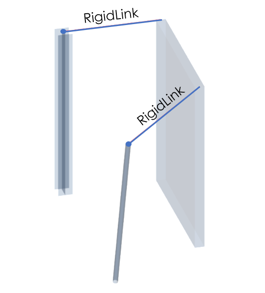
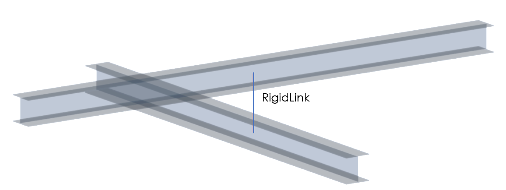

# RelConnectsRigidLink

## Rigid Link

A virtual connection of two nodes from\([StructuralPointConnection](../structural-analysis-elements/structuralpointconnection.md#node)\) for directly defined nodes, \([StructuralSurfaceMember](../structural-analysis-elements/structuralsurfacemember.md#2d-member-plate-wall)\) or \([StructuralCurveMember](../structural-analysis-elements/structuralcurvemember.md#1d-member-beam-column)\)for internal nodes on 1D and 2D members, where structural behavior could be set. Master and slave node have to be defined. The rigid links are used for the connection, where you want to simulate infinite rigidity or user defined properties.

### Specification in the excel

<table>
  <thead>
    <tr>
      <th style="text-align:center">Name of the column header</th>
      <th style="text-align:center">Type of data</th>
      <th style="text-align:center">Value example or enum definition</th>
      <th style="text-align:center">Required value</th>
      <th style="text-align:left">Description</th>
    </tr>
  </thead>
  <tbody>
    <tr>
      <td style="text-align:center">Name</td>
      <td style="text-align:center">String</td>
      <td style="text-align:center">RL1</td>
      <td style="text-align:center">yes</td>
      <td style="text-align:left">Human readable unique name of the object</td>
    </tr>
    <tr>
      <td style="text-align:center">Nodes</td>
      <td style="text-align:center">String</td>
      <td style="text-align:center">N3; N4</td>
      <td style="text-align:center">yes</td>
      <td style="text-align:left">
        
The name of the valid existing node (<a href="../structural-analysis-elements/structuralpointconnection.md#node">StructuralPoinConnection</a>),
          or (<a href="../structural-analysis-elements/structuralcurvemember.md#1d-member-beam-column">StructuralCurveMember</a>,
          <a
          href="../structural-analysis-elements/structuralsurfacemember.md#2d-member-plate-wall">StructuralSurfaceMember</a>) for internal nodes

        
Maximum of two nodes can be connected by RelConnectsRigitLink

        
First in node is seen as &quot;master node&quot;, second in row is &quot;slave
          node&quot;

      </td>
    </tr>
    <tr>
      <td style="text-align:center">Hinge position</td>
      <td style="text-align:center">Enum</td>
      <td style="text-align:center">
        
None

        

        
Begin (master node)

        

        
End (slave node)

        

        
Both

      </td>
      <td style="text-align:center">yes</td>
      <td style="text-align:left">
        
This attribute serves to indicate if hinges should be applied to rigid
          link and if so, than on which node.

        
Hinge position allows user to define constrains of selected node or nodes
          of RelConnectsRigidLink for translation (ui) and rotation (fii)

      </td>
    </tr>
    <tr>
      <td style="text-align:center">ux</td>
      <td style="text-align:center">Enum</td>
      <td style="text-align:center">
        
Free

        

        
Rigid

        

        
Flexible

        

        
Compression only

        

        
Tension only

        

        
Flexible compression only

        

        
Flexible tension only

        

        
Non linear

      </td>
      <td style="text-align:center">yes</td>
      <td style="text-align:left">
        
Displacement in the direction X

        
Free - That is it imposes no constraint in the direction. Rigid - The
          connection in fully rigid in the specified direction. Flexible - The connection
          is flexible (elastic) in the specified direction. Non linear - resistance
          in specified direction could be defined

        
(Flexible) compression/tension only - acts rigid or flexible, only for
          defined strain (compression or tension)

        
See notes for coordinates reference.

      </td>
    </tr>
    <tr>
      <td style="text-align:center">uy</td>
      <td style="text-align:center">Enum</td>
      <td style="text-align:center">
        
Free

        

        
Rigid

        

        
Flexible

        

        
Compression only

        

        
Tension only

        

        
Flexible compression only

        

        
Flexible tension only

        

        
Non linear

      </td>
      <td style="text-align:center">yes</td>
      <td style="text-align:left">
        
Displacement in the direction Y

        
Free - That is it imposes no constraint in the direction. Rigid - The
          connection in fully rigid in the specified direction. Flexible - The connection
          is flexible (elastic) in the specified direction. Non linear - resistance
          in specified direction could be defined

        
(Flexible) compression/tension only - acts rigid or flexible, only for
          defined strain (compression or tension)

        
See notes for coordinates reference.

      </td>
    </tr>
    <tr>
      <td style="text-align:center">uz</td>
      <td style="text-align:center">Enum</td>
      <td style="text-align:center">
        
Free

        

        
Rigid

        

        
Flexible

        

        
Compression only

        

        
Tension only

        

        
Flexible compression only

        

        
Flexible tension only

        

        
Non linear

      </td>
      <td style="text-align:center">yes</td>
      <td style="text-align:left">
        
Displacement in the direction Z

        
Free - That is it imposes no constraint in the direction. Rigid - The
          connection in fully rigid in the specified direction. Flexible - The connection
          is flexible (elastic) in the specified direction. Non linear - resistance
          in specified direction could be defined

        
(Flexible) compression/tension only - acts rigid or flexible, only for
          defined strain (compression or tension)

        
See notes for coordinates reference.

      </td>
    </tr>
    <tr>
      <td style="text-align:center">fix</td>
      <td style="text-align:center">Enum</td>
      <td style="text-align:center">
        
Free

        

        
Rigid

        

        
Flexible

        

        
Non linear

      </td>
      <td style="text-align:center">yes</td>
      <td style="text-align:left">
        
Rotation around X axis

        
Free - That is it imposes no constraint in the direction. Rigid - The
          connection in fully rigid in the specified direction. Flexible - The connection
          is flexible (elastic) in the specified direction. Non linear - resistance
          in specified direction could be defined

        
See notes for coordinates reference.

      </td>
    </tr>
    <tr>
      <td style="text-align:center">fiy</td>
      <td style="text-align:center">Enum</td>
      <td style="text-align:center">
        
Free

        

        
Rigid

        

        
Flexible

        

        
Non linear

      </td>
      <td style="text-align:center">yes</td>
      <td style="text-align:left">
        
Rotation around Y axis

        
Free - That is it imposes no constraint in the direction. Rigid - The
          connection in fully rigid in the specified direction. Flexible - The connection
          is flexible (elastic) in the specified direction. Non linear - resistance
          in specified direction could be defined

        
See notes for coordinates reference.

      </td>
    </tr>
    <tr>
      <td style="text-align:center">fiz</td>
      <td style="text-align:center">Enum</td>
      <td style="text-align:center">
        
Free

        

        
Rigid

        

        
Flexible

        

        
Non linear

      </td>
      <td style="text-align:center">yes</td>
      <td style="text-align:left">
        
Rotation around Z axis

        
Free - That is it imposes no constraint in the direction. Rigid - The
          connection in fully rigid in the specified direction. Flexible - The connection
          is flexible (elastic) in the specified direction. Non linear - resistance
          in specified direction could be defined

        
See notes for coordinates reference.

      </td>
    </tr>
    <tr>
      <td style="text-align:center">Stiffness X [MN/m]</td>
      <td style="text-align:center">Double</td>
      <td style="text-align:center">3.00</td>
      <td style="text-align:center">yes, if ux = Flexible, Flexible compression/tension only or Non linear</td>
      <td
      style="text-align:left">
        
The flexibility in direction X

        
Use this property only if the ux is set Flexible, Flexible compression/tension
          only or Non linear

        
See notes for coordinates reference.

        </td>
    </tr>
    <tr>
      <td style="text-align:center">Resistance X [MN]</td>
      <td style="text-align:center">Double</td>
      <td style="text-align:center">0.25</td>
      <td style="text-align:center">yes, if ux = Non linear</td>
      <td style="text-align:left">
        
The resistance in direction X

        
Use this property only if the ux is set to Non linear

        
See notes for coordinates reference.

      </td>
    </tr>
    <tr>
      <td style="text-align:center">Stiffness Y [MN/m]</td>
      <td style="text-align:center">Double</td>
      <td style="text-align:center">2.50</td>
      <td style="text-align:center">yes, if uy = Flexible, Flexible compression/tension only or Non linear</td>
      <td
      style="text-align:left">
        
The flexibility in direction Y

        
Use this property only if the uy is set Flexible, Flexible compression/tension
          only or Non linear

        
See notes for coordinates reference.

        </td>
    </tr>
    <tr>
      <td style="text-align:center">Resistance Y [MN]</td>
      <td style="text-align:center">Double</td>
      <td style="text-align:center">0.30</td>
      <td style="text-align:center">yes, if uy = Non linear</td>
      <td style="text-align:left">
        
The resistance in direction Y

        
Use this property only if the uy is set Non linear

        
See notes for coordinates reference.

      </td>
    </tr>
    <tr>
      <td style="text-align:center">Stiffness Z [MN/m]</td>
      <td style="text-align:center">Double</td>
      <td style="text-align:center">2.00</td>
      <td style="text-align:center">yes, if uz = Flexible, Flexible compression/tension only or Non linear</td>
      <td
      style="text-align:left">
        
The flexibility in direction Z

        
Use this property only if the uz is set Flexible, Flexible compression/tension
          only or Non linear

        
See notes for coordinates reference.

        </td>
    </tr>
    <tr>
      <td style="text-align:center">Resistance Z [MN]</td>
      <td style="text-align:center">Double</td>
      <td style="text-align:center">0.75</td>
      <td style="text-align:center">yes, if uz = Non linear</td>
      <td style="text-align:left">
        
The resistance in direction Z

        
Use this property only if the uz is set Non linear

        
See notes for coordinates reference.

      </td>
    </tr>
    <tr>
      <td style="text-align:center">Stiffness Fix [MNm/rad]</td>
      <td style="text-align:center">Double</td>
      <td style="text-align:center">5.00</td>
      <td style="text-align:center">yes, if fix = Flexible or Non linear</td>
      <td style="text-align:left">
        
The flexibility in rotation around X axis

        
Use this property only if the Rotational stiffness fix is Flexible or
          Non linear

        
See notes for coordinates reference.

      </td>
    </tr>
    <tr>
      <td style="text-align:center">Resistance Fix [MNm]</td>
      <td style="text-align:center">Double</td>
      <td style="text-align:center">1.00</td>
      <td style="text-align:center">yes, if fix = Non linear</td>
      <td style="text-align:left">
        
The resistance in rotation around Y axis

        
Use this property only if the Rotational stiffness fix is Non linear

        
See notes for coordinates reference.

      </td>
    </tr>
    <tr>
      <td style="text-align:center">Stiffness Fiy [MNm/rad]</td>
      <td style="text-align:center">Double</td>
      <td style="text-align:center">6.25</td>
      <td style="text-align:center">yes, if fiy = Flexible or Non linear</td>
      <td style="text-align:left">
        
The flexibility in rotation around Y axis

        
Use this property only if the Rotational stiffness fiy is Flexible or
          Non linear

        
See notes for coordinates reference.

      </td>
    </tr>
    <tr>
      <td style="text-align:center">Resistance Fiy [MNm]</td>
      <td style="text-align:center">Double</td>
      <td style="text-align:center">0.80</td>
      <td style="text-align:center">yes, if fiy = Non linear</td>
      <td style="text-align:left">
        
The resistance in rotation around Y axis

        
Use this property only if the Rotational stiffness fiy is Non linear

        
See notes for coordinates reference.

      </td>
    </tr>
    <tr>
      <td style="text-align:center">Stiffness Fiz [MNm/rad]</td>
      <td style="text-align:center">Double</td>
      <td style="text-align:center">3.00</td>
      <td style="text-align:center">yes, if fiz = Flexible or Non linear</td>
      <td style="text-align:left">
        
The flexibility in rotation around Z axis

        
Use this property only if the Rotational stiffness fiz is Flexible or
          Non linear

        
See notes for coordinates reference.

      </td>
    </tr>
    <tr>
      <td style="text-align:center">Resistance Fiz [MNm]</td>
      <td style="text-align:center">Double</td>
      <td style="text-align:center">0.10</td>
      <td style="text-align:center">yes, if fiz = Non linear</td>
      <td style="text-align:left">
        
The resistance in rotation around Z axis

        
Use this property only if the Rotational stiffness fiz is Non linear

        
See notes for coordinates reference.

      </td>
    </tr>
    <tr>
      <td style="text-align:center">Id</td>
      <td style="text-align:center">String</td>
      <td style="text-align:center">39f238a5-01d0-45cf-a2eb-958170fd4f39</td>
      <td style="text-align:center">no</td>
      <td style="text-align:left">Unique attribute designation</td>
    </tr>
  </tbody>
</table>

## Notes


For constrains, the LCS of RelConnectsRigidLink is taken into account.

Local coordination system is given by master node and its parent object.

**Non linear** behavior of material is handled with "Resistance". The example is shown below.


