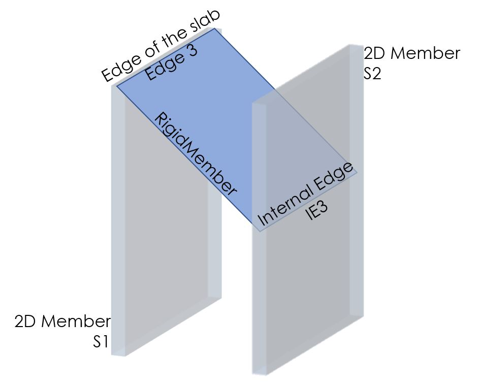

# RelConnectsRigidMember

## Rigid Member

A rigid connection between two entities. Rigid Member allows to create connections between nodes \([StructuralPoinConnection](../structural-analysis-elements/structuralpointconnection.md#node)\), 1D members \([StructuralCurveMember](../structural-analysis-elements/structuralcurvemember.md#1d-member-beam-column)\) and edges of 2D members \([StructuralSurfaceMember](../structural-analysis-elements/structuralsurfacemember.md#2d-member-plate-wall)\). Connection could be infinitely rigid or with user defined properties. Maximum of two entities could be connected with one **RelConnectsRigidMember**.

### Specification in the excel

<table>
  <thead>
    <tr>
      <th style="text-align:left">Name of the column header</th>
      <th style="text-align:left">Type of data</th>
      <th style="text-align:left">Value example or enum definition</th>
      <th style="text-align:left">Required value</th>
      <th style="text-align:left">Description</th>
    </tr>
  </thead>
  <tbody>
    <tr>
      <td style="text-align:left">Name</td>
      <td style="text-align:left">String</td>
      <td style="text-align:left">RM1</td>
      <td style="text-align:left">yes</td>
      <td style="text-align:left">Human readable unique name of the object</td>
    </tr>
    <tr>
      <td style="text-align:left">Node</td>
      <td style="text-align:left">String</td>
      <td style="text-align:left">N3</td>
      <td style="text-align:left">
        
yes

        
,if is connection between node and other entity is desired

        
otherwise no

      </td>
      <td style="text-align:left">
        
The name of the valid existing node (<a href="../structural-analysis-elements/structuralpointconnection.md#node">StructuralPoinConnection</a>)

        
Fiil in node indication, when connection between node, 2D member edge,
          1D member or internal edge is desired

      </td>
    </tr>
    <tr>
      <td style="text-align:left">2D Members</td>
      <td style="text-align:left">String</td>
      <td style="text-align:left">S1; S2</td>
      <td style="text-align:left">
        
yes

        
,if connection between 2D member edge and other entity is desired

        
otherwise no

      </td>
      <td style="text-align:left">
        
The name of the valid existing 2D member (<a href="../structural-analysis-elements/structuralsurfacemember.md#2d-member-plate-wall">StructuralSurfaceMember</a>)

        
Maximum of two 2D members can be connected by RelConnectsRigitMember

        
Fiil in one 2D member indication, when connection with node, 1D member
          or internal edge is desired

      </td>
    </tr>
    <tr>
      <td style="text-align:left">Edges</td>
      <td style="text-align:left">String</td>
      <td style="text-align:left">3; 1</td>
      <td style="text-align:left">
        
yes

        
,if column &quot;2D Members&quot; is filled

        
otherwise no

      </td>
      <td style="text-align:left">
        
This attribute defines edges that should be connected with RelConnectsRigidMember

        
One value for every value set in column &quot;2D Member&quot;

        
For further information about 2D members and edges see <a href="../structural-analysis-elements/structuralsurfacemember.md#2d-member-plate-wall">StructuralSurfaceMember</a>
        

      </td>
    </tr>
    <tr>
      <td style="text-align:left">Internal edge</td>
      <td style="text-align:left">String</td>
      <td style="text-align:left">IE2; IE6</td>
      <td style="text-align:left">
        
yes

        
,if connection between internal edges and other entity is desired

        
otherwise no

      </td>
      <td style="text-align:left">
        
The name of the valid existing internal edge (<a href="../structural-analysis-elements/structuralcurveedge.md#internal-edge">StructuralCurveEdge</a>)

        
Maximum of two internal edges can be connected by RelConnectsRigitMember

        
Fiil in one internal edge indication, when connection with node, 1D member
          or 2D member edge is desired

      </td>
    </tr>
    <tr>
      <td style="text-align:left">1D Members</td>
      <td style="text-align:left">String</td>
      <td style="text-align:left">B1; B3</td>
      <td style="text-align:left">
        
yes

        
,if connection between 1D member and other entity is desired

        
otherwise no

      </td>
      <td style="text-align:left">
        
The name of valid existing 1D member (<a href="../structural-analysis-elements/structuralcurvemember.md#1d-member-beam-column">StructuralCurveMember</a>)

        
Maximum of two 1D members can be sonnected by StrucutralRigidMember

        
Fill in one 1D member indication, when connection with node, 2D member
          edge or internal edge is desired

      </td>
    </tr>
    <tr>
      <td style="text-align:left">Type</td>
      <td style="text-align:left">Enum</td>
      <td style="text-align:left">
        
Fixed

        
Custom

      </td>
      <td style="text-align:left">yes</td>
      <td style="text-align:left">
        
Constraint of the Rigid Member

        
The way the RigidMemberk acts in individual directions

        
Fixed value automaticly defines displacements and rotations constrains

        
Custom allows user defined behavior of Rigid Member

      </td>
    </tr>
    <tr>
      <td style="text-align:left">ux</td>
      <td style="text-align:left">Enum</td>
      <td style="text-align:left">
        
Free

        
Rigid

        
Flexible

        
Compression only

        
Tension only

        
Flexible compression only

        
Flexible tension only

        
Non linear

      </td>
      <td style="text-align:left">yes</td>
      <td style="text-align:left">
        
Displacement in the direction X

        
Free - That is it imposes no constraint in the direction. Rigid - The
          connection in fully rigid in the specified direction. Flexible - The connection
          is flexible (elastic) in the specified direction. Non linear - resistance
          in specified direction could be defined

        
(Flexible) compression/tension only - acts rigid or flexible, only for
          defined strain (compression or tension)

        
See notes for coordinates reference.

      </td>
    </tr>
    <tr>
      <td style="text-align:left">uy</td>
      <td style="text-align:left">Enum</td>
      <td style="text-align:left">
        
Free

        
Rigid

        
Flexible

        
Compression only

        
Tension only

        
Flexible compression only

        
Flexible tension only

        
Non linear

      </td>
      <td style="text-align:left">yes</td>
      <td style="text-align:left">
        
Displacement in the direction Y

        
Free - That is it imposes no constraint in the direction. Rigid - The
          connection in fully rigid in the specified direction. Flexible - The connection
          is flexible (elastic) in the specified direction. Non linear - resistance
          in specified direction could be defined

        
(Flexible) compression/tension only - acts rigid or flexible, only for
          defined strain (compression or tension)

        
See notes for coordinates reference.

      </td>
    </tr>
    <tr>
      <td style="text-align:left">uz</td>
      <td style="text-align:left">Enum</td>
      <td style="text-align:left">
        
Free

        
Rigid

        
Flexible

        
Compression only

        
Tension only

        
Flexible compression only

        
Flexible tension only

        
Non linear

      </td>
      <td style="text-align:left">yes</td>
      <td style="text-align:left">
        
Displacement in the direction Z

        
Free - That is it imposes no constraint in the direction. Rigid - The
          connection in fully rigid in the specified direction. Flexible - The connection
          is flexible (elastic) in the specified direction. Non linear - resistance
          in specified direction could be defined

        
(Flexible) compression/tension only - acts rigid or flexible, only for
          defined strain (compression or tension)

        
See notes for coordinates reference.

      </td>
    </tr>
    <tr>
      <td style="text-align:left">fix</td>
      <td style="text-align:left">Enum</td>
      <td style="text-align:left">
        
Free

        
Rigid

        
Flexible

        
Non linear

      </td>
      <td style="text-align:left">yes</td>
      <td style="text-align:left">
        
Rotation around X axis

        
Free - That is it imposes no constraint in the direction. Rigid - The
          connection in fully rigid in the specified direction. Flexible - The connection
          is flexible (elastic) in the specified direction. Non linear - resistance
          in specified direction could be defined

        
See notes for coordinates reference.

      </td>
    </tr>
    <tr>
      <td style="text-align:left">fiy</td>
      <td style="text-align:left">Enum</td>
      <td style="text-align:left">
        
Free

        
Rigid

        
Flexible

        
Non linear

      </td>
      <td style="text-align:left">yes</td>
      <td style="text-align:left">
        
Rotation around Y axis

        
Free - That is it imposes no constraint in the direction. Rigid - The
          connection in fully rigid in the specified direction. Flexible - The connection
          is flexible (elastic) in the specified direction. Non linear - resistance
          in specified direction could be defined

        
See notes for coordinates reference.

      </td>
    </tr>
    <tr>
      <td style="text-align:left">fiz</td>
      <td style="text-align:left">Enum</td>
      <td style="text-align:left">
        
Free

        
Rigid

        
Flexible

        
Non linear

      </td>
      <td style="text-align:left">yes</td>
      <td style="text-align:left">
        
Rotation around Z axis

        
Free - That is it imposes no constraint in the direction. Rigid - The
          connection in fully rigid in the specified direction. Flexible - The connection
          is flexible (elastic) in the specified direction. Non linear - resistance
          in specified direction could be defined

        
See notes for coordinates reference.

      </td>
    </tr>
    <tr>
      <td style="text-align:left">Stiffness X [MN/m2]</td>
      <td style="text-align:left">Double</td>
      <td style="text-align:left">3.00</td>
      <td style="text-align:left">yes, if ux = Flexible, Flexible compression/tension or Non linear</td>
      <td
      style="text-align:left">
        
The flexibility in direction X

        
Use this property only if the ux is set Flexible, Flexible compression/tension
          or Non linear

        
See notes for coordinates reference.

        </td>
    </tr>
    <tr>
      <td style="text-align:left">Resistance X [MN/m]</td>
      <td style="text-align:left">Double</td>
      <td style="text-align:left">0.25</td>
      <td style="text-align:left">yes, if ux = Non linear</td>
      <td style="text-align:left">
        
The resistance in direction X

        
Use this property only if the ux is set to Non linear

        
See notes for coordinates reference.

      </td>
    </tr>
    <tr>
      <td style="text-align:left">Stiffness Y [MN/m2]</td>
      <td style="text-align:left">Double</td>
      <td style="text-align:left">2.50</td>
      <td style="text-align:left">yes, if uy = Flexible, Flexible compression/tension or Non linear</td>
      <td
      style="text-align:left">
        
The flexibility in direction Y

        
Use this property only if the uy is set Flexible, Flexible compression/tension
          or Non linear

        
See notes for coordinates reference.

        </td>
    </tr>
    <tr>
      <td style="text-align:left">Resistance Y [MN/m]</td>
      <td style="text-align:left">Double</td>
      <td style="text-align:left">0.30</td>
      <td style="text-align:left">yes, if uy = Non linear</td>
      <td style="text-align:left">
        
The resistance in direction Y

        
Use this property only if the uy is set Non linear

        
See notes for coordinates reference.

      </td>
    </tr>
    <tr>
      <td style="text-align:left">Stiffness Z [MN/m2]</td>
      <td style="text-align:left">Double</td>
      <td style="text-align:left">2.00</td>
      <td style="text-align:left">yes, if uz = Flexible, Flexible compression/tension or Non linear</td>
      <td
      style="text-align:left">
        
The flexibility in direction Z

        
Use this property only if the uz is set Flexible, Flexible compression/tension
          or Non linear

        
See notes for coordinates reference.

        </td>
    </tr>
    <tr>
      <td style="text-align:left">Resistance Z [MN/m]</td>
      <td style="text-align:left">Double</td>
      <td style="text-align:left">0.75</td>
      <td style="text-align:left">yes, if uz = Non linear</td>
      <td style="text-align:left">
        
The resistance in direction Z

        
Use this property only if the uz is set Non linear

        
See notes for coordinates reference.

      </td>
    </tr>
    <tr>
      <td style="text-align:left">Stiffness Fix [MNm/rad/m]</td>
      <td style="text-align:left">Double</td>
      <td style="text-align:left">5.00</td>
      <td style="text-align:left">yes, if fix = Flexible or Non linear</td>
      <td style="text-align:left">
        
The flexibility in rotation around X axis

        
Use this property only if the Rotational stiffness fix is Flexible or
          Non linear

        
See notes for coordinates reference.

      </td>
    </tr>
    <tr>
      <td style="text-align:left">Resistance Fix [MNm/m]</td>
      <td style="text-align:left">Double</td>
      <td style="text-align:left">1.00</td>
      <td style="text-align:left">yes, if fix = Non linear</td>
      <td style="text-align:left">
        
The resistance in rotation around Y axis

        
Use this property only if the Rotational stiffness fix is Non linear

        
See notes for coordinates reference.

      </td>
    </tr>
    <tr>
      <td style="text-align:left">Stiffness Fiy [MNm/rad/m]</td>
      <td style="text-align:left">Double</td>
      <td style="text-align:left">6.25</td>
      <td style="text-align:left">yes, if fiy = Flexible or Non linear</td>
      <td style="text-align:left">
        
The flexibility in rotation around Y axis

        
Use this property only if the Rotational stiffness fiy is Flexible or
          Non linear

        
See notes for coordinates reference.

      </td>
    </tr>
    <tr>
      <td style="text-align:left">Resistance Fiy [MNm/m]</td>
      <td style="text-align:left">Double</td>
      <td style="text-align:left">0.80</td>
      <td style="text-align:left">yes, if fiy = Non linear</td>
      <td style="text-align:left">
        
The resistance in rotation around Y axis

        
Use this property only if the Rotational stiffness fiy is Non linear

        
See notes for coordinates reference.

      </td>
    </tr>
    <tr>
      <td style="text-align:left">Stiffness Fiz [MNm/rad/m]</td>
      <td style="text-align:left">Double</td>
      <td style="text-align:left">3.00</td>
      <td style="text-align:left">yes, if fiz = Flexible or Non linear</td>
      <td style="text-align:left">
        
The flexibility in rotation around Z axis

        
Use this property only if the Rotational stiffness fiz is Flexible or
          Non linear

        
See notes for coordinates reference.

      </td>
    </tr>
    <tr>
      <td style="text-align:left">Resistance Fiz [MNm/m]</td>
      <td style="text-align:left">Double</td>
      <td style="text-align:left">0.10</td>
      <td style="text-align:left">yes, if fiz = Non linear</td>
      <td style="text-align:left">
        
The resistance in rotation around Z axis

        
Use this property only if the Rotational stiffness fiz is Non linear

        
See notes for coordinates reference.

      </td>
    </tr>
    <tr>
      <td style="text-align:left">Id</td>
      <td style="text-align:left">String</td>
      <td style="text-align:left">39f238a5-01d0-45cf-a2eb-958170fd4f39</td>
      <td style="text-align:left">no</td>
      <td style="text-align:left">Unique attribute designation</td>
    </tr>
  </tbody>
</table>

## Notes


Local coordination system is given by first node and its related object.

**Non linear** behavior of material is handled with "Resistance". The example is shown below.


