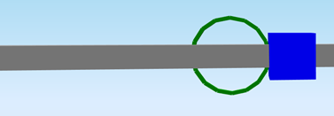

# RelConnectsStructuralMember

## Hinges on 1D member

The entity RelConnectsStructuralMember allows users to release degrees of freedom between structural members \(beams, columns\) and structural connection objects \(nodes or supports\). When no RelConnectsStrucutralMember is defined, connections are taken into account as fully rigid. The defined connections may be rigid or free or anything in between. In each direction \(translations along X, Y, and Z local 1D member axes, rotation around X, Y, and Z local 1D member axes\) the condition may be: Free, Rigid, Flexible.

### Specification in the excel:

<table>
  <thead>
    <tr>
      <th style="text-align:center">Name of the column header</th>
      <th style="text-align:center">Type of data</th>
      <th style="text-align:center">Value example or enum definition</th>
      <th style="text-align:center">Required value</th>
      <th style="text-align:left">Description</th>
    </tr>
  </thead>
  <tbody>
    <tr>
      <td style="text-align:center">Name</td>
      <td style="text-align:center">String</td>
      <td style="text-align:center">H1</td>
      <td style="text-align:center">yes</td>
      <td style="text-align:left">Human readable unique name of the RelConnectsStrucutralMember</td>
    </tr>
    <tr>
      <td style="text-align:center">Member</td>
      <td style="text-align:center">String</td>
      <td style="text-align:center">Beam B54</td>
      <td style="text-align:center">yes</td>
      <td style="text-align:left">The name of the curve member to which is hinge related</td>
    </tr>
    <tr>
      <td style="text-align:center">Position</td>
      <td style="text-align:center">Enum</td>
      <td style="text-align:center">
        
Begin

        

        
End

        

        
Both

      </td>
      <td style="text-align:center">yes</td>
      <td style="text-align:left">The position of the hinge on the curve member. *see notes</td>
    </tr>
    <tr>
      <td style="text-align:center">ux</td>
      <td style="text-align:center">Enum</td>
      <td style="text-align:center">
        
Free

        

        
Rigid

        

        
Flexible

      </td>
      <td style="text-align:center">yes</td>
      <td style="text-align:left">Translation in X direction. Free - That is it imposes no constraint in
        the direction. Rigid - The connection in fully rigid in the specified direction.
        Flexible - The connection is flexible (elastic) in the specified direction.
        Parameter Flexible can be linear only, non-linearity is not supported.</td>
    </tr>
    <tr>
      <td style="text-align:center">uy</td>
      <td style="text-align:center">Enum</td>
      <td style="text-align:center">
        
Free

        

        
Rigid

        

        
Flexible

      </td>
      <td style="text-align:center">yes</td>
      <td style="text-align:left">Translation in Y direction. Free - That is it imposes no constraint in
        the direction. Rigid - The connection in fully rigid in the specified direction.
        Flexible - The connection is flexible (elastic) in the specified direction.
        Parameter Flexible can be linear only, non-linearity is not supported.</td>
    </tr>
    <tr>
      <td style="text-align:center">uz</td>
      <td style="text-align:center">Enum</td>
      <td style="text-align:center">
        
Free

        

        
Rigid

        

        
Flexible

      </td>
      <td style="text-align:center">yes</td>
      <td style="text-align:left">Translation in Z direction. Free - That is it imposes no constraint in
        the direction. Rigid - The connection in fully rigid in the specified direction.
        Flexible - The connection is flexible (elastic) in the specified direction.
        Parameter Flexible can be linear only, non-linearity is not supported.</td>
    </tr>
    <tr>
      <td style="text-align:center">fix</td>
      <td style="text-align:center">Enum</td>
      <td style="text-align:center">
        
Free

        

        
Rigid

        

        
Flexible

      </td>
      <td style="text-align:center">yes</td>
      <td style="text-align:left">Rotational stiffness around X axis. Parameter Flexible can be linear only,
        non-linearity is not supported.</td>
    </tr>
    <tr>
      <td style="text-align:center">fiy</td>
      <td style="text-align:center">Enum</td>
      <td style="text-align:center">
        
Free

        

        
Rigid

        

        
Flexible

      </td>
      <td style="text-align:center">yes</td>
      <td style="text-align:left">Rotational stiffness around Y axis. Parameter Flexible can be linear only,
        non-linearity is not supported.</td>
    </tr>
    <tr>
      <td style="text-align:center">fiz</td>
      <td style="text-align:center">Enum</td>
      <td style="text-align:center">
        
Free

        

        
Rigid

        

        
Flexible

      </td>
      <td style="text-align:center">yes</td>
      <td style="text-align:left">Rotational stiffness around Z axis. Parameter Flexible can be linear only,
        non-linearity is not supported.</td>
    </tr>
    <tr>
      <td style="text-align:center">Stiffness X [MN/m]</td>
      <td style="text-align:center">Double</td>
      <td style="text-align:center">100</td>
      <td style="text-align:center">yes, if ux = Flexible</td>
      <td style="text-align:left">The flexibility of the connection in X direction</td>
    </tr>
    <tr>
      <td style="text-align:center">Stiffness Y [MN/m]</td>
      <td style="text-align:center">Double</td>
      <td style="text-align:center">100</td>
      <td style="text-align:center">yes, if uy = Flexible</td>
      <td style="text-align:left">The flexibility of the connection in Y direction</td>
    </tr>
    <tr>
      <td style="text-align:center">Stiffness Z [MN/m]</td>
      <td style="text-align:center">Double</td>
      <td style="text-align:center">100</td>
      <td style="text-align:center">yes, if uz = Flexible</td>
      <td style="text-align:left">The flexibility of the connection in Z direction</td>
    </tr>
    <tr>
      <td style="text-align:center">Stiffness Fix [MNm/rad]</td>
      <td style="text-align:center">Double</td>
      <td style="text-align:center">50</td>
      <td style="text-align:center">yes, if fix = Flexible</td>
      <td style="text-align:left">The flexibility in rotation of the connection around local X axis</td>
    </tr>
    <tr>
      <td style="text-align:center">Stiffness Fiy [MNm/rad]</td>
      <td style="text-align:center">Double</td>
      <td style="text-align:center">50</td>
      <td style="text-align:center">yes, if fiy = Flexible</td>
      <td style="text-align:left">The flexibility in rotation of the connection around local Y axis</td>
    </tr>
    <tr>
      <td style="text-align:center">Stiffness Fiz [MNm/rad]</td>
      <td style="text-align:center">Double</td>
      <td style="text-align:center">50</td>
      <td style="text-align:center">yes, if fiz = Flexible</td>
      <td style="text-align:left">The flexibility in rotation of the connection around local Z axis</td>
    </tr>
    <tr>
      <td style="text-align:center">Parent ID</td>
      <td style="text-align:center">String</td>
      <td style="text-align:center">67b35d84-3d04-47aa-aa4a-dc1263982320</td>
      <td style="text-align:center">no</td>
      <td style="text-align:left">
        
Is filled for objects created be dividing curved geometry to series of
          straight line objects.
           
           Parent ID will ensure that curved edge is imported as straight parts to
          nonsupporting application, and back to original supporting application
          as curved geometry.

        
To ensure successful round trip of segmented objects and their related
          objects, Parent ID needs to be present in both directions.

      </td>
    </tr>
    <tr>
      <td style="text-align:center">Id</td>
      <td style="text-align:center">String</td>
      <td style="text-align:center">39f238a5-01d0-45cf-a2eb-958170fd4f39</td>
      <td style="text-align:center">no</td>
      <td style="text-align:left">Unique attribute designation</td>
    </tr>
  </tbody>
</table>

## Notes


**Hinge position** is used for allowing users to define where degrees of freedom are released \(user defined constrains\).

When the fully rigid connection is desired - no RelConnectsStructuralMember is defined!


