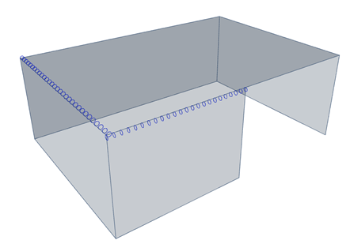

# RelConnectsSurfaceEdge

## Hinges on 2D member edge

A connection of two slabs \(2D members\) may be modelled as a fixed one or a hinge may be inserted to create a pinned connection. Three configurations of slab hinge are allowed: rigid, free, flexible. Under any configuration, all translations are fully transferred from one slab to the other. If there is no hinge, the connection is rigid.

<table>
  <thead>
    <tr>
      <th style="text-align:center">Name of the column header</th>
      <th style="text-align:center">Type of data</th>
      <th style="text-align:center">Value example or enum definition</th>
      <th style="text-align:center">Required value</th>
      <th style="text-align:left">Description</th>
    </tr>
  </thead>
  <tbody>
    <tr>
      <td style="text-align:center">Name</td>
      <td style="text-align:center">String</td>
      <td style="text-align:center">Sn6</td>
      <td style="text-align:center">yes</td>
      <td style="text-align:left">Human readable unique name of the support</td>
    </tr>
    <tr>
      <td style="text-align:center">2D Member</td>
      <td style="text-align:center">String</td>
      <td style="text-align:center">S3</td>
      <td style="text-align:center">yes</td>
      <td style="text-align:left">The name of the surface member to which is hinge related</td>
    </tr>
    <tr>
      <td style="text-align:center">Edge</td>
      <td style="text-align:center">Integer</td>
      <td style="text-align:center">1</td>
      <td style="text-align:center">yes</td>
      <td style="text-align:left">The index of edge of the surface member. The index starting with 0. The
        order is according to order of &#x201C;edges&#x201D; property at StrucutralSurfaceMember.</td>
    </tr>
    <tr>
      <td style="text-align:center">ux</td>
      <td style="text-align:center">Enum</td>
      <td style="text-align:center">
        
Free

        

        
Rigid

        

        
Flexible

      </td>
      <td style="text-align:center">yes</td>
      <td style="text-align:left">Translation in X direction. Free - That is it imposes no constraint in
        the direction. Rigid - The connection in fully rigid in the specified direction.
        Flexible - The connection is flexible (elastic) in the specified direction.
        Parameter Flexible can be linear only, non-linearity is not supported.</td>
    </tr>
    <tr>
      <td style="text-align:center">uy</td>
      <td style="text-align:center">Enum</td>
      <td style="text-align:center">
        
Free

        

        
Rigid

        

        
Flexible

      </td>
      <td style="text-align:center">yes</td>
      <td style="text-align:left">Translation in Y direction. Free - That is it imposes no constraint in
        the direction. Rigid - The connection in fully rigid in the specified direction.
        Flexible - The connection is flexible (elastic) in the specified direction.
        Parameter Flexible can be linear only, non-linearity is not supported.</td>
    </tr>
    <tr>
      <td style="text-align:center">uz</td>
      <td style="text-align:center">Enum</td>
      <td style="text-align:center">
        
Free

        

        
Rigid

        

        
Flexible

      </td>
      <td style="text-align:center">yes</td>
      <td style="text-align:left">Translation in Z direction. Free - That is it imposes no constraint in
        the direction. Rigid - The connection in fully rigid in the specified direction.
        Flexible - The connection is flexible (elastic) in the specified direction.
        Parameter Flexible can be linear only, non-linearity is not supported.</td>
    </tr>
    <tr>
      <td style="text-align:center">fix</td>
      <td style="text-align:center">Enum</td>
      <td style="text-align:center">
        
Free

        

        
Rigid

        

        
Flexible

      </td>
      <td style="text-align:center">yes</td>
      <td style="text-align:left">Rotational stiffness around X axis. Parameter Flexible can be linear only,
        non-linearity is not supported.</td>
    </tr>
    <tr>
      <td style="text-align:center">fiy</td>
      <td style="text-align:center">Enum</td>
      <td style="text-align:center">
        
Free

        

        
Rigid

        

        
Flexible

      </td>
      <td style="text-align:center">yes</td>
      <td style="text-align:left">Rotational stiffness around Y axis. Parameter Flexible can be linear only,
        non-linearity is not supported.</td>
    </tr>
    <tr>
      <td style="text-align:center">fiz</td>
      <td style="text-align:center">Enum</td>
      <td style="text-align:center">
        
Free

        

        
Rigid

        

        
Flexible

      </td>
      <td style="text-align:center">yes</td>
      <td style="text-align:left">Rotational stiffness around Z axis. Parameter Flexible can be linear only,
        non-linearity is not supported.</td>
    </tr>
    <tr>
      <td style="text-align:center">Stiffness X [MN/m2]</td>
      <td style="text-align:center">Double</td>
      <td style="text-align:center">100</td>
      <td style="text-align:center">yes, if ux = Flexible</td>
      <td style="text-align:left">The flexibility of the connection in X direction</td>
    </tr>
    <tr>
      <td style="text-align:center">Stiffness Y [MN/m2]</td>
      <td style="text-align:center">Double</td>
      <td style="text-align:center">100</td>
      <td style="text-align:center">yes, if uy = Flexible</td>
      <td style="text-align:left">The flexibility of the connection in Y direction</td>
    </tr>
    <tr>
      <td style="text-align:center">Stiffness Z [MN/m2]</td>
      <td style="text-align:center">Double</td>
      <td style="text-align:center">100</td>
      <td style="text-align:center">yes, if uz = Flexible</td>
      <td style="text-align:left">The flexibility of the connection in Z direction</td>
    </tr>
    <tr>
      <td style="text-align:center">Stiffness Fix [MNm/rad/m]</td>
      <td style="text-align:center">Double</td>
      <td style="text-align:center">50</td>
      <td style="text-align:center">yes, if fix = Flexible</td>
      <td style="text-align:left">The flexibility in rotation of the connection around local X axis</td>
    </tr>
    <tr>
      <td style="text-align:center">Stiffness Fiy [MNm/rad/m]</td>
      <td style="text-align:center">Double</td>
      <td style="text-align:center">50</td>
      <td style="text-align:center">yes, if fiy = Flexible</td>
      <td style="text-align:left">The flexibility in rotation of the connection around local Y axis</td>
    </tr>
    <tr>
      <td style="text-align:center">Stiffness Fiz [MNm/rad/m]</td>
      <td style="text-align:center">Double</td>
      <td style="text-align:center">50</td>
      <td style="text-align:center">yes, if fiz = Flexible</td>
      <td style="text-align:left">The flexibility in rotation of the connection around local Z axis</td>
    </tr>
    <tr>
      <td style="text-align:center">Coordinate definition</td>
      <td style="text-align:center">Enum</td>
      <td style="text-align:center">
        
Absolute

        

        
Relative

      </td>
      <td style="text-align:center">yes</td>
      <td style="text-align:left">Selects the coordinate system that is used to define the length of the
        hinge. Relative means without units. To define length of the hinges in
        meters input absolute</td>
    </tr>
    <tr>
      <td style="text-align:center">Origin</td>
      <td style="text-align:center">Enum</td>
      <td style="text-align:center">
        
From start

        

        
From end

      </td>
      <td style="text-align:center">yes</td>
      <td style="text-align:left">Specifies the origin of the coordinate system used for the definition
        of the length of the hinge</td>
    </tr>
    <tr>
      <td style="text-align:center">Start point [m]</td>
      <td style="text-align:center">Double</td>
      <td style="text-align:center">
        
value in meters for Coordinate definition = Absolute

        
0,0

        
value in percentage for Coordinate definition = Relative

        
0,0

      </td>
      <td style="text-align:center">yes</td>
      <td style="text-align:left">
        
Defines the position of the start point of the hinge in relative or absolute
          coordinates

        
Units in meters [m]

      </td>
    </tr>
    <tr>
      <td style="text-align:center">End point [m]</td>
      <td style="text-align:center">Double</td>
      <td style="text-align:center">
        
value in meters for Coordinate definition = Absolute

        
5,25

        
value in percentage for Coordinate definition = Relative

        
1,0

      </td>
      <td style="text-align:center">yes</td>
      <td style="text-align:left">
        
Defines the position of the end point of the hinge in relative or absolute
          coordinates

        
Units in meters [m

      </td>
    </tr>
    <tr>
      <td style="text-align:center">Parent ID</td>
      <td style="text-align:center">String</td>
      <td style="text-align:center">67b35d84-3d04-47aa-aa4a-dc1263982320</td>
      <td style="text-align:center">no</td>
      <td style="text-align:left">
        
Is filled for objects created be dividing curved geometry to series of
          straight line objects.
           Parent ID will ensure that curved edge is imported as straight parts to
          nonsupporting application, and back to original supporting application
          as curved geometry.

        
To ensure successful round trip of segmented objects and their related
          objects, Parent ID needs to be present in both directions.

      </td>
    </tr>
    <tr>
      <td style="text-align:center">Id</td>
      <td style="text-align:center">String</td>
      <td style="text-align:center">39f238a5-01d0-45cf-a2eb-958170fd4f39</td>
      <td style="text-align:center">no</td>
      <td style="text-align:left">Unique attribute designation</td>
    </tr>
  </tbody>
</table>

