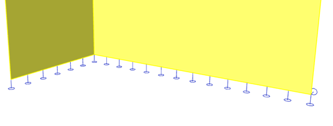

# StructuralEdgeConnection

## Supports on 2D members edges

Object definition for a line support on a 2D member \([StructuralSurfaceMember](../structural-analysis-elements/structuralsurfacemember.md#2d-member-plate-wall)\) edge. The support can be defined along the entire length of an edge or on its part only.

Specification in the excel:

<table>
  <thead>
    <tr>
      <th style="text-align:left">Name of the column header</th>
      <th style="text-align:left">Type of data</th>
      <th style="text-align:left">Value example or enum definition</th>
      <th style="text-align:left">Required value</th>
      <th style="text-align:left">Description</th>
    </tr>
  </thead>
  <tbody>
    <tr>
      <td style="text-align:left">Name</td>
      <td style="text-align:left">String</td>
      <td style="text-align:left">Sn6</td>
      <td style="text-align:left">yes</td>
      <td style="text-align:left">Human readable unique name of the support</td>
    </tr>
    <tr>
      <td style="text-align:left">Type</td>
      <td style="text-align:left">Enum</td>
      <td style="text-align:left">
        
Fixed

        
Hinged

        
Sliding

        
Custom

      </td>
      <td style="text-align:left">no</td>
      <td style="text-align:left">Type of constraint support in general. Has just informative value. Actual
        boundary conditions are set per transition/rotation per direction.</td>
    </tr>
    <tr>
      <td style="text-align:left">Boundary condition</td>
      <td style="text-align:left">Enum</td>
      <td style="text-align:left">
        
On edge

        
On subregion edge

        
On opening edge

      </td>
      <td style="text-align:left">yes</td>
      <td style="text-align:left">Specifies on which type of object the force acts</td>
    </tr>
    <tr>
      <td style="text-align:left">2D Member</td>
      <td style="text-align:left">String</td>
      <td style="text-align:left">S3</td>
      <td style="text-align:left">yes</td>
      <td style="text-align:left">The name of the <a href="../structural-analysis-elements/structuralsurfacemember.md#2d-member-plate-wall">StructuralSurfaceMember</a> or
        <a
        href="../structural-analysis-elements/structuralsurfacememberregion.md#region-of-different-plate-thickness">StructuralSurfaceMemberRegion</a>or <a href="../structural-analysis-elements/structuralsurfacememberopening.md#opening-in-surface-member">StructuralSurfaceMemberOpening</a> of
          affected edge.</td>
    </tr>
    <tr>
      <td style="text-align:left">Edge</td>
      <td style="text-align:left">Integer</td>
      <td style="text-align:left">1</td>
      <td style="text-align:left">yes</td>
      <td style="text-align:left">The index of edge of the surface member. The index starting with 1. The
        order is according to order of &#x201C;edges&#x201D; property at <a href="../structural-analysis-elements/structuralsurfacemember.md#2d-member-plate-wall">StructuralSurfaceMember</a>.</td>
    </tr>
    <tr>
      <td style="text-align:left">ux</td>
      <td style="text-align:left">Enum</td>
      <td style="text-align:left">
        
Free

        
Rigid

        
Flexible

        
Compression only

        
Tension only

      </td>
      <td style="text-align:left">yes</td>
      <td style="text-align:left">
        
Translation in X direction.

        
Free - That is it imposes no constraint in the direction. Rigid - The
          connection in fully rigid in the specified direction. Flexible - The connection
          is flexible (elastic) in the specified direction. Parameter Flexible can
          be linear only, non-linearity is not supported. Compression only acts only
          under compression. If the support gets under tension it stops acting. Tension
          only support acts only under tension.

      </td>
    </tr>
    <tr>
      <td style="text-align:left">uy</td>
      <td style="text-align:left">Enum</td>
      <td style="text-align:left">
        
Free

        
Rigid

        
Flexible

        
Compression only

        
Tension only

      </td>
      <td style="text-align:left">yes</td>
      <td style="text-align:left">
        
Translation in Y direction.

        
Free - That is it imposes no constraint in the direction. Rigid - The
          connection in fully rigid in the specified direction. Flexible - The connection
          is flexible (elastic) in the specified direction. Parameter Flexible can
          be linear only, non-linearity is not supported. Compression only acts only
          under compression. If the support gets under tension it stops acting. Tension
          only support acts only under tension.

      </td>
    </tr>
    <tr>
      <td style="text-align:left">uz</td>
      <td style="text-align:left">Enum</td>
      <td style="text-align:left">
        
Free

        
Rigid

        
Flexible

        
Compression only

        
Tension only

      </td>
      <td style="text-align:left">yes</td>
      <td style="text-align:left">
        
Translation in Z direction.

        
Free - That is it imposes no constraint in the direction. Rigid - The
          connection in fully rigid in the specified direction. Flexible - The connection
          is flexible (elastic) in the specified direction. Parameter Flexible can
          be linear only, non-linearity is not supported. Compression only acts only
          under compression. If the support gets under tension it stops acting. Tension
          only support acts only under tension.

      </td>
    </tr>
    <tr>
      <td style="text-align:left">fix</td>
      <td style="text-align:left">Enum</td>
      <td style="text-align:left">
        
Free

        
Rigid

        
Flexible

      </td>
      <td style="text-align:left">yes</td>
      <td style="text-align:left">Rotational stiffness around X axis. Parameter Flexible can be linear only,
        non-linearity is not supported.</td>
    </tr>
    <tr>
      <td style="text-align:left">fiy</td>
      <td style="text-align:left">Enum</td>
      <td style="text-align:left">
        
Free

        
Rigid

        
Flexible

      </td>
      <td style="text-align:left">yes</td>
      <td style="text-align:left">Rotational stiffness around Y axis. Parameter Flexible can be linear only,
        non-linearity is not supported.</td>
    </tr>
    <tr>
      <td style="text-align:left">fiz</td>
      <td style="text-align:left">Enum</td>
      <td style="text-align:left">
        
Free

        
Rigid

        
Flexible

      </td>
      <td style="text-align:left">yes</td>
      <td style="text-align:left">Rotational stiffness around Z axis. Parameter Flexible can be linear only,
        non-linearity is not supported.</td>
    </tr>
    <tr>
      <td style="text-align:left">Stiffness X [MN/m2]</td>
      <td style="text-align:left">Double</td>
      <td style="text-align:left">100</td>
      <td style="text-align:left">yes, if Translation X = Flexible</td>
      <td style="text-align:left">The flexibility of the connection in X direction. Use this property only
        if the Translation X direction is Flexible.</td>
    </tr>
    <tr>
      <td style="text-align:left">Stiffness Y [MN/m2]</td>
      <td style="text-align:left">Double</td>
      <td style="text-align:left">100</td>
      <td style="text-align:left">yes, if Translation Y = Flexible</td>
      <td style="text-align:left">The flexibility of the connection in Y direction. Use this property only
        if the Translation Y direction is Flexible.</td>
    </tr>
    <tr>
      <td style="text-align:left">Stiffness Z [MN/m2]</td>
      <td style="text-align:left">Double</td>
      <td style="text-align:left">100</td>
      <td style="text-align:left">yes, if Translation Z = Flexible</td>
      <td style="text-align:left">The flexibility of the connection in Z direction. Use this property only
        if the Translation Z direction is Flexible.</td>
    </tr>
    <tr>
      <td style="text-align:left">Stiffness Fix [MNm/rad/m]</td>
      <td style="text-align:left">Double</td>
      <td style="text-align:left">50</td>
      <td style="text-align:left">yes, if Rx = Flexible</td>
      <td style="text-align:left">The flexibility in rotation of the connection around local X axis. Use
        this property only if the Rotational stiffness Rx is Flexible.</td>
    </tr>
    <tr>
      <td style="text-align:left">Stiffness Fiy [MNm/rad/m]</td>
      <td style="text-align:left">Double</td>
      <td style="text-align:left">50</td>
      <td style="text-align:left">yes, if Ry = Flexible</td>
      <td style="text-align:left">The flexibility in rotation of the connection around local Y axis. Use
        this property only if the Rotational stiffness Ry is Flexible.</td>
    </tr>
    <tr>
      <td style="text-align:left">Stiffness Fiz [MNm/rad/m]</td>
      <td style="text-align:left">Double</td>
      <td style="text-align:left">50</td>
      <td style="text-align:left">yes, if Rz = Flexible</td>
      <td style="text-align:left">The flexibility in rotation of the connection around local Z axis. Use
        this property only if the Rotational stiffness Rz is Flexible.</td>
    </tr>
    <tr>
      <td style="text-align:left">Coordinate system</td>
      <td style="text-align:left">Enum</td>
      <td style="text-align:left">
        
Global

        
Local

      </td>
      <td style="text-align:left">yes</td>
      <td style="text-align:left">Defines the co-ordinate system of the member in which the support is applied</td>
    </tr>
    <tr>
      <td style="text-align:left">Coordinate definition</td>
      <td style="text-align:left">Enum</td>
      <td style="text-align:left">
        
Absolute

        
Relative

      </td>
      <td style="text-align:left">yes</td>
      <td style="text-align:left">Selects the coordinate system that is used to define the length of the
        hinge. Relative means without units. For define length of the hinges in
        meters input absolute</td>
    </tr>
    <tr>
      <td style="text-align:left">Origin</td>
      <td style="text-align:left">Enum</td>
      <td style="text-align:left">
        
From start

        
From end

      </td>
      <td style="text-align:left">yes</td>
      <td style="text-align:left">Specifies the origin of the coordinate system used for the definition
        of the length of the hinge</td>
    </tr>
    <tr>
      <td style="text-align:left">Start point [m]</td>
      <td style="text-align:left">Double</td>
      <td style="text-align:left">
        
value in meters for Coordinate definition = Absolute

        
0,0

        
value in percentage for Coordinate definition = Relative

        
0,0

      </td>
      <td style="text-align:left">yes</td>
      <td style="text-align:left">Defines the position of the start point of the support in relative or
        absolute coordinates [m]</td>
    </tr>
    <tr>
      <td style="text-align:left">End point [m]</td>
      <td style="text-align:left">Double</td>
      <td style="text-align:left">
        
value in meters for Coordinate definition = Absolute

        
5,25

        
value in percentage for Coordinate definition = Relative

        
1,0

      </td>
      <td style="text-align:left">yes</td>
      <td style="text-align:left">Defines the position of the end point of the support in relative or absolute
        coordinates [m]</td>
    </tr>
    <tr>
      <td style="text-align:left">Parent ID</td>
      <td style="text-align:left">String</td>
      <td style="text-align:left">67b35d84-3d04-47aa-aa4a-dc1263982320</td>
      <td style="text-align:left">no</td>
      <td style="text-align:left">
        
Is filled for objects created be dividing curved geometry to series of
          straight line objects.
           
           Parent ID will ensure that curved edge is imported as straight parts to
          nonsupporting application, and back to original supporting application
          as curved geometry.

        
To ensure successful round trip of segmented objects and their related
          objects, Parent ID needs to be present in both directions.

      </td>
    </tr>
    <tr>
      <td style="text-align:left">Id</td>
      <td style="text-align:left">String</td>
      <td style="text-align:left">39f238a5-01d0-45cf-a2eb-958170fd4f39</td>
      <td style="text-align:left">no</td>
      <td style="text-align:left">Unique attribute designation</td>
    </tr>
  </tbody>
</table>

