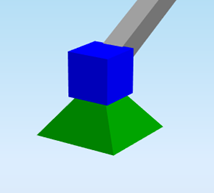

# StructuralPointSupport

## Support in node

StructuralPointSupport represents a support of the analytical model in a node. The support is defined by six separate parameters. Each parameter defines the constraint in one direction: translation in the direction of the X, Y, Z axis and rotation around the same axes. A nodal support is oriented in the global co-ordinate system.

Specification in the excel:

<table>
  <thead>
    <tr>
      <th style="text-align:center">Name of the column header</th>
      <th style="text-align:center">Type of data</th>
      <th style="text-align:center">Value example or enum definition</th>
      <th style="text-align:center">Required value</th>
      <th style="text-align:left">Description</th>
    </tr>
  </thead>
  <tbody>
    <tr>
      <td style="text-align:center">Name</td>
      <td style="text-align:center">String</td>
      <td style="text-align:center">Sn6</td>
      <td style="text-align:center">yes</td>
      <td style="text-align:left">Human readable unique name of the support</td>
    </tr>
    <tr>
      <td style="text-align:center">Type</td>
      <td style="text-align:center">Enum</td>
      <td style="text-align:center">
        
Fixed

        

        
Hinged

        

        
Sliding

        

        
Custom

      </td>
      <td style="text-align:center">no</td>
      <td style="text-align:left">Type of constraint support in general. Has just informative value. Actual
        boundary conditions are set per transition/rotation per direction.</td>
    </tr>
    <tr>
      <td style="text-align:center">Node</td>
      <td style="text-align:center">String</td>
      <td style="text-align:center">N5</td>
      <td style="text-align:center">yes</td>
      <td style="text-align:left">The name of the node to which is point support related</td>
    </tr>
    <tr>
      <td style="text-align:center">ux</td>
      <td style="text-align:center">Enum</td>
      <td style="text-align:center">
        
Rigid

        

        
Free

        

        
Flexible

        

        
Compression only

        

        
Tension only

        

        
Flexible compression only

        

        
Flexible tension only

        

        
Non linear

      </td>
      <td style="text-align:center">yes</td>
      <td style="text-align:left">
        
Translation in X direction.
           Free - That is it imposes no constraint in the direction.

        
Rigid - The support in fully rigid in the specified direction.

        
Flexible - The support is flexible (elastic) in the specified direction.
          Parameter Flexible can be linear only, non-linearity is not supported.
          Compression only acts only under compression. If the support gets under
          tension it stops acting. Tension only support acts only under tension.

      </td>
    </tr>
    <tr>
      <td style="text-align:center">uy</td>
      <td style="text-align:center">Enum</td>
      <td style="text-align:center">
        
Rigid

        

        
Free

        

        
Flexible

        

        
Compression only

        

        
Tension only

        

        
Flexible compression only

        

        
Flexible tension only

        

        
Non linear

      </td>
      <td style="text-align:center">yes</td>
      <td style="text-align:left">
        
Translation in Y direction.

        
Free - That is it imposes no constraint in the direction.

        
Rigid - The support in fully rigid in the specified direction.

        
Flexible - The support is flexible (elastic) in the specified direction.
          Parameter Flexible can be linear only, non-linearity is not supported.
          Compression only acts only under compression. If the support gets under
          tension it stops acting. Tension only support acts only under tension.

      </td>
    </tr>
    <tr>
      <td style="text-align:center">uz</td>
      <td style="text-align:center">Enum</td>
      <td style="text-align:center">
        
Rigid

        

        
Free

        

        
Flexible

        

        
Compression only

        

        
Tension only

        

        
Flexible compression only

        

        
Flexible tension only

        

        
Non linear

      </td>
      <td style="text-align:center">yes</td>
      <td style="text-align:left">
        
Translation in Z direction.

        
Free - That is it imposes no constraint in the direction.

        
Rigid - The support in fully rigid in the specified direction.

        
Flexible - The support is flexible (elastic) in the specified direction.
          Parameter Flexible can be linear only, non-linearity is not supported.
          Compression only acts only under compression. If the support gets under
          tension it stops acting. Tension only support acts only under tension.

      </td>
    </tr>
    <tr>
      <td style="text-align:center">fix</td>
      <td style="text-align:center">Enum</td>
      <td style="text-align:center">
        
Free

        

        
Rigid

        

        
Flexible

        

        
Non linear

      </td>
      <td style="text-align:center">yes</td>
      <td style="text-align:left">
        
Rotational stiffness around X axis. Parameter

        
Flexible can be linear only, non-linearity is not supported.

      </td>
    </tr>
    <tr>
      <td style="text-align:center">fiy</td>
      <td style="text-align:center">Enum</td>
      <td style="text-align:center">
        
Free

        

        
Rigid

        

        
Flexible

        

        
Non linear

      </td>
      <td style="text-align:center">yes</td>
      <td style="text-align:left">Rotational stiffness around Y axis. Parameter Flexible can be linear only,
        non-linearity is not supported.</td>
    </tr>
    <tr>
      <td style="text-align:center">fiz</td>
      <td style="text-align:center">Enum</td>
      <td style="text-align:center">
        
Free

        

        
Rigid

        

        
Flexible

        

        
Non linear

      </td>
      <td style="text-align:center">yes</td>
      <td style="text-align:left">
        
Rotational stiffness around Z axis.

        
Parameter Flexible can be linear only, non-linearity is not supported.

      </td>
    </tr>
    <tr>
      <td style="text-align:center">Stiffness X [MN/m]</td>
      <td style="text-align:center">Double</td>
      <td style="text-align:center">100</td>
      <td style="text-align:center">
        
yes, if Translation X = Flexible

        

        
yes, if Translation X = Non linear

      </td>
      <td style="text-align:left">The flexibility of the support in X direction</td>
    </tr>
    <tr>
      <td style="text-align:center">Stiffness Y [MN/m]</td>
      <td style="text-align:center">Double</td>
      <td style="text-align:center">100</td>
      <td style="text-align:center">
        
yes, if Translation Y = Flexible

        

        
yes, if Translation Y = Non linear

      </td>
      <td style="text-align:left">The flexibility of the support in Y direction</td>
    </tr>
    <tr>
      <td style="text-align:center">Stiffness Z [MN/m]</td>
      <td style="text-align:center">Double</td>
      <td style="text-align:center">100</td>
      <td style="text-align:center">
        
yes, if Translation Z = Flexible

        

        
yes, if Translation Z = Non linear

      </td>
      <td style="text-align:left">The flexibility of the support in Z direction</td>
    </tr>
    <tr>
      <td style="text-align:center">Stiffness Fix [MNm/rad]</td>
      <td style="text-align:center">Double</td>
      <td style="text-align:center">50</td>
      <td style="text-align:center">
        
yes, if Rx = Flexible

        

        
yes, if Rx = Non linear

      </td>
      <td style="text-align:left">The flexibility in rotation of the connection around local X axis</td>
    </tr>
    <tr>
      <td style="text-align:center">Stiffness Fiy [MNm/rad]</td>
      <td style="text-align:center">Double</td>
      <td style="text-align:center">50</td>
      <td style="text-align:center">
        
yes, if Ry = Flexible

        

        
yes, if Ry = Non linear

      </td>
      <td style="text-align:left">The flexibility in rotation of the connection around local Y axis</td>
    </tr>
    <tr>
      <td style="text-align:center">Stiffness Fiz [MNm/rad]</td>
      <td style="text-align:center">Double</td>
      <td style="text-align:center">50</td>
      <td style="text-align:center">
        
yes, if Rz = Flexible

        

        
yes, if Rz = Non linear
           
        

      </td>
      <td style="text-align:left">The flexibility in rotation of the connection around local Z axis</td>
    </tr>
    <tr>
      <td style="text-align:center">Id</td>
      <td style="text-align:center">String</td>
      <td style="text-align:center">39f238a5-01d0-45cf-a2eb-958170fd4f39</td>
      <td style="text-align:center">no</td>
      <td style="text-align:left">Unique attribute designation</td>
    </tr>
  </tbody>
</table>

