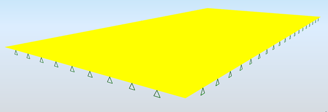

# StructuralSurfaceConnection

## Support on 2D member

Instances of the objects StructuralSurfaceConnection are used to describe structural supports provided by planar elements. In most cases, it represents the interaction between the structure and the subsoil.

The properties of such model are expressed by what is called interaction parameters marked C. These parameters are assigned directly to structural elements that are in contact with the subsoil and they influence the stiffness matrix in analysis calculation.

To simplify the matter, we may imagine that C is the characteristic of elastic, more precisely pseudo-elastic, links, or surface spring constants that change according to the actual state of the analysed system. We may also use the professional slang that calls it "support on C parameters", which is the generalisation of standard Winkler idea of the supporting in the form of thick liquid g = C1 \(MNm-3\) or in the form of an infinitely dense system of vertical springs. The parameters of the interaction between the foundation and the subsoil depend on the distribution and loading level, or the contact stress between the structure surface and the surrounding subsoil, on the geometry of the footing surface and on mechanical properties of the soil.

### Specification in the excel

<table>
  <thead>
    <tr>
      <th style="text-align:center">Name of the column header</th>
      <th style="text-align:center">Type of data</th>
      <th style="text-align:center">Value example or enum definition</th>
      <th style="text-align:center">Required value</th>
      <th style="text-align:left">Description</th>
    </tr>
  </thead>
  <tbody>
    <tr>
      <td style="text-align:center">Name</td>
      <td style="text-align:center">String</td>
      <td style="text-align:center">Sn6</td>
      <td style="text-align:center">yes</td>
      <td style="text-align:left">Human readable unique name of the support</td>
    </tr>
    <tr>
      <td style="text-align:center">2D Member</td>
      <td style="text-align:center">String</td>
      <td style="text-align:center">S13</td>
      <td style="text-align:center">yes</td>
      <td style="text-align:left">The name of the <a href="../structural-analysis-elements/structuralsurfacemember.md#2d-member-plate-wall">StructuralSurfaceMember</a> to
        which is the surface support is related</td>
    </tr>
    <tr>
      <td style="text-align:center">2D Member Region</td>
      <td style="text-align:center">String</td>
      <td style="text-align:center">R1</td>
      <td style="text-align:center">no</td>
      <td style="text-align:left">The name of the <a href="../structural-analysis-elements/structuralsurfacememberregion.md#region-of-different-plate-thickness">StructuralSurfaceMemberRegion</a> to
        which is the surface support related if it is available on 2D member</td>
    </tr>
    <tr>
      <td style="text-align:center">Subsoil</td>
      <td style="text-align:center">String</td>
      <td style="text-align:center">Gravel</td>
      <td style="text-align:center">yes</td>
      <td style="text-align:left">Type of the subsoil</td>
    </tr>
    <tr>
      <td style="text-align:center">Description</td>
      <td style="text-align:center">String</td>
      <td style="text-align:center">Loam/Very sandy</td>
      <td style="text-align:center">no</td>
      <td style="text-align:left">Characteristics of the subsoil</td>
    </tr>
    <tr>
      <td style="text-align:center">C1x [MN/m3]</td>
      <td style="text-align:center">Double</td>
      <td style="text-align:center">80,5</td>
      <td style="text-align:center">yes</td>
      <td style="text-align:left">
        
Resistance of environment against xP (mm) [C1x in MN/m3] (deformation
          in local x direction)

        
See notes for coordinates reference.

      </td>
    </tr>
    <tr>
      <td style="text-align:center">C1y [MN/m3]</td>
      <td style="text-align:center">Double</td>
      <td style="text-align:center">35,5</td>
      <td style="text-align:center">yes</td>
      <td style="text-align:left">
        
Resistance of environment against yP (mm) [C1y in MN/m3] (deformation
          in local y direction)

        
See notes for coordinates reference.

      </td>
    </tr>
    <tr>
      <td style="text-align:center">C1z Spring</td>
      <td style="text-align:center">String</td>
      <td style="text-align:center">Linear</td>
      <td style="text-align:center">no</td>
      <td style="text-align:left">
        
Resistance of environment against zP (deformation in local z direction).

        
Non-linear is not supported.

        
See notes for coordinates reference.

      </td>
    </tr>
    <tr>
      <td style="text-align:center">C1z [MN/m3]</td>
      <td style="text-align:center">Double</td>
      <td style="text-align:center">50</td>
      <td style="text-align:center">yes</td>
      <td style="text-align:left">
        
Resistance of environment against zP (mm) [C1z in MN/m3] (deformation
          in local z direction)

        
See notes for coordinates reference.

      </td>
    </tr>
    <tr>
      <td style="text-align:center">C2x [MN/m]</td>
      <td style="text-align:center">Double</td>
      <td style="text-align:center">15,5</td>
      <td style="text-align:center">yes</td>
      <td style="text-align:left">
        
Resistance of environment against zP/xP (mm/m) [C2x in MN/m]

        
See notes for coordinates reference.

      </td>
    </tr>
    <tr>
      <td style="text-align:center">C2y [MN/m]</td>
      <td style="text-align:center">Double</td>
      <td style="text-align:center">10,2</td>
      <td style="text-align:center">yes</td>
      <td style="text-align:left">
        
Resistance of environment against zP/yP (mm/m) [C2y in MN/m]

        
See notes for coordinates reference.

      </td>
    </tr>
    <tr>
      <td style="text-align:center">Parent ID</td>
      <td style="text-align:center">String</td>
      <td style="text-align:center">67b35d84-3d04-47aa-aa4a-dc1263982320</td>
      <td style="text-align:center">no</td>
      <td style="text-align:left">
        
Is filled for objects created be dividing curved geometry to series of
          straight line objects.
           
           Parent ID will ensure that curved edge is imported as straight parts to
          nonsupporting application, and back to original supporting application
          as curved geometry.

        
To ensure successful round trip of segmented objects and their related
          objects, Parent ID needs to be present in both directions.

      </td>
    </tr>
    <tr>
      <td style="text-align:center">Id</td>
      <td style="text-align:center">String</td>
      <td style="text-align:center">39f238a5-01d0-45cf-a2eb-958170fd4f39</td>
      <td style="text-align:center">no</td>
      <td style="text-align:left">Unique attribute designation</td>
    </tr>
  </tbody>
</table>

## Notes


Local coordination system is given by parent 2D object - [StructuralSurfaceMember](../structural-analysis-elements/structuralsurfacemember.md#2d-member-plate-wall)


